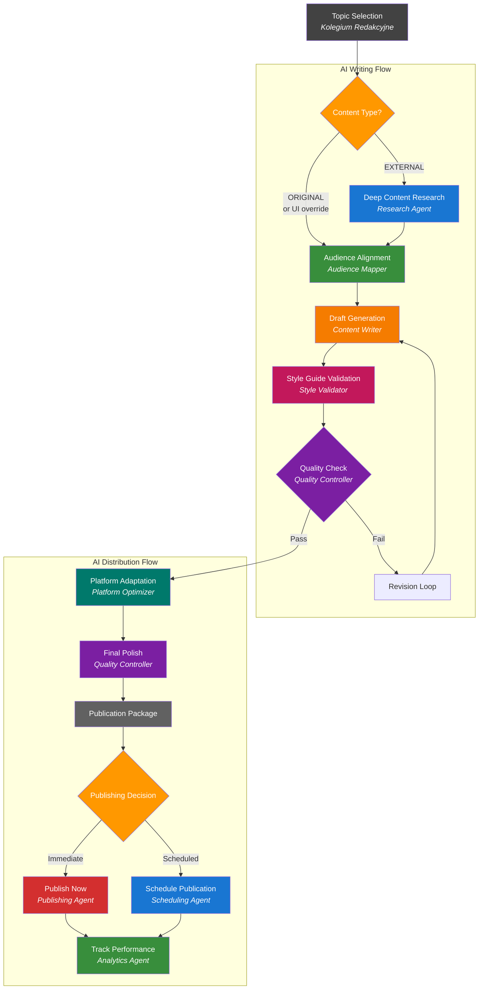

# AI Writing Flow - Diagram przepływu

## Podział odpowiedzialności między systemami

### Kolegium Redakcyjne (już zaimplementowane)
Odpowiada za wstępną analizę i selekcję tematów:

- **Topic Discovery** - odkrywanie trendów i tematów
- **Viral Analysis** - analiza potencjału wiralnego (viral score)
- **Content Type Detection** - STANDALONE vs SERIES
- **Ownership Analysis** - ORIGINAL vs EXTERNAL
- **Editorial Decision** - wstępna decyzja redakcyjna
- **Quality Assessment** - ocena jakości contentu

### AI Writing Flow (do implementacji)
Odpowiada za generowanie gotowych do publikacji materiałów:

### Przepływ danych między systemami

**Kolegium przekazuje do Writing Flow:**
- `topic_title` - wybrany temat
- `viral_score` - potencjał wiralny
- `content_type` - typ contentu (STANDALONE/SERIES)
- `folder_path` - ścieżka do źródeł
- `content_ownership` - własność contentu (ORIGINAL/EXTERNAL)
- `editorial_recommendations` - rekomendacje redakcyjne

**Opcje UI:**
- Checkbox: "Pomiń research dla contentu własnego" - pozwala ręcznie pominąć Deep Content Research nawet dla contentu EXTERNAL

**Writing Flow zwraca:**
- `final_draft` - gotowy artykuł
- `platform_variants` - wersje dla różnych platform
- `publication_metadata` - metadane do publikacji
- `quality_score` - finalna ocena jakości