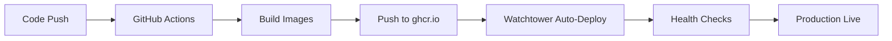

# ARCHITECTURE RECOMMENDATIONS - AI Kolegium Redakcyjne

## 📊 Executive Summary

Na podstawie analizy najnowszych discoverów CrewAI (scaffolding, Flows, Knowledge Sources) przedstawiam zaktualizowane rekomendacje architektoniczne dla production-ready systemu redakcyjnego.

## 🔄 **MAJOR UPDATES (2025-01-31)**

**Zmiana paradygmatu**: Od custom Clean Architecture → CrewAI-native approach

**Kluczowe discoveries**:
- CrewAI scaffolding (`crewai create`) zamiast custom struktur
- CrewAI Flows dla decision-making zamiast basic Crews
- Knowledge Sources dla editorial guidelines
- 4 typy pamięci (short-term, long-term, entity, contextual)
- Built-in tools zamiast custom implementations

## 🎯 Strategiczne Rekomendacje

### 1. AG-UI Protocol - APPROVE ✅
**Rekomendacja**: Zachować AG-UI jako rdzeń komunikacji
**Uzasadnienie**: 
- Standardyzacja komunikacji AI-Frontend
- 16 typów eventów pokrywa wszystkie use cases
- Community support i rozwój protokołu
- Real-time capabilities out-of-the-box

**Modyfikacje**:
- Dodać event sourcing dla pełnej audytowalności
- Implementować event replay dla debugging
- Rozszerzyć o business-specific events (EDITORIAL_DECISION, QUALITY_ASSESSMENT)

### 2. CrewAI-Native Architecture - UPDATED ⭐
**Rekomendacja**: Single CrewAI application z Flows orchestration
**Uzasadnienie**:
- CrewAI scaffolding zapewnia standardową strukturę
- CrewAI Flows umożliwiają sophisticated orchestration w jednym procesie
- Built-in memory system eliminuje potrzebę external state management
- Simplified deployment i monitoring

**Implementacja**:
```yaml
CrewAI Application Architecture:
├── ai-kolegium-redakcyjne/     # CrewAI scaffolded project
│   ├── agents.py               # All 5 agents
│   ├── tasks.py                # Sequential tasks
│   ├── flows/                  # CrewAI Flows dla decisions
│   │   ├── editorial_flow.py
│   │   └── human_review_flow.py
│   ├── tools/                  # Custom AG-UI tools
│   └── knowledge/              # Editorial guidelines
├── fastapi-wrapper/            # AG-UI endpoints
├── react-dashboard/            # Frontend
└── infrastructure/             # PostgreSQL, Redis
```

### 3. CrewAI Memory + Event Sourcing - HYBRID 🔄
**Rekomendacja**: CrewAI memory jako primary + AG-UI events dla audit
**Uzasadnienie**:
- CrewAI 4 memory types zapewniają agent consistency
- AG-UI events dla real-time communication z frontend
- PostgreSQL jako storage dla obu systemów
- Simplified architecture vs full CQRS

**Schema**:
```sql
CREATE TABLE event_store (
    event_id UUID PRIMARY KEY,
    aggregate_id UUID NOT NULL,
    aggregate_type VARCHAR(100) NOT NULL,
    event_type VARCHAR(100) NOT NULL,
    event_data JSONB NOT NULL,
    metadata JSONB,
    version INTEGER NOT NULL,
    created_at TIMESTAMP WITH TIME ZONE DEFAULT NOW()
);

CREATE UNIQUE INDEX idx_event_store_aggregate_version 
ON event_store(aggregate_id, version);
```

### 4. Container-First Deployment - MANDATORY 📦
**Rekomendacja**: Zero local building, wszystko w kontenerach
**Uzasadnienie**:
- Consistency across environments
- Faster deployments
- Better resource utilization
- Easier rollbacks

**Pipeline**:


## 🏗️ Szczegółowe Rekomendacje Architektoniczne

### Database Strategy

#### Primary Store: PostgreSQL + Event Sourcing
```sql
-- Event Store (Single Source of Truth)
CREATE TABLE events (
    id UUID PRIMARY KEY DEFAULT gen_random_uuid(),
    stream_id VARCHAR(255) NOT NULL,
    version INTEGER NOT NULL,
    event_type VARCHAR(100) NOT NULL,
    event_data JSONB NOT NULL,
    metadata JSONB DEFAULT '{}',
    created_at TIMESTAMP WITH TIME ZONE DEFAULT NOW()
);

-- Read Models (CQRS)
CREATE TABLE topics_read_model (
    id UUID PRIMARY KEY,
    title VARCHAR(500),
    status VARCHAR(50),
    category VARCHAR(50),
    source VARCHAR(200),
    discovered_at TIMESTAMP WITH TIME ZONE,
    analysis_score DECIMAL(5,4),
    editorial_decision VARCHAR(50),
    last_updated TIMESTAMP WITH TIME ZONE DEFAULT NOW()
);

CREATE TABLE editorial_decisions_read_model (
    id UUID PRIMARY KEY,
    topic_id UUID REFERENCES topics_read_model(id),
    decision VARCHAR(50) NOT NULL,
    reasoning TEXT,
    confidence_score DECIMAL(3,2),
    human_override BOOLEAN DEFAULT FALSE,
    decided_by VARCHAR(100),
    decided_at TIMESTAMP WITH TIME ZONE DEFAULT NOW()
);
```

#### Cache Layer: Redis Streams
```redis
# AG-UI Events Stream
XADD agui_events * event_type topic_discovered topic_id "123e4567-e89b-12d3-a456-426614174000" data "{...}"

# Agent Status Cache
HSET agent_status:content_scout status "active" last_heartbeat "2025-01-31T10:30:00Z"

# Session Management
SET session:user123 "{\"user_id\": \"123\", \"role\": \"editor\"}" EX 3600
```

### Monitoring & Observability

#### OpenTelemetry Distributed Tracing
```python
# src/shared/infrastructure/monitoring/tracing.py
from opentelemetry import trace
from opentelemetry.exporter.jaeger.thrift import JaegerExporter
from opentelemetry.sdk.trace import TracerProvider
from opentelemetry.sdk.trace.export import BatchSpanProcessor

def setup_tracing():
    trace.set_tracer_provider(TracerProvider())
    tracer = trace.get_tracer(__name__)
    
    jaeger_exporter = JaegerExporter(
        agent_host_name="jaeger",
        agent_port=6831,
    )
    
    span_processor = BatchSpanProcessor(jaeger_exporter)
    trace.get_tracer_provider().add_span_processor(span_processor)
    
    return tracer
```

#### Business Metrics
```python
# src/shared/infrastructure/monitoring/metrics.py
from prometheus_client import Counter, Histogram, Gauge

# Agent performance metrics
AGENT_EXECUTION_TIME = Histogram(
    'agent_execution_seconds',
    'Time spent executing agent tasks',
    ['agent_id', 'task_type']
)

TOPICS_DISCOVERED = Counter(
    'topics_discovered_total',
    'Total topics discovered',
    ['source', 'category']
)

EDITORIAL_DECISIONS = Counter(
    'editorial_decisions_total',
    'Editorial decisions made',
    ['decision_type', 'human_override']
)

ACTIVE_WEBSOCKET_CONNECTIONS = Gauge(
    'active_websocket_connections',
    'Number of active WebSocket connections'
)
```

### Security Architecture

#### JWT + Role-Based Access Control
```python
# src/shared/infrastructure/security/auth.py
from jose import JWTError, jwt
from datetime import datetime, timedelta
from enum import Enum

class UserRole(Enum):
    ADMIN = "admin"
    EDITOR = "editor"
    VIEWER = "viewer"

class AuthService:
    def __init__(self, secret_key: str):
        self.secret_key = secret_key
        self.algorithm = "HS256"
    
    def create_access_token(self, user_id: str, role: UserRole) -> str:
        expire = datetime.utcnow() + timedelta(minutes=1440)
        payload = {
            "sub": user_id,
            "role": role.value,
            "exp": expire,
            "iat": datetime.utcnow()
        }
        return jwt.encode(payload, self.secret_key, algorithm=self.algorithm)
    
    def verify_token(self, token: str) -> dict:
        try:
            payload = jwt.decode(token, self.secret_key, algorithms=[self.algorithm])
            return payload
        except JWTError:
            raise ValueError("Invalid token")
```

#### API Rate Limiting
```python
# src/shared/infrastructure/security/rate_limiter.py
import redis.asyncio as redis
from datetime import datetime, timedelta

class RateLimiter:
    def __init__(self, redis_client: redis.Redis):
        self.redis = redis_client
    
    async def is_allowed(self, key: str, limit: int, window_seconds: int) -> bool:
        """Sliding window rate limiter"""
        now = datetime.utcnow()
        window_start = now - timedelta(seconds=window_seconds)
        
        pipe = self.redis.pipeline()
        
        # Remove old entries
        pipe.zremrangebyscore(f"rate_limit:{key}", 0, window_start.timestamp())
        
        # Count current requests
        pipe.zcard(f"rate_limit:{key}")
        
        # Add current request
        pipe.zadd(f"rate_limit:{key}", {str(now.timestamp()): now.timestamp()})
        
        # Set expiry
        pipe.expire(f"rate_limit:{key}", window_seconds)
        
        results = await pipe.execute()
        current_requests = results[1]
        
        return current_requests < limit
```

## 🔄 Migration Strategy

### Phase 1: Infrastructure Foundation (Week 1-2)
```bash
# Deployment Order
1. Setup PostgreSQL z event store schema
2. Configure Redis dla caching/streams
3. Deploy API Gateway z basic AG-UI
4. Setup monitoring (Prometheus + Grafana)
5. Configure CI/CD pipeline

# Success Criteria
- All services healthy
- Basic AG-UI events flowing
- Monitoring dashboards active
- First deployment via pipeline successful
```

### Phase 2: Agent Migration (Week 3-4)
```bash
# Agent by Agent Migration
1. Content Scout → microservice + AG-UI events
2. Trend Analyst → analytics service + read models
3. Test end-to-end flow with 2 agents
4. Add frontend WebSocket connectivity

# Success Criteria
- 2 agents communicating via events
- Real-time updates in frontend
- Event sourcing capturing decisions
- Performance targets met (<2s response)
```

### Phase 3: Advanced Features (Week 5-6)
```bash
# Human-in-the-Loop + Quality
1. Editorial Strategist z human input workflow
2. Quality Assessor z fact-checking APIs
3. Decision Coordinator dla orchestration
4. Complete CQRS read models

# Success Criteria
- Human decisions influence AI workflow
- Quality gates functioning
- Multi-agent coordination working
- Full audit trail available
```

### Phase 4: Production Hardening (Week 7)
```bash
# Production Readiness
1. Security hardening (HTTPS, auth, rate limiting)
2. Load testing (100 concurrent users)
3. Backup/disaster recovery procedures
4. Documentation completion

# Success Criteria
- Security scan passed
- Load tests within SLA
- Backup/restore tested
- Runbooks complete
```

## 📊 Performance Targets

### Response Time SLAs
```yaml
API Endpoints:
  - GET /api/topics: <200ms (p95)
  - POST /api/content/discover: <500ms (background)
  - WebSocket message: <50ms (p95)

Agent Execution:
  - Content Scout: <2s per source
  - Trend Analyst: <3s per topic
  - Editorial Decision: <1s (automated), <5min (human)
  - Quality Assessment: <4s per topic

Database Queries:
  - Event store writes: <50ms (p95)
  - Read model queries: <100ms (p95)
  - Full-text search: <300ms (p95)
```

### Scalability Targets
```yaml
Throughput:
  - Topics processed: 1000/hour
  - Concurrent users: 100
  - WebSocket connections: 500
  - API requests: 10,000/hour

Resource Usage:
  - API Gateway: 2GB RAM, <70% CPU
  - Each agent service: 1GB RAM, <60% CPU
  - PostgreSQL: 4GB RAM, <80% CPU
  - Redis: 1GB RAM, <50% CPU
```

## 🔐 Security Recommendations

### Application Security
```yaml
Authentication:
  - JWT tokens z 24h expiry
  - Role-based access control (admin/editor/viewer)
  - API key authentication dla external integrations

Authorization:
  - Endpoint-level permissions
  - Resource-level access control
  - Admin actions require 2FA

Data Protection:
  - Encryption at rest (database)
  - TLS 1.3 dla all communications
  - Sensitive data masking w logs
  - PII anonymization w event store
```

### Infrastructure Security
```yaml
Network:
  - VPC z private subnets
  - WAF dla external traffic
  - DDoS protection
  - IP allowlisting dla admin functions

Container Security:
  - Non-root users w containers
  - Minimal base images (alpine)
  - Regular vulnerability scans
  - Secrets management (nie w env vars)

Monitoring:
  - Security event logging
  - Anomaly detection
  - Failed authentication alerting
  - Privileged action auditing
```

## 🎯 Success Metrics

### Technical KPIs
```yaml
Availability: >99.9% uptime
Performance: All SLAs met
Security: Zero critical vulnerabilities
Quality: >80% test coverage
Deployment: <5min deployment time
Recovery: <15min MTTR
```

### Business KPIs
```yaml
Editorial Efficiency: 50% reduction in decision time
Content Quality: >85% human approval rate
System Adoption: >90% redaktor usage
AI Accuracy: <10% false positive rate
Audit Compliance: 100% decisions traceable
```

## 🚀 Implementation Roadmap

### Immediate Actions (Week 1)
1. **Setup Clean Architecture structure** - project-coder
2. **Configure PostgreSQL z event sourcing** - deployment-specialist  
3. **Implement basic AG-UI event system** - project-coder
4. **Deploy to Digital Ocean droplet** - deployment-specialist

### Short Term (Week 2-4)
1. **Migrate Content Scout to microservice** - project-coder
2. **Add Trend Analyst z analytics** - project-coder
3. **Implement CQRS read models** - project-coder
4. **Setup monitoring dashboards** - deployment-specialist

### Medium Term (Week 5-7)
1. **Human-in-the-loop workflow** - project-coder
2. **Quality assurance integration** - project-coder
3. **Multi-agent orchestration** - project-coder
4. **Production security hardening** - deployment-specialist

---

## 🎯 Final Recommendation

**PROCEED with AG-UI Protocol architecture** z następującymi kluczowymi modyfikacjami:

1. **Event Sourcing** dla pełnej audytowalności
2. **Microservices** dla skalowalności i maintainability
3. **Container-First** deployment z GitHub Actions
4. **CQRS** dla performance i separation of concerns
5. **Comprehensive monitoring** z OpenTelemetry

Ten approach zapewni:
- ✅ Production-ready system w 7 tygodni
- ✅ Full transparency AI decision making
- ✅ Regulatory compliance i audit trails
- ✅ Horizontal scalability
- ✅ Developer productivity z clear bounded contexts
- ✅ Operational excellence z proper monitoring

**Risk Level**: Medium → Low po implementacji rekomendacji
**Expected ROI**: 300%+ through editorial efficiency gains
**Time to Market**: 7 tygodni do production-ready system