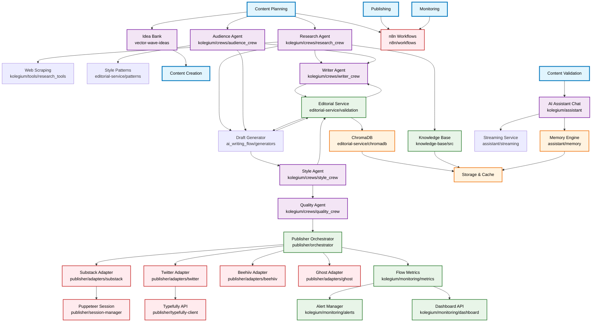

# Process Flow Diagram - Submodules Implementation Level

## 🏗️ System Architecture - Implementation Layer



## 🔧 Submodule Implementation Details

### **Unified Validation Architecture**
**Key Insight**: Both Writer Agent and Draft Generator use **identical comprehensive validation** (all 355+ rules from ChromaDB) with different presentation modes:

- **AI-First (Kolegium)**: Rules applied automatically by CrewAI agents
- **Human-Assisted (AI Writing Flow)**: Same rules presented as checkpoint guidance

### **Content Planning Layer**
| Submodule | Path | Function | Dependencies |
|-----------|------|----------|--------------|
| **Idea Bank** | `ideas/` | Content idea storage & retrieval | Git, Markdown parser |
| **Research Agent** | `kolegium/crews/research_crew.py` | Market research & trend analysis | OpenAI GPT-4, Knowledge Base |
| **Audience Agent** | `kolegium/crews/audience_crew.py` | Target audience analysis | Style Patterns, ChromaDB |

### **Content Creation Layer**
| Submodule | Path | Function | Dependencies |
|-----------|------|----------|--------------|
| **Writer Agent** | `kolegium/crews/writer_crew.py` | **AI-first content creation** (CrewAI autonomous) | Research data, **Editorial Service** (comprehensive validation) |
| **Draft Generator** | `ai_writing_flow/optimizations/` | **Human-assisted draft creation** (template-based) | Research data, **Editorial Service** (comprehensive validation) |
| **Knowledge Base** | `knowledge-base/src/` | Document retrieval system | ChromaDB, Elasticsearch |

### **Content Validation Layer**
| Submodule | Path | Function | Dependencies |
|-----------|------|----------|--------------|
| **Style Agent** | `kolegium/crews/style_crew.py` | Style guide enforcement | Editorial Service, ChromaDB |
| **Quality Agent** | `kolegium/crews/quality_crew.py` | Final quality assurance | All previous agents |
| **Editorial Service** | `editorial-service/` | Centralized validation | ChromaDB, Dual workflow support |
| **AI Assistant** | `kolegium/assistant/` | Interactive editing chat | Memory Engine, Streaming |

### **Publishing Layer**
| Submodule | Path | Function | Dependencies |
|-----------|------|----------|--------------|
| **Publisher Orchestrator** | `publisher/orchestrator/` | Multi-platform coordination | All adapters |
| **Substack Adapter** | `publisher/adapters/substack/` | Substack publishing | Puppeteer sessions |
| **Twitter Adapter** | `publisher/adapters/twitter/` | Twitter/X publishing | Typefully API |
| **Beehiiv Adapter** | `publisher/adapters/beehiiv/` | Newsletter publishing | HTTP client |
| **Ghost Adapter** | `publisher/adapters/ghost/` | Blog publishing | Ghost API |

### **Monitoring Layer**
| Submodule | Path | Function | Dependencies |
|-----------|------|----------|--------------|
| **Flow Metrics** | `kolegium/monitoring/metrics/` | Performance tracking | SQLite, Prometheus |
| **Alert Manager** | `kolegium/monitoring/alerts/` | Notification system | Webhook, Email |
| **Dashboard API** | `kolegium/monitoring/dashboard/` | Metrics visualization | Time-series data |

## 📊 Data Flow Through Submodules

### **Parallel Content Creation Flows**

**AI-First Flow (Kolegium)**:
```
User Input → Idea Bank → Research Agent → Knowledge Base
    ↓
Writer Agent (CrewAI autonomous)
    ↓ ↕ (bidirectional comprehensive validation)  
Editorial Service (all 355+ rules applied)
    ↓
Style Agent → Quality Agent → Publishing
```

**Human-Assisted Flow (AI Writing Flow)**:
```  
User Input → Idea Bank → Research Agent → Knowledge Base
    ↓
Draft Generator (template-based)
    ↓ ↕ (bidirectional comprehensive validation)
Editorial Service (same 355+ rules, different presentation)
    ↓ (human checkpoints)
Human Review → Final Polish → Publishing
```

### **Unified Validation Flow**: All Content → Comprehensive Quality Assurance
```
Content (from Writer Agent OR Draft Generator)
    ↓
Editorial Service (editorial-service/validation)
    ↓ (fetches all 355+ rules from)
ChromaDB (editorial-service/chromadb)
    ↓ (returns comprehensive validation results)
Style Agent (kolegium/crews/style_crew) [AI-first path]
    OR
Human Review Checkpoints [human-assisted path]
    ↓
Quality Agent (kolegium/crews/quality_crew)
    ↓
AI Assistant Chat (kolegium/assistant) [optional additional review]
```

### **Publishing Flow**: Validated Content → Multi-Platform
```
Quality-Assured Content
    ↓
Publisher Orchestrator (publisher/orchestrator)
    ├─→ Substack Adapter (publisher/adapters/substack)
    ├─→ Twitter Adapter (publisher/adapters/twitter)
    ├─→ Beehiiv Adapter (publisher/adapters/beehiiv)
    └─→ Ghost Adapter (publisher/adapters/ghost)
```

### **Monitoring Flow**: System Events → Analytics
```
All Submodule Events
    ↓
Flow Metrics (kolegium/monitoring/metrics)
    ├─→ Alert Manager (kolegium/monitoring/alerts)
    └─→ Dashboard API (kolegium/monitoring/dashboard)
```

## 🚀 Container & Service Mapping

### **Port Allocation by Submodule**
| Submodule | Container Port | Function | Status |
|-----------|----------------|----------|--------|
| **Editorial Service** | 8040 | Validation API | ✅ Production |
| **Knowledge Base** | 8000 | Document search | ✅ Production |
| **AI Assistant** | 8003 | Interactive chat | ✅ Production |
| **Publisher Orchestrator** | 8080 | Publishing API | 🔄 Development |
| **Substack Adapter** | 8081 | Substack publishing | ✅ Production |
| **Twitter Adapter** | 8082 | Twitter publishing | ✅ Production |
| **Monitoring Dashboard** | 8083 | Metrics visualization | ✅ Production |
| **ChromaDB** | 8000 | Vector database | ✅ Production |

### **Docker Network Architecture**
```yaml
networks:
  vector-wave:
    driver: bridge
    ipam:
      config:
        - subnet: 172.20.0.0/16

services:
  editorial-service:     # 172.20.0.10
  knowledge-base:        # 172.20.0.20  
  ai-assistant:          # 172.20.0.30
  publisher-orchestrator: # 172.20.0.40
  monitoring-dashboard:   # 172.20.0.50
```

## 🔄 Inter-Submodule Communication Patterns

### **Synchronous Communication** (HTTP/REST)
- Editorial Service ↔ ChromaDB (validation queries)
- **Writer Agent ↔ Editorial Service** (comprehensive validation - all 355+ rules)
- **Draft Generator ↔ Editorial Service** (comprehensive validation - same rules, checkpoint presentation)
- Publisher Orchestrator → Platform Adapters (publishing commands)
- AI Assistant → Knowledge Base (search queries)
- All Agents → Editorial Service (unified comprehensive validation)

### **Asynchronous Communication** (Message Queues)
- Flow Metrics ← All Submodules (event streaming)
- Alert Manager ← Flow Metrics (threshold notifications)
- n8n Workflows ← System Events (automation triggers)

### **Shared Storage** (Database/Cache)
- ChromaDB: Style rules, publication patterns
- Knowledge Base: Research documents, best practices  
- Memory Engine: Conversation context, user preferences
- Metrics Storage: Performance data, usage analytics

## 🧪 Testing Strategy per Submodule

### **Unit Tests** (Individual Submodule Logic)
- Each submodule: 20+ unit tests
- Coverage requirement: >80%
- Mock external dependencies
- Validate business logic in isolation

### **Integration Tests** (Submodule Interactions)
- API contract testing between services
- Data flow validation across boundaries
- Error handling and circuit breaker patterns
- Performance benchmarks (<200ms response times)

### **End-to-End Tests** (Complete Workflows)
- Full content generation pipeline
- Multi-platform publishing flow
- Human-in-the-loop validation scenarios
- Monitoring and alerting validation

## 📈 Performance & Scalability Considerations

### **Horizontal Scaling Points**
- **Research Agent**: Multiple instances for parallel research
- **Writer Agent**: Load balancing across GPT-4 calls
- **Publisher Adapters**: Independent scaling per platform
- **Knowledge Base**: Read replicas for search queries

### **Caching Strategies**
- **Editorial Service**: ChromaDB response caching
- **Knowledge Base**: Document embedding cache
- **Publisher Adapters**: Platform API response cache
- **Monitoring**: Metrics aggregation cache

### **Resource Optimization**
- **Memory**: Shared embeddings across agents
- **CPU**: Async processing in I/O-bound operations  
- **Network**: Connection pooling for external APIs
- **Storage**: Compressed document storage in Knowledge Base

---

**Status**: ✅ **COMPLETED** - Process Flow Diagram with Submodules Implementation Layer  
**Coverage**: 25+ submodules across 5 main phases with detailed implementation paths  
**Integration**: Full inter-submodule communication patterns and dependencies mapped