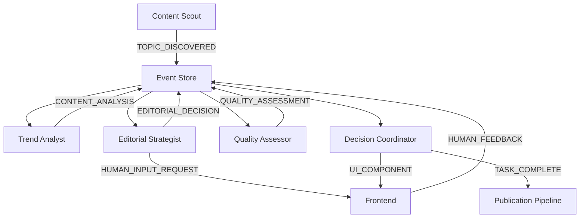

# PROJECT CONTEXT - AI Kolegium Redakcyjne

## 🚨 AKTUALNY STAN PROJEKTU (2025-08-05)

### 🔄 Aktualnie Realizowana Ścieżka: Container-First Transformation
- **Dokument**: `/kolegium/transformation/CONTAINER_FIRST_TRANSFORMATION_PLAN.md`
- **Faza**: 🔄 Faza 2 - Frontend Integration & Flow Diagnostics (IN PROGRESS)
- **Ostatnie Zadanie**: ✅ Task 2.2: Frontend Backend Switch (COMPLETED)
- **Commit**: `19dfe1950e3ef0f4d1a18235bdce517cf3bcf3be` (2025-08-05 21:09:42 +0200)
- **Następne**: Task 2.3: Human Review UI Integration (Faza 2)
- **Status**: TASK 2.2 UKOŃCZONA - Przyciski "Analizuj potencjał" działają!

### 🎉 Kluczowe Osiągnięcie
Zaimplementowano endpoint `/api/analyze-potential` z ultraszybką analizą contentu:
- Czas odpowiedzi: **1ms** (vs 2-3s w wymaganiach)
- Uproszczona implementacja bez zależności od AI agentów
- Działające przyciski "Analizuj potencjał" w UI
- Poprawiona konfiguracja portów (backend na 8003)

### 📊 Status Container-First Transformation
```yaml
Faza 0: Minimal Container Foundation ✅ COMPLETED
- [x] Zadanie 0.1: Minimalny kontener FastAPI
- [x] Zadanie 0.2: Docker Compose setup  
- [x] Zadanie 0.3: Pytest container tests

Faza 1: CrewAI Integration Container ✅ COMPLETED & VERIFIED
- [x] Zadanie 1.1: Research Agent Endpoint ✅
- [x] Zadanie 1.2: Writer Agent Endpoint ✅ (verified with OpenAI GPT-4)
- [x] Zadanie 1.3: Complete Flow Endpoint ✅ (verified 2025-08-05)
  - Pełny flow: routing → research → writing
  - Wszystkie testy przechodzą z prawdziwym API
  - Czasy wykonania: 20-50s (realistyczne)

Faza 2: CrewAI Flow Integration 🔄 IN PROGRESS (2/3)
- [x] Zadanie 2.1: Flow Diagnostics Endpoint ✅ (2025-08-05, verified)
  - Pełne śledzenie wykonania flow z diagnostyką
  - Agent decisions tracking i content loss metrics
  - Testy potwierdzają działanie z prawdziwym API
- [x] Zadanie 2.2: Frontend Backend Switch ✅ (2025-08-05, commit: 19dfe19)
  - Dodano endpoint /api/analyze-potential
  - Szybka analiza contentu (1ms response time)
  - Uproszczone audience scoring bez AI dependencies
  - Naprawiono konfigurację portów
- [ ] Zadanie 2.3: Human Review UI Integration

Faza 3: Production Container ⏳ PENDING
- [ ] Zadanie 3.1: Multi-stage Dockerfile
- [ ] Zadanie 3.2: Health checks & monitoring
- [ ] Zadanie 3.3: Environment configuration

Faza 4: Full Integration ⏳ PENDING
- [ ] Zadanie 4.1: Knowledge Base Integration
- [ ] Zadanie 4.2: Complete Flow Testing
- [ ] Zadanie 4.3: Documentation
```

## 🎯 Misja Projektu
Stworzenie inteligentnego systemu wspomagającego decyzje redakcyjne poprzez orkiestrację agentów AI z zachowaniem pełnej transparentności i kontroli przez człowieka.

## 🏗️ Architektura Systemu

### Paradygmat: CrewAI Flows + Event-Driven Architecture
- **CrewAI Flows** - deterministyczne decision-making zamiast basic Crews  
- **Knowledge Sources** - editorial guidelines jako Vector Database
- **4 Memory Types** - short-term, long-term, entity, contextual
- **Multi-LLM Setup** - OpenAI primary, Claude fallback
- **AG-UI Protocol** - real-time communication z frontend
- **Event Sourcing** - full audit trail wszystkich AI decisions

### Stack Technologiczny (Zaktualizowany 2025-08-03)
```yaml
AI Framework:
  - CrewAI 0.152.0 z CLI scaffolding ✅
  - CrewAI Flows dla decision trees ✅ 
  - Built-in tools (SerperDev, ScrapeWebsite, etc.) ✅
  - Knowledge Base integration (Vector DB) ✅
  - Enhanced Knowledge Tools z adapter pattern ✅
  - Multi-LLM setup (OpenAI primary) ✅

Knowledge Base:
  - Standalone KB service (port 8082) ✅
  - PostgreSQL + Redis + ChromaDB ✅
  - REST API z health monitoring ✅
  - Hybrid search strategies (KB_FIRST, FILE_FIRST, HYBRID) ✅
  - Circuit breaker pattern ✅

Backend:
  - Python 3.11 + FastAPI ✅
  - PostgreSQL (event store + crew memory) ✅
  - Redis (cache + AG-UI streams) ✅
  - AG-UI Protocol implementation 🔄
  - OpenTelemetry tracing 📋

Frontend:
  - React 18 + TypeScript 📋
  - CopilotKit integration 📋  
  - AG-UI WebSocket/SSE client 🔄
  - Real-time dashboard components 📋

Infrastructure:
  - Digital Ocean Droplet (46.101.156.14) ✅ [ACTIVE]
  - Docker Compose (dev & prod) ✅
  - GitHub Container Registry ✅
  - GitHub Actions CI/CD ✅
  - Watchtower auto-deployment ✅
  - Prometheus + Grafana monitoring ✅

Legenda: ✅ Done | 🔄 In Progress | 📋 Planned
```

### 📊 Stan Implementacji (2025-08-03)

**Phase 1: Foundation & Infrastructure** ✅ COMPLETED
- [x] Task 1.0: Digital Ocean setup - COMPLETED 2025-01-17
  - Droplet ID: 511009535, IP: 46.101.156.14
  - User: editorial-ai (SSH alias: crew)
  - Python venv: /home/editorial-ai/venv
- [x] Discovery: CrewAI scaffolding approach (2025-01-31)
  - Use `crewai create` instead of custom Clean Architecture
  - Built-in tools replace custom implementations  
  - CrewAI Flows for decision-making replace basic Crews
  - Knowledge Sources for editorial guidelines
- [x] Task 1.1: Knowledge Base integration - COMPLETED 2025-08-03
  - Standalone KB service w kontenerach Docker
  - Adapter pattern dla CrewAI tools
  - Enhanced Knowledge Tools z circuit breaker
  - Testy integracyjne przechodzą pomyślnie
- [x] Task 1.2: Docker containers setup - COMPLETED 2025-08-03
  - docker-compose.yml dla development
  - docker-compose.prod.yml dla produkcji
  - Konfiguracja wszystkich serwisów
- [x] Task 1.3: GitHub Actions CI/CD - COMPLETED 2025-08-03
  - Pełny pipeline CI/CD w .github/workflows/ci-cd.yml
  - Build i push do GitHub Container Registry
  - Automatyczny deployment przez Watchtower
- [ ] Task 1.4: AG-UI Event System integration

## 🎭 Agenci i ich Implementacja (CrewAI)

### 1. Content Scout (IMPLEMENTED)
**CrewAI Agent Configuration**:
- **Role**: "Content Scout"
- **Goal**: "Discover trending AI and tech topics with viral potential"
- **Tools**: SerperDevTool(), ScrapeWebsiteTool()
- **LLM**: GPT-4-turbo (temperature=0.1)
- **Memory**: Enabled (consistency across sessions)
- **Output**: Pydantic model TopicDiscovery

### 2. Trend Analyst (IMPLEMENTED)  
**CrewAI Agent Configuration**:
- **Role**: "Trend Analyst"
- **Goal**: "Analyze viral potential and engagement prediction"
- **Tools**: SerperDevTool(), Google Trends integration
- **LLM**: GPT-4 (temperature=0.2)
- **Memory**: Enabled
- **Output**: Pydantic model ViralAnalysis

### 3. Editorial Strategist (IMPLEMENTED)
**Implementation**: CrewAI Flow z conditional routing
- **Flow**: EditorialDecisionFlow

### AI Writing Flow Agents (IMPLEMENTED)

### 6. Research Agent (ENHANCED WITH KB)
**CrewAI Agent Configuration**:
- **Role**: "Senior Research Analyst"
- **Goal**: "Conduct thorough research on topics"
- **Tools**: 
  - read_source_files(), extract_sources(), research_web_sources()
  - search_crewai_knowledge() - Knowledge Base integration
  - get_flow_examples() - CrewAI pattern examples
  - troubleshoot_crewai() - Debugging assistance
- **Knowledge Base**: Full access to CrewAI documentation
- **Output**: ResearchResult model

### 7. Audience Mapper
**CrewAI Agent Configuration**:
- **Role**: "Audience Strategy Specialist"
- **Goal**: "Map content to target audiences"
- **Tools**: analyze_topic_fit(), generate_key_messages(), calibrate_tone()
- **Output**: AudienceAlignment model

### 8. Content Writer
**CrewAI Agent Configuration**:
- **Role**: "Senior Content Strategist & Writer"
- **Goal**: "Create compelling content following Vector Wave style"
- **Tools**: generate_hook(), extract_insights(), structure_content()
- **Output**: DraftContent model

### 9. Style Validator
**CrewAI Agent Configuration**:
- **Role**: "Editorial Style Guardian"
- **Goal**: "Ensure Vector Wave style compliance"
- **Tools**: check_forbidden_phrases(), validate_required_elements()
- **Output**: StyleValidation model

### 10. Quality Controller
**CrewAI Agent Configuration**:
- **Role**: "Chief Quality Officer"
- **Goal**: "Final quality assessment and fact-checking"
- **Tools**: fact_check_claims(), verify_code_examples(), check_controversy()
- **Output**: QualityAssessment model
- **Routing**: @router based on controversy_level
- **Human-in-the-Loop**: Native Flow support
- **Decision Tree**: approve/reject/human_review paths

### 4. Quality Assessor (PLANNED)
**CrewAI Agent Configuration**:
- **Tools**: Fact-checking APIs, source verification
- **Knowledge Source**: Editorial guidelines vector DB
- **Integration**: AG-UI events dla quality scores

### 5. Decision Coordinator (PLANNED - Flow Orchestrator)
**Implementation**: Main orchestration Flow
- **Coordinates**: All other agents via Flow system
- **Generates**: Dynamic UI components
- **Outputs**: Final editorial decisions + reports

## 🔄 Event Flow Architecture



## 📊 Kluczowe Metryki

### Business KPIs
- **Decision Accuracy**: >85% human approval rate
- **Time to Decision**: <5 minut od discovery do decision
- **Human Intervention Rate**: 15-25% (optimal dla controversial topics)
- **False Positive Rate**: <10% (topics rejected after analysis)

### Technical KPIs  
- **Event Processing Latency**: <100ms p95
- **WebSocket Connection Stability**: >99.5% uptime
- **Agent Response Time**: <2s dla standard queries
- **System Availability**: >99.9% excluding planned maintenance

### Quality KPIs
- **Code Coverage**: >80% dla core business logic
- **Deployment Frequency**: Multiple per day (small increments)
- **Mean Time to Recovery**: <15 minut
- **Change Failure Rate**: <5%

## 🚀 Deployment Strategy

### Container-First Approach
1. **Local Development**: Docker Compose z hot-reload
2. **CI Pipeline**: GitHub Actions → GitHub Container Registry
3. **Production**: Watchtower auto-deploy z ghcr.io
4. **Zero Manual Building**: Wszystko automatyczne

### Deployment Bloki
- **Blok 0-2**: Core infrastructure + basic AG-UI
- **Blok 3-5**: First agent (Content Scout) + tests
- **Blok 6-8**: Analytics agent + frontend integration  
- **Blok 9-11**: Human-in-the-loop workflow
- **Blok 12-14**: Quality assurance + orchestration
- **Blok 15-17**: Production hardening + monitoring

## 🔐 Security & Compliance

### Authentication & Authorization
- **JWT tokens** dla API access
- **Role-based access** (admin, editor, viewer)
- **Rate limiting** per user i per endpoint
- **CORS** properly configured

### Data Protection
- **Encryption at rest** dla sensitive data
- **TLS 1.3** dla all communications
- **PII anonymization** w event logs
- **GDPR compliance** dla EU users

## 🎯 Success Criteria

### Phase 1 (Foundation)
- [ ] AG-UI events flow end-to-end
- [ ] Basic Content Scout operational
- [ ] CI/CD pipeline delivers to production
- [ ] Monitoring dashboard shows key metrics

### Phase 2 (Multi-Agent)
- [ ] All 5 agents operational
- [ ] Human-in-the-loop workflow complete
- [ ] Event sourcing captures full audit trail
- [ ] Performance targets met

### Phase 3 (Production)
- [ ] Security hardening complete  
- [ ] Load testing passed (100 concurrent users)
- [ ] Documentation complete
- [ ] Training materials ready

## 🎨 Conventions

### Code Organization
```
src/
├── domains/           # Domain logic (DDD)
│   ├── content/
│   ├── analytics/
│   ├── editorial/
│   ├── quality/
│   └── orchestration/
├── infrastructure/    # External concerns
│   ├── agui/
│   ├── database/
│   ├── cache/
│   └── monitoring/
├── application/       # Use cases
└── interfaces/        # Controllers, DTOs
```

### Git Workflow
- **main** branch - production ready
- **develop** branch - integration
- **feature/** branches - atomic changes
- **hotfix/** branches - emergency fixes

### Commit Messages
```
feat(content): add RSS feed discovery
fix(agui): resolve WebSocket connection drops  
docs(readme): update deployment instructions
test(analytics): add viral potential scoring tests
```

## 🔧 Development Guidelines

### Agent Implementation Pattern
```python
class Agent(BaseAgent):
    async def execute(self, context: Context) -> AgentResult:
        # 1. Emit PROGRESS_UPDATE
        # 2. Perform core logic
        # 3. Emit domain-specific events
        # 4. Return structured result
```

### Event Handling Pattern
```python
@event_handler(AGUIEventType.TOPIC_DISCOVERED)
async def handle_topic_discovery(event: AGUIEvent):
    # 1. Validate event data
    # 2. Store in event store
    # 3. Trigger downstream processing
    # 4. Update read models
```

### Testing Strategy
- **Unit Tests**: Domain logic isolation
- **Integration Tests**: Agent communication
- **E2E Tests**: Full workflow scenarios
- **Performance Tests**: Load + stress testing

## 📈 Roadmap Overview (Zaktualizowany)

### Week 1-2: CrewAI Foundation
- ✅ CrewAI project scaffolding (`crewai create`)
- ✅ Content Scout + Trend Analyst agents
- 🔄 AG-UI event integration
- 📋 Docker containerization
- 📋 GitHub Actions CI/CD

### Week 3-4: Advanced Agents + Flows
- 📋 EditorialDecisionFlow implementation
- 📋 Human-in-the-loop workflows
- 📋 Knowledge Sources setup
- 📋 Quality Assessor agent
- 📋 React frontend dashboard

### Week 5-6: Production Features
- 📋 Decision Coordinator Flow
- 📋 Multi-LLM fallback setup
- 📋 4 memory types configuration
- 📋 Performance optimization
- 📋 Security hardening

### Week 7: Dynamic Agents
- 📋 Runtime agent creation
- 📋 Natural language agent parser
- 📋 Agent marketplace
- 📋 Full documentation
- 📋 Production deployment

---

**Kluczowe Principy (Zaktualizowane)**:
1. **CrewAI-First**: Scaffolding zamiast custom architecture
2. **Flows-First**: Deterministic decision trees zamiast autonomous agents
3. **Knowledge-First**: Vector DB z editorial guidelines
4. **Memory-First**: 4 typy pamięci dla consistency
5. **Human-First**: AI analizuje, człowiek decyduje przy kontrowersyjnych
6. **Event-First**: AG-UI Protocol dla real-time collaboration
7. **Container-First**: GitHub Container Registry + Watchtower auto-deploy