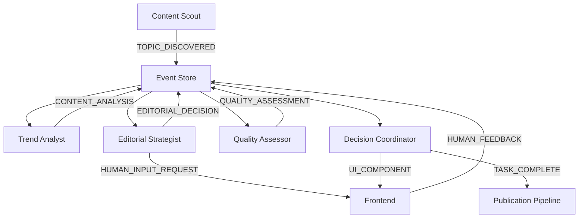

# PROJECT CONTEXT - AI Kolegium Redakcyjne

## 🎯 Misja Projektu
Stworzenie inteligentnego systemu wspomagającego decyzje redakcyjne poprzez orkiestrację agentów AI z zachowaniem pełnej transparentności i kontroli przez człowieka.

## 🏗️ Architektura Systemu

### Paradygmat: Event-Driven Microservices z Clean Architecture
- **AG-UI Protocol** - standardized event communication
- **CQRS + Event Sourcing** - pełna audytowalność decyzji
- **Domain-Driven Design** - rozdzielenie logiki biznesowej
- **Container-First** - zero lokalnego budowania
- **TDD** - test-driven development od początku

### Stack Technologiczny
```yaml
Backend:
  - Python 3.11 + FastAPI
  - CrewAI dla orchestracji agentów
  - AG-UI Protocol dla real-time communication
  - PostgreSQL (event store + read models)
  - Redis (cache + message broker)
  - OpenTelemetry (distributed tracing)

Frontend:
  - React 18 + TypeScript
  - CopilotKit dla AI interactions
  - AG-UI React hooks
  - Tailwind CSS
  - React Query (state management)

Infrastructure:
  - Digital Ocean Droplet (46.101.156.14)
  - Docker + Docker Compose
  - GitHub Container Registry (ghcr.io)
  - GitHub Actions (CI/CD)
  - Prometheus + Grafana (monitoring)
```

## 🎭 Agenci i ich Domeny

### 1. Content Discovery Domain
**Agent**: Content Scout
- **Rola**: Real-time topic discovery
- **Źródła**: RSS, social media, news APIs
- **Output**: TOPIC_DISCOVERED events

### 2. Analytics Domain  
**Agent**: Trend Analyst
- **Rola**: Viral potential assessment
- **Narzędzia**: Google Trends, sentiment analysis
- **Output**: CONTENT_ANALYSIS events

### 3. Editorial Strategy Domain
**Agent**: Editorial Strategist
- **Rola**: Human-in-the-loop decision making
- **Funkcje**: Controversy detection, editorial guidelines
- **Output**: HUMAN_INPUT_REQUEST, EDITORIAL_DECISION events

### 4. Quality Assurance Domain
**Agent**: Quality Assessor
- **Rola**: Fact-checking i source verification
- **Narzędzia**: Fact-checking APIs, plagiarism detection
- **Output**: QUALITY_ASSESSMENT events

### 5. Orchestration Domain
**Agent**: Decision Coordinator
- **Rola**: Multi-agent coordination
- **Funkcje**: Consensus building, report generation
- **Output**: UI_COMPONENT, TASK_COMPLETE events

## 🔄 Event Flow Architecture



## 📊 Kluczowe Metryki

### Business KPIs
- **Decision Accuracy**: >85% human approval rate
- **Time to Decision**: <5 minut od discovery do decision
- **Human Intervention Rate**: 15-25% (optimal dla controversial topics)
- **False Positive Rate**: <10% (topics rejected after analysis)

### Technical KPIs  
- **Event Processing Latency**: <100ms p95
- **WebSocket Connection Stability**: >99.5% uptime
- **Agent Response Time**: <2s dla standard queries
- **System Availability**: >99.9% excluding planned maintenance

### Quality KPIs
- **Code Coverage**: >80% dla core business logic
- **Deployment Frequency**: Multiple per day (small increments)
- **Mean Time to Recovery**: <15 minut
- **Change Failure Rate**: <5%

## 🚀 Deployment Strategy

### Container-First Approach
1. **Local Development**: Docker Compose z hot-reload
2. **CI Pipeline**: GitHub Actions → GitHub Container Registry
3. **Production**: Watchtower auto-deploy z ghcr.io
4. **Zero Manual Building**: Wszystko automatyczne

### Deployment Bloki
- **Blok 0-2**: Core infrastructure + basic AG-UI
- **Blok 3-5**: First agent (Content Scout) + tests
- **Blok 6-8**: Analytics agent + frontend integration  
- **Blok 9-11**: Human-in-the-loop workflow
- **Blok 12-14**: Quality assurance + orchestration
- **Blok 15-17**: Production hardening + monitoring

## 🔐 Security & Compliance

### Authentication & Authorization
- **JWT tokens** dla API access
- **Role-based access** (admin, editor, viewer)
- **Rate limiting** per user i per endpoint
- **CORS** properly configured

### Data Protection
- **Encryption at rest** dla sensitive data
- **TLS 1.3** dla all communications
- **PII anonymization** w event logs
- **GDPR compliance** dla EU users

## 🎯 Success Criteria

### Phase 1 (Foundation)
- [ ] AG-UI events flow end-to-end
- [ ] Basic Content Scout operational
- [ ] CI/CD pipeline delivers to production
- [ ] Monitoring dashboard shows key metrics

### Phase 2 (Multi-Agent)
- [ ] All 5 agents operational
- [ ] Human-in-the-loop workflow complete
- [ ] Event sourcing captures full audit trail
- [ ] Performance targets met

### Phase 3 (Production)
- [ ] Security hardening complete  
- [ ] Load testing passed (100 concurrent users)
- [ ] Documentation complete
- [ ] Training materials ready

## 🎨 Conventions

### Code Organization
```
src/
├── domains/           # Domain logic (DDD)
│   ├── content/
│   ├── analytics/
│   ├── editorial/
│   ├── quality/
│   └── orchestration/
├── infrastructure/    # External concerns
│   ├── agui/
│   ├── database/
│   ├── cache/
│   └── monitoring/
├── application/       # Use cases
└── interfaces/        # Controllers, DTOs
```

### Git Workflow
- **main** branch - production ready
- **develop** branch - integration
- **feature/** branches - atomic changes
- **hotfix/** branches - emergency fixes

### Commit Messages
```
feat(content): add RSS feed discovery
fix(agui): resolve WebSocket connection drops  
docs(readme): update deployment instructions
test(analytics): add viral potential scoring tests
```

## 🔧 Development Guidelines

### Agent Implementation Pattern
```python
class Agent(BaseAgent):
    async def execute(self, context: Context) -> AgentResult:
        # 1. Emit PROGRESS_UPDATE
        # 2. Perform core logic
        # 3. Emit domain-specific events
        # 4. Return structured result
```

### Event Handling Pattern
```python
@event_handler(AGUIEventType.TOPIC_DISCOVERED)
async def handle_topic_discovery(event: AGUIEvent):
    # 1. Validate event data
    # 2. Store in event store
    # 3. Trigger downstream processing
    # 4. Update read models
```

### Testing Strategy
- **Unit Tests**: Domain logic isolation
- **Integration Tests**: Agent communication
- **E2E Tests**: Full workflow scenarios
- **Performance Tests**: Load + stress testing

## 📈 Roadmap Overview

### Week 1-2: Foundation
- Clean Architecture setup
- AG-UI event system
- CI/CD pipeline
- Basic monitoring

### Week 3-4: Core Agents
- Content Scout implementation
- Trend Analyst with analytics
- Event sourcing setup
- Frontend dashboard

### Week 5-6: Advanced Features  
- Human-in-the-loop workflow
- Quality assessment
- Multi-agent orchestration
- Generative UI components

### Week 7: Production
- Security hardening
- Performance optimization  
- Documentation
- Go-live preparation

---

**Kluczowe Principy**:
1. **Event-First**: Wszystko komunikuje się przez eventy
2. **Container-First**: Zero lokalnego budowania
3. **Test-First**: TDD od pierwszej linii kodu
4. **Human-First**: AI wspomaga, człowiek decyduje
5. **Transparency-First**: Pełna audytowalność procesów