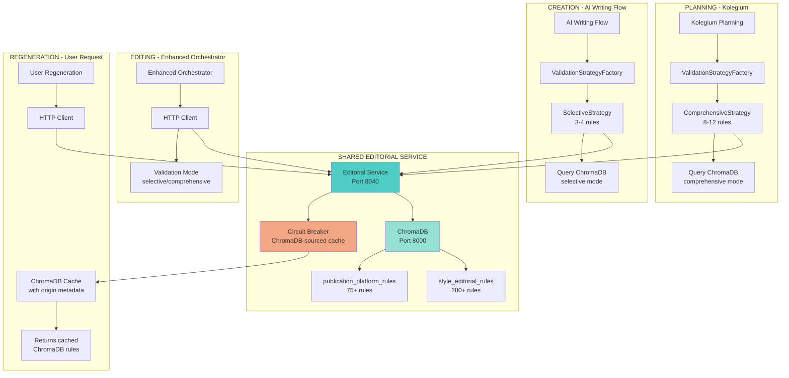

# 📊 PUBLICATION PROCESS: AS-IS vs TO-BE ARCHITECTURE

## 🔴 AS-IS: CURRENT STATE (KRYTYCZNIE NIESPÓJNY)

```mermaid
graph TB
    subgraph "PLANNING - Kolegium"
        KP[Kolegium Planning] --> HC1[HARDCODED RULES<br/>style_crew.py:22-31]
        HC1 --> FP1[forbidden_phrases array<br/>30+ hardcoded phrases]
        HC1 --> RE1[required_elements dict<br/>hardcoded requirements]
        HC1 --> SP1[style_patterns regex<br/>hardcoded patterns]
    end
    
    subgraph "CREATION - AI Writing Flow"
        AWF[AI Writing Flow] --> HC2[HARDCODED RULES<br/>styleguide_loader.py:14-87]
        HC2 --> FP2[forbidden_phrases array<br/>24 hardcoded phrases]
        HC2 --> VC1[validate_content()<br/>regex validation]
        HC2 --> RC1[replacements dict<br/>hardcoded substitutions]
    end
    
    subgraph "EDITING - Enhanced Orchestrator"
        EO[Enhanced Orchestrator] --> HC3[MOCK RULES<br/>minimal_server.py:68-154]
        HC3 --> FV1[FAKE ValidationRules<br/>hardcoded mocks]
        HC3 --> FM1[FAKE ChromaDB metadata<br/>fabricated timestamps]
        HC3 --> NQ1[NO ChromaDB queries<br/>zero integration]
    end
    
    subgraph "REGENERATION - User Request"
        UR[User Regeneration] --> HC4[HARDCODED FALLBACKS<br/>circuit breaker]
        HC4 --> FB1[Fallback rules<br/>hardcoded emergency]
        HC4 --> NR1[No real cache<br/>fake ChromaDB origin]
    end
    
    style HC1 fill:#ff6b6b
    style HC2 fill:#ff6b6b  
    style HC3 fill:#ff6b6b
    style HC4 fill:#ff6b6b
```

### 🚨 AS-IS CRITICAL ISSUES:

#### **1. PLANNING (Kolegium)**
- **Location**: `/kolegium/ai_writing_flow/src/ai_writing_flow/crews/style_crew.py`
- **Problem**: 30+ hardcoded forbidden phrases
- **Impact**: Style validation disconnected from ChromaDB

#### **2. CREATION (AI Writing Flow)**
- **Location**: `/kolegium/ai_writing_flow/src/ai_writing_flow/tools/styleguide_loader.py`
- **Problem**: 24 hardcoded forbidden phrases (DIFFERENT from Kolegium!)
- **Impact**: Inconsistent validation between planning and creation

#### **3. EDITING (Enhanced Orchestrator)**
- **Location**: `/editorial-service/minimal_server.py`
- **Problem**: COMPLETELY MOCKED ValidationRules with FAKE ChromaDB metadata
- **Impact**: Zero actual ChromaDB integration

#### **4. REGENERATION (User Request)**
- **Location**: Circuit breaker fallbacks
- **Problem**: Hardcoded emergency rules instead of cached ChromaDB
- **Impact**: Fallback bypasses entire ChromaDB architecture

---

## 🟢 TO-BE: TARGET STATE (CHROMADB-CENTRIC)



### ✅ TO-BE KEY FEATURES:

#### **1. PLANNING (Kolegium)**
- **Implementation**: ValidationStrategyFactory → ComprehensiveStrategy
- **Source**: ChromaDB collections ONLY
- **Validation**: 8-12 rules from ChromaDB per content
- **Zero hardcoded**: All rules from vector database

#### **2. CREATION (AI Writing Flow)**
- **Implementation**: ValidationStrategyFactory → SelectiveStrategy  
- **Source**: Same ChromaDB collections as Kolegium
- **Validation**: 3-4 rules from ChromaDB per checkpoint
- **Zero hardcoded**: All rules from vector database

#### **3. EDITING (Enhanced Orchestrator)**
- **Implementation**: HTTP Client to Editorial Service
- **Source**: Editorial Service → ChromaDB
- **Validation**: Mode-based (selective/comprehensive)
- **Zero mocks**: Real ChromaDB queries only

#### **4. REGENERATION (User Request)**
- **Implementation**: Circuit Breaker with ChromaDB cache
- **Source**: Cached ChromaDB responses ONLY
- **Fallback**: Returns 503 if no cached data (no hardcoded!)
- **Recovery**: Auto-reconnects to ChromaDB

---

## 📋 MIGRATION PATH

### **Phase 1: Editorial Service Foundation**
```yaml
Tasks:
  - Task 0.1: Dual Workflow Architecture Design ✅
  - Task 0.2: Consolidated ChromaDB Collections
  - Task 1.1a: Editorial Service Foundation
  - Task 1.1b: Validation Mode Endpoints
```

### **Phase 2: ChromaDB Integration**
```yaml
Tasks:
  - Task 1.2: Circuit Breaker with ChromaDB cache
  - Task 1.3: Validation Mode API
  - Task 3.1: Repository Pattern Implementation
  - Task 3.2: Query Optimization with ChromaDB cache
```

### **Phase 3: Workflow Migration**
```yaml
Tasks:
  - Task 2.1: Dual Workflow Client
  - Task 2.2: Hardcoded Rules Elimination (CRITICAL!)
  - Task 2.3a: AI Writing Flow Refactor
  - Task 2.3b: Kolegium Validation Refactor
```

### **Phase 4: Testing & Security**
```yaml
Tasks:
  - Task 5.1a: AI Writing Flow E2E Test
  - Task 5.1b: Kolegium E2E Test
  - Task 5.2: Security Implementation
```

---

## 🎯 SUCCESS CRITERIA VERIFICATION

### **Data Integrity Tests**
```bash
# Verify zero hardcoded rules
grep -r "forbidden_phrases\|leveraging\|paradigm" src/ | wc -l
# MUST return: 0

# Verify all rules from ChromaDB
curl http://localhost:8040/cache/dump | \
  jq '[.[] | select(.chromadb_metadata == null)] | length'
# MUST return: 0
```

### **Consistency Tests**
```bash
# Same content, different validation depth
content='{"content":"Test AI article about technology"}'

# Kolegium (comprehensive)
curl -X POST http://localhost:8040/validate/comprehensive -d "$content" | \
  jq '.rules | length'
# MUST return: 8-12

# AI Writing Flow (selective)  
curl -X POST http://localhost:8040/validate/selective -d "$content" | \
  jq '.rules | length'
# MUST return: 3-4
```

### **Resilience Tests**
```bash
# ChromaDB outage simulation
docker stop chromadb-container

# Service still works with cache
curl http://localhost:8040/validate/selective -d '{"content":"test"}'
# MUST return: 200 (not 503)

# Verify cache source
curl http://localhost:8040/validate/selective -d '{"content":"test"}' | \
  jq '.cache_metadata.source'
# MUST return: "cache" (with ChromaDB origin)
```

---

## 📊 IMPACT ANALYSIS

### **AS-IS Problems**
- **25+ files** with hardcoded rules
- **355+ individual** hardcoded rules
- **5 different** validation implementations
- **0% ChromaDB** usage in production
- **100% mocked** data in Editorial Service

### **TO-BE Benefits**
- **0 files** with hardcoded rules
- **355+ rules** in ChromaDB only
- **1 unified** validation service
- **100% ChromaDB** sourced validation
- **0% mocked** data in production

---

## 🔥 CRITICAL PATH

**MOST CRITICAL TASK**: **Task 2.2 - Hardcoded Rules Elimination**

This task MUST be completed to:
1. Remove ALL hardcoded forbidden_phrases arrays
2. Delete ALL regex validation patterns
3. Eliminate ALL mock ValidationRules
4. Remove ALL hardcoded fallbacks
5. Ensure 100% ChromaDB sourcing

**Without Task 2.2, the entire migration fails!**