# User Vision Architecture Diagram - Vector Wave Content System

## 🎯 Architecture Based on User Sketch

```mermaid
flowchart TD
    %% User Input & Ideas
    User[👤 User] --> IdeaBank[💡 Idea Bank<br/>Content Ideas]
    
    %% Shared Knowledge Base
    IdeaBank --> KB[🗄️ Knowledge Base<br/>ChromaDB Research]
    
    %% Single Writer Agent with Two Interaction Modes
    KB --> WriterAgent[🤖 Writer Agent<br/>Content Generation Core]
    
    %% Two Interaction Patterns
    WriterAgent --> AIMode[🚀 AI-First Mode<br/>Autonomous Execution]
    WriterAgent --> HumanMode[👨‍💻 Human-Assisted Mode<br/>Interactive Checkpoints]
    
    %% Editorial Service - Central Validation Hub
    AIMode --> ES[⚖️ Editorial Service<br/>355+ Rules ChromaDB]
    HumanMode --> ES
    ES --> AIMode
    ES --> HumanMode
    
    %% Style & Quality Processing
    ES --> StyleAgent[🎨 Style Agent<br/>Style Validation]
    ES --> HumanReview[👨‍💻 Human Review<br/>Checkpoints]
    
    %% Quality Control
    StyleAgent --> QualityAgent[✅ Quality Agent<br/>Final QA]
    HumanReview --> QualityAgent
    
    %% AI Assistant Chat Integration
    QualityAgent --> AIChat[💬 AI Assistant Chat<br/>Interactive Editing]
    AIChat --> QualityAgent
    
    %% Publishing Orchestration
    QualityAgent --> PublishOrch[🚀 Publisher Orchestrator<br/>Multi-Platform]
    
    %% Platform Adapters
    PublishOrch --> SubstackAdapt[📧 Substack Adapter]
    PublishOrch --> TwitterAdapt[🐦 Twitter Adapter]
    PublishOrch --> BeehiivAdapt[📬 Beehiiv Adapter]
    PublishOrch --> GhostAdapt[👻 Ghost Adapter]
    
    %% Scheduling & Publication
    SubstackAdapt --> Schedule[📅 Scheduling Service<br/>Publication Timeline]
    TwitterAdapt --> Schedule
    BeehiivAdapt --> Schedule
    GhostAdapt --> Schedule
    
    %% User Accepts/Rejects Feedback Loop
    Schedule --> UserAccept{👤 User Accepts<br/>Publication?}
    UserAccept --> |✅ Accept| Publication[📢 Publication<br/>Multi-Channel]
    UserAccept --> |❌ Reject| AIChat
    
    %% Style Patterns & Analytics
    Publication --> Analytics[📊 Analytics<br/>User Topics]
    Analytics --> StylePatterns[🎯 Style Patterns<br/>Topic Optimization]
    StylePatterns --> ES
    
    %% Styling
    classDef user fill:#e3f2fd,stroke:#1976d2,stroke-width:3px,color:#000
    classDef knowledge fill:#f3e5f5,stroke:#7b1fa2,stroke-width:2px,color:#000
    classDef creation fill:#e8f5e8,stroke:#388e3c,stroke-width:2px,color:#000
    classDef validation fill:#fff3e0,stroke:#f57c00,stroke-width:3px,color:#000
    classDef quality fill:#fce4ec,stroke:#c2185b,stroke-width:2px,color:#000
    classDef publishing fill:#e0f2f1,stroke:#00695c,stroke-width:2px,color:#000
    classDef platform fill:#f1f8e9,stroke:#689f38,stroke-width:2px,color:#000
    classDef feedback fill:#e8eaf6,stroke:#3f51b5,stroke-width:2px,color:#000
    
    class User,UserAccept user
    class IdeaBank,KB knowledge
    class WriterPath,WriterAgent,DraftGen creation
    class ES validation
    class StyleAgent,HumanReview,QualityAgent,AIChat quality
    class PublishOrch publishing
    class SubstackAdapt,TwitterAdapt,BeehiivAdapt,GhostAdapt platform
    class Schedule,Publication,Analytics,StylePatterns feedback
```



## 🔄 Key Architecture Insights from User Vision

### **1. Central Editorial Service Hub**
- **Single validation point** for all content (Writer Agent + Draft Generator)
- **Bidirectional communication** - both query rules AND get validated
- **355+ rules from ChromaDB** applied consistently across both paths

### **2. Single Writer Agent with Dual Interaction Modes**
- **AI-First Mode**: Autonomous execution - Writer Agent runs independently
- **Human-Assisted Mode**: Interactive checkpoints - Writer Agent pauses for human input
- **Same core engine** - identical content generation, different interaction patterns

### **3. User Feedback Loop Integration** 
- **AI Assistant Chat** enables interactive editing at quality stage
- **User Accept/Reject** decision point before publication
- **Rejection loops back** to AI Chat for refinement

### **4. Style Pattern Learning**
- **Analytics** track what user accepts/rejects
- **Style Patterns** learn user preferences
- **Feedback to Editorial Service** improves future validation

### **5. Unified Publishing Pipeline**
- **Single Orchestrator** handles all platforms
- **Scheduling Service** coordinates publication timing
- **Multi-channel output** from unified quality source

## 📊 Data Flow Analysis

### **Content Creation Flow**
```
User → Idea Bank → Knowledge Base → Writer Agent 
    ↓ (mode selection)
[AI-First Mode OR Human-Assisted Mode]
    ↕ (bidirectional validation)
Editorial Service (ChromaDB 355+ rules) 
    ↓
Style Agent/Human Review → Quality Agent → AI Chat → User Decision
```

### **Validation & Quality Flow**
```
Content → Editorial Service ↔ ChromaDB (comprehensive rules)
    ↓
[Style Agent (AI path) OR Human Review (assisted path)]
    ↓  
Quality Agent → AI Assistant Chat → User Accept/Reject
```

### **Publishing & Learning Flow**
```
Approved Content → Publisher Orchestrator → Platform Adapters → Scheduling
    ↓
Publication → Analytics → Style Patterns → Editorial Service (learning loop)
```

## 🎯 Key Architectural Advantages

### **Unified Validation Architecture**
- **Single source of truth**: Editorial Service with ChromaDB rules
- **Consistent quality**: Both paths use identical comprehensive validation  
- **No dual-mode complexity**: Same rules, different presentation modes

### **User-Centric Design**
- **Interactive editing**: AI Chat enables real-time content refinement
- **Accept/reject workflow**: User maintains final control
- **Learning system**: Style patterns adapt to user preferences

### **Scalable Publishing**
- **Multi-platform support**: 4+ adapters with unified orchestration
- **Scheduling coordination**: Centralized timeline management
- **Analytics feedback**: Data-driven content optimization

### **Bidirectional Data Flow**
- **Editorial Service**: Both queries rules AND validates content
- **AI Chat**: Both receives content AND provides edited versions
- **User Decision**: Both accepts content AND provides rejection feedback

## 🔧 Implementation Architecture Map

| Component | Path | Function | Key Feature |
|-----------|------|----------|-------------|
| **Editorial Service** | `editorial-service/` | Central validation hub | **Bidirectional API** |
| **Writer Agent** | `kolegium/crews/writer_crew.py` | **Core content generation** | **Dual mode: autonomous + interactive** |
| **AI-First Mode** | `writer_crew.py` (autonomous) | Autonomous execution | **CrewAI independent run** |
| **Human-Assisted Mode** | `writer_crew.py` (interactive) | Checkpoint-driven | **CrewAI with human gates** |
| **AI Assistant** | `kolegium/assistant/` | Interactive editing | **User feedback loop** |
| **Publisher Orchestrator** | `publisher/orchestrator/` | Multi-platform coord | **Unified publishing** |
| **Analytics** | `monitoring/analytics/` | User preference tracking | **Style pattern learning** |

## 💡 User Vision Advantages

### **Simplified Mental Model**
- Content flows through **one validation service**
- User has **one interaction point** (AI Chat + Accept/Reject)  
- All platforms handled by **one publishing system**

### **Quality Consistency**
- **Same 355+ rules** applied to both AI and human-assisted paths
- **No quality compromise** between different workflows
- **Learning system** improves over time based on user feedback

### **Flexible Content Creation**
- Choose **AI-first** for speed and automation
- Choose **human-assisted** for control and creativity
- **Same final quality** regardless of path chosen

---

**Architecture Philosophy**: Single validation hub, parallel creation paths, unified publishing pipeline, continuous user feedback learning loop.