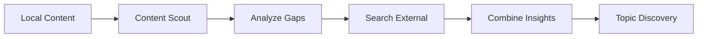

# Local Content Integration Guide

## 🎯 Overview

AI Kolegium Redakcyjne teraz może czytać i analizować lokalne pliki z folderu `/content/raw`, łącząc istniejącą wiedzę z nowymi trendami.

## 📁 Struktura folderów

```
/Users/hretheum/dev/bezrobocie/vector-wave/content/
└── raw/                         # Surowe pomysły i materiały
    ├── 2025-07-27-ai-agents/   # Folder tematyczny
    │   ├── README.md           # Główny dokument
    │   ├── twitter-thread.md   # Content na różne platformy
    │   ├── linkedin-post.md
    │   └── technical-details.md
    └── 2025-07-31-adhd-ideas/  # Inny temat
        └── ...
```

## 🛠️ Komponenty

### 1. LocalContentReaderTool
Czyta wszystkie pliki markdown z folderu i zwraca:
- Tytuł i preview
- Pełną treść
- Metadane (data utworzenia, liczba słów)
- Liczbę data points (metryki, procenty, kwoty)

### 2. ContentAnalyzerTool
Analizuje przeczytane treści pod kątem:
- Typów content (Twitter, LinkedIn, technical)
- Częstotliwości tematów
- Treści bogatych w dane
- Luk w pokryciu tematów

## 🔄 Workflow integracji



## 🚀 Jak używać

### 1. Podstawowe użycie
```bash
cd ai_kolegium_redakcyjne
python src/ai_kolegium_redakcyjne/main.py
```

### 2. Test integracji
```bash
python test_local_content.py
```

### 3. Własna ścieżka do content
```python
inputs = {
    'categories': ['AI', 'Technology'],
    'current_date': datetime.now().strftime("%Y-%m-%d"),
    'content_source_path': '/your/custom/path'
}
```

## 📋 Reguły styleguide w akcji

Content Scout automatycznie stosuje reguły:

1. **3+ źródła** - lokalne pliki liczą się jako źródła
2. **Konkretne metryki** - wyciąga liczby z lokalnych plików
3. **Forbidden phrases** - filtruje "revolutionary", "game-changing"
4. **Data tracking** - zapisuje skąd pochodzi każda informacja

## 📊 Przykład output

```json
{
  "topic_id": "tech_20250801_001",
  "title": "ADHD jako przewaga w AI development",
  "source": "local_content:/content/raw/2025-07-31-adhd-ideas/README.md",
  "category": "Productivity",
  "data_points": [
    "1000 pomysłów na minutę",
    "7 różnych projektów",
    "27 workflow'ów n8n"
  ],
  "local_content_enhanced": true
}
```

## 🎯 Best Practices

1. **Organizacja folderów**: YYYY-MM-DD-topic-name
2. **Nazwy plików**: opisowe (twitter-thread.md, technical-details.md)
3. **Metadane**: używaj YAML front matter lub JSON blocks
4. **Data points**: zawsze podawaj konkretne liczby

## 🔧 Troubleshooting

### Problem: "No content found"
- Sprawdź ścieżkę: `/content/raw`
- Upewnij się, że są pliki .md

### Problem: "Low data points"
- Dodaj więcej metryk do plików
- Używaj konkretnych liczb, nie "many" czy "significant"

### Problem: "Tools not available"
- Sprawdź import: `from .tools import create_local_content_tools`
- Upewnij się, że __init__.py istnieje w /tools

## 🚦 Co dalej?

1. **Automatyczny watcher** - monitoruj zmiany w /content/raw
2. **Semantic search** - vector DB dla lepszego wyszukiwania
3. **Version tracking** - śledź które wersje były użyte
4. **Performance metrics** - które lokalne źródła generują najlepszy content

---

💡 **Pro tip**: Używaj lokalnych plików jako "seed content" - AI będzie budować na twojej istniejącej wiedzy, zamiast zaczynać od zera.