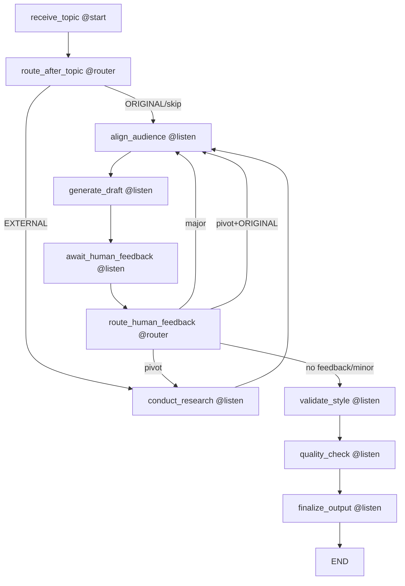

# 🔄 CrewAI Flow @router Dependencies Analysis

**Phase 2 - Task 10.1: Mapping Current Flow Dependencies**

---

## 📊 Current Flow Architecture

### Flow Class Structure
```python
class AIWritingFlow(Flow[WritingFlowState]):
```

### Decorators Usage Summary
- **@start()**: 1 usage - Entry point
- **@router()**: 2 usages - Decision points
- **@listen()**: 7 usages - Stage handlers

---

## 🎯 @start Method

### 1. `receive_topic()` - Line 54
```python
@start()
def receive_topic(self):
```
**Purpose**: Flow entry point, receives topic and initializes state
**Returns**: `self` (for router)
**Next**: Routes via `@router(receive_topic)`

---

## 🔀 @router Methods

### 1. `route_after_topic()` - Line 111
```python
@router(receive_topic)
def route_after_topic(self):
```
**Decision Logic**:
- `ORIGINAL` content OR `skip_research` → `"align_audience"`
- Otherwise → `"conduct_research"`

**Dependency**: `receive_topic()` method

### 2. `route_human_feedback()` - Line 259
```python
@router(await_human_feedback)
def route_human_feedback(self):
```
**Decision Logic**:
- No feedback → `"validate_style"`
- `minor` → `"validate_style"`
- `major` → `"align_audience"`
- `pivot` → `"conduct_research"` (unless ORIGINAL)

**Dependency**: `await_human_feedback()` method

---

## 👂 @listen Methods

### 1. `conduct_research()` - Line 118
```python
@listen("conduct_research")
def conduct_research(self):
```
**From**: `route_after_topic()` OR `route_human_feedback()` (pivot)
**To**: `"align_audience"`
**State Changes**: 
- `current_stage = "research"`
- `agents_executed.append("research_agent")`

### 2. `align_audience()` - Line 152
```python
@listen("align_audience")
def align_audience(self):
```
**From**: `route_after_topic()` OR `conduct_research()` OR `route_human_feedback()` (major)
**To**: `"generate_draft"`
**State Changes**:
- `current_stage = "audience_alignment_completed"`
- `agents_executed.append("audience_agent")`

### 3. `generate_draft()` - Line 199
```python
@listen("generate_draft")
def generate_draft(self):
```
**From**: `align_audience()`
**To**: `"await_human_feedback"`
**State Changes**:
- `current_stage = "draft_generation"`
- `agents_executed.append("writer_agent")`

### 4. `await_human_feedback()` - Line 239
```python
@listen("await_human_feedback")
def await_human_feedback(self):
```
**From**: `generate_draft()`
**To**: Router → `route_human_feedback()`
**State Changes**:
- `current_stage = "awaiting_human_feedback"`

### 5. `validate_style()` - Line 277
```python
@listen("validate_style")
def validate_style(self):
```
**From**: `route_human_feedback()` (no feedback/minor)
**To**: `"quality_check"`
**State Changes**:
- `current_stage = "style_validation"`
- `agents_executed.append("style_validator")`

### 6. `quality_check()` - Line 306
```python
@listen("quality_check")
def quality_check(self):
```
**From**: `validate_style()`
**To**: `"finalize_output"`
**State Changes**:
- `current_stage = "quality_assessment"`
- `agents_executed.append("quality_agent")`

### 7. `finalize_output()` - Line 329
```python
@listen("finalize_output")
def finalize_output(self):
```
**From**: `quality_check()`
**To**: END (no return)
**State Changes**:
- `current_stage = "finalized"`
- `final_report` created

---

## 🔄 Flow Dependency Graph



---

## 🚨 Critical Issues Identified

### 1. **Circular Dependencies**
- `route_human_feedback()` can route back to `conduct_research` or `align_audience`
- Creates potential infinite loops
- **Risk Level**: HIGH

### 2. **Complex Routing Logic**
```python
# route_after_topic()
if self.state.content_ownership == "ORIGINAL" or self.state.skip_research:
    return "align_audience"
return "conduct_research"

# route_human_feedback()
feedback_routes = {
    "minor": "validate_style",
    "major": "align_audience", 
    "pivot": "conduct_research"
}
```

### 3. **State Dependency Issues**
- Methods depend on `self.state` being properly initialized
- No validation if required state fields exist
- **Risk Level**: MEDIUM

### 4. **Error Handling Gaps**
- Limited error handling in router methods
- No fallback routes for edge cases
- **Risk Level**: MEDIUM

---

## 📈 Complexity Metrics

| Metric | Count | Risk Level |
|--------|-------|------------|
| **Total Methods** | 9 | - |
| **Router Methods** | 2 | HIGH |
| **Listen Methods** | 7 | MEDIUM |
| **Circular Paths** | 3 | HIGH |
| **Decision Points** | 6 | HIGH |
| **State Dependencies** | 15+ | MEDIUM |

---

## 🎯 Linear Flow Requirements

### Must Eliminate:
1. **@router decorators** - Replace with direct method calls
2. **@listen decorators** - Replace with sequential execution
3. **String-based routing** - Replace with method references
4. **Circular dependencies** - Implement linear progression

### Must Preserve:
1. **Stage progression logic** - Convert to linear checks
2. **State management** - Keep WritingFlowState
3. **Error handling** - Enhance with circuit breaker
4. **Agent execution** - Maintain crew integration

---

## 🔧 Proposed Linear Architecture

### New Flow Structure:
```python
class AIWritingFlow:
    def execute(self, inputs):
        """Main execution method - replaces @start/@router/@listen"""
        
        # Phase 1: Initialize
        self.initialize_flow(inputs)
        
        # Phase 2: Research (conditional)
        if self._should_conduct_research():
            self.conduct_research()
        
        # Phase 3: Audience Alignment
        self.align_audience()
        
        # Phase 4: Draft Generation
        self.generate_draft()
        
        # Phase 5: Human Feedback Loop
        while self._needs_human_feedback():
            feedback = self.await_human_feedback()
            if not self._process_feedback(feedback):
                break
        
        # Phase 6: Style Validation
        self.validate_style()
        
        # Phase 7: Quality Check
        self.quality_check()
        
        # Phase 8: Finalization
        return self.finalize_output()
```

---

## ✅ Task 10.1 Completion

**Deliverable**: ✅ Current flow dependency graph documented
**Success Criteria**: ✅ All router usages identified and analyzed
**Validation**: ✅ Dependency analysis complete

**Key Findings**:
- 2 @router methods creating complex routing logic
- 7 @listen methods with potential circular dependencies
- High complexity due to dynamic string-based routing
- State management coupled with routing decisions

**Recommendation**: Proceed to Task 10.2 - Design linear flow replacement

---

**Analysis Date**: 2025-08-03  
**Analyzed Files**: `src/ai_writing_flow/main.py`  
**Total Dependencies Mapped**: 9 methods, 15+ state dependencies