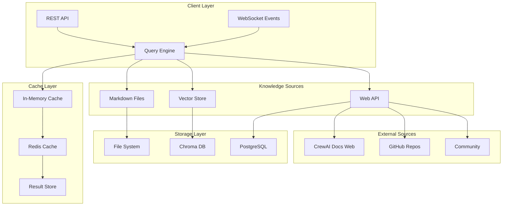
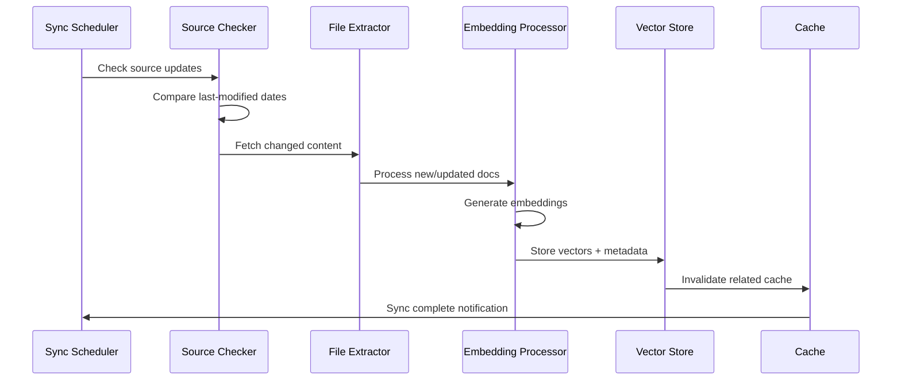
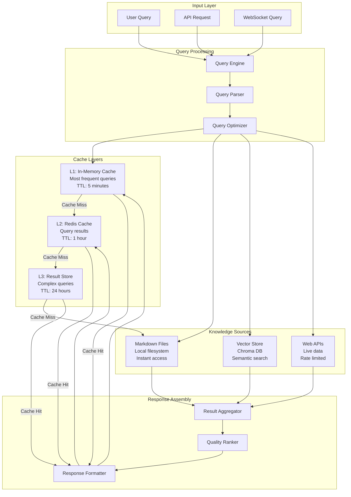

# Hybrydowa Baza Wiedzy CrewAI - Architektura Systemu

## 📊 Executive Summary

Projekt hybrydowej bazy wiedzy CrewAI dla Vector Wave zapewnia kompletny system zarządzania wiedzą o CrewAI z wykorzystaniem wielowarstwowej architektury cache + vector store + markdown + web API. System jest zaprojektowany dla 99% availability i query latency <100ms (cached), <500ms (uncached).

## 🎯 Główne Funkcjonalności

- **Hybrid Data Sources**: Lokalne pliki Markdown + Web API + Vector Store
- **Intelligent Caching**: Redis + In-Memory dla szybkich odpowiedzi
- **Vector Search**: Chroma DB z semantic similarity search
- **Offline Support**: Pełna funkcjonalność bez połączenia internetowego
- **Auto-Sync**: Automatyczne aktualizacje z oficjalnej dokumentacji CrewAI
- **Query Engine**: Unified interface z fall-back mechanisms

## 🏗️ Architektura Systemu



## 📁 Struktura Folderów

```
knowledge-base/
├── ARCHITECTURE.md                 # Ten dokument
├── config/
│   ├── chroma_config.yaml         # Konfiguracja Chroma DB
│   ├── redis_config.yaml          # Konfiguracja Redis
│   ├── sources_config.yaml        # Konfiguracja źródeł danych
│   └── query_engine_config.yaml   # Konfiguracja Query Engine
├── docs/
│   ├── crewai-official/           # Oficjalna dokumentacja (sync)
│   │   ├── installation/
│   │   ├── core-concepts/
│   │   ├── how-to-guides/
│   │   ├── tools/
│   │   ├── llms/
│   │   ├── memory/
│   │   ├── planning/
│   │   └── flows/
│   ├── known-issues/              # Znane problemy i rozwiązania
│   │   ├── installation-issues.md
│   │   ├── memory-problems.md
│   │   ├── tool-conflicts.md
│   │   └── performance-issues.md
│   ├── patterns/                  # Best practices i wzorce
│   │   ├── agent-design/
│   │   ├── task-orchestration/
│   │   ├── error-handling/
│   │   └── testing/
│   └── vector-wave-specific/      # Nasza implementacja
│       ├── editorial-agents.md
│       ├── decision-flows.md
│       └── integration-guide.md
├── src/
│   ├── __init__.py
│   ├── knowledge_engine.py        # Główny Query Engine
│   ├── cache/
│   │   ├── __init__.py
│   │   ├── memory_cache.py        # In-memory caching
│   │   ├── redis_cache.py         # Redis caching
│   │   └── cache_manager.py       # Cache orchestration
│   ├── sources/
│   │   ├── __init__.py
│   │   ├── markdown_source.py     # Markdown file reader
│   │   ├── vector_source.py       # Vector DB queries
│   │   ├── web_source.py          # Web API calls
│   │   └── hybrid_source.py       # Combined sources
│   ├── storage/
│   │   ├── __init__.py
│   │   ├── chroma_client.py       # Chroma DB integration
│   │   ├── postgres_client.py     # PostgreSQL for metadata
│   │   └── file_manager.py        # File system operations
│   ├── sync/
│   │   ├── __init__.py
│   │   ├── docs_scraper.py        # CrewAI docs scraping
│   │   ├── github_sync.py         # GitHub issues/discussions
│   │   ├── community_sync.py      # Community content
│   │   └── sync_scheduler.py      # Scheduled updates
│   ├── api/
│   │   ├── __init__.py
│   │   ├── routes.py              # FastAPI endpoints
│   │   ├── websocket.py           # WebSocket handlers
│   │   └── middleware.py          # Request/response middleware
│   └── utils/
│       ├── __init__.py
│       ├── embeddings.py          # Embedding generation
│       ├── text_processing.py     # Text preprocessing
│       └── validation.py          # Input validation
├── tests/
│   ├── __init__.py
│   ├── test_cache.py
│   ├── test_sources.py
│   ├── test_query_engine.py
│   ├── test_sync.py
│   └── integration/
│       ├── test_end_to_end.py
│       └── test_performance.py
├── scripts/
│   ├── initial_sync.py            # Pierwszy sync danych
│   ├── update_embeddings.py       # Aktualizacja embeddings
│   ├── cache_warmup.py            # Rozgrzewanie cache
│   └── health_check.py            # Monitoring zdrowia
├── docker/
│   ├── Dockerfile
│   ├── docker-compose.yml
│   └── docker-compose.prod.yml
├── requirements.txt
├── pyproject.toml
└── README.md
```

## 🔧 API Interface Specification

### REST API Endpoints

```yaml
# Query Interface
GET /api/v1/knowledge/query:
  parameters:
    - query: string (required)          # Search query
    - sources: array (optional)         # Specific sources to search
    - limit: integer (default: 10)      # Number of results
    - score_threshold: float (default: 0.35)  # Relevance threshold
    - cache: boolean (default: true)    # Use cache
  responses:
    200:
      type: object
      properties:
        results: array[KnowledgeResult]
        total_count: integer
        query_time_ms: integer
        from_cache: boolean
        sources_used: array[string]

# Health Check
GET /api/v1/knowledge/health:
  responses:
    200:
      type: object
      properties:
        status: string                   # "healthy" | "degraded" | "unhealthy"
        cache_status: object
        vector_store_status: object
        sources_status: object
        last_sync: string               # ISO datetime

# Statistics
GET /api/v1/knowledge/stats:
  responses:
    200:
      type: object
      properties:
        total_documents: integer
        total_embeddings: integer
        cache_hit_ratio: float
        avg_query_time_ms: float
        sources_health: object

# Manual Sync
POST /api/v1/knowledge/sync:
  parameters:
    - sources: array (optional)         # Sources to sync
    - force: boolean (default: false)   # Force full resync
  responses:
    202:
      type: object
      properties:
        sync_job_id: string
        estimated_duration_minutes: integer
```

### WebSocket Events

```yaml
# Query Progress (for long-running queries)
event: query_progress
data:
  query_id: string
  stage: string                        # "cache_check" | "vector_search" | "web_fetch"
  progress: float                      # 0.0 to 1.0
  message: string

# Sync Updates
event: sync_update
data:
  sync_job_id: string
  source: string
  progress: float
  documents_processed: integer
  status: string                       # "running" | "completed" | "failed"

# Cache Events
event: cache_update
data:
  cache_type: string                   # "memory" | "redis"
  operation: string                    # "hit" | "miss" | "eviction"
  key: string
  performance_impact: float
```

## 🗄️ Cache Schema (Redis)

### Cache Key Patterns

```redis
# Query Results Cache
kb:query:{query_hash} = {
  "results": [...],
  "total_count": 42,
  "query_time_ms": 150,
  "sources_used": ["markdown", "vector"],
  "expires_at": "2025-08-04T10:30:00Z"
}
TTL: 3600 seconds (1 hour)

# Document Cache
kb:doc:{doc_id} = {
  "content": "...",
  "metadata": {...},
  "embeddings": [...],
  "last_updated": "2025-08-03T15:45:00Z"
}
TTL: 86400 seconds (24 hours)

# Source Health Cache
kb:health:{source_name} = {
  "status": "healthy",
  "last_check": "2025-08-03T16:00:00Z",
  "response_time_ms": 120,
  "error_count": 0
}
TTL: 300 seconds (5 minutes)

# Popular Queries Cache
kb:popular:queries = ZSET {
  "crewai installation": 150,          # score = query count
  "agent configuration": 89,
  "memory setup": 67
}

# Session Cache
kb:session:{session_id} = {
  "user_preferences": {...},
  "query_history": [...],
  "favorite_sources": [...]
}
TTL: 7200 seconds (2 hours)
```

### Redis Streams for Events

```redis
# Knowledge Events Stream
kb:events:* = XADD kb:events * 
  type "query_executed" 
  query "crewai flows" 
  response_time_ms 250
  sources_used "markdown,vector"
  cache_hit false

# Sync Events Stream  
kb:sync:* = XADD kb:sync *
  type "sync_started"
  source "crewai_docs"
  documents_count 0
  estimated_duration 300
```

## 🧠 Vector Store Schema (Chroma)

### Collection Structure

```python
# Main Knowledge Collection
collection_name: "crewai_knowledge"

# Document Schema
document = {
    "id": "doc_unique_id",               # Unique document identifier
    "content": "Full text content...",   # Main searchable content
    "metadata": {
        "source_type": "markdown|web|api",
        "source_url": "https://...",
        "title": "Document Title",
        "category": "installation|concepts|tools|...",
        "tags": ["agent", "memory", "flow"],
        "created_at": "2025-08-03T10:00:00Z",
        "updated_at": "2025-08-03T15:30:00Z",
        "version": "1.2.0",
        "difficulty": "beginner|intermediate|advanced",
        "content_type": "tutorial|reference|example|troubleshooting",
        "vector_wave_specific": true|false,
        "quality_score": 0.85,           # 0.0 to 1.0
        "word_count": 1200,
        "reading_time_minutes": 5
    },
    "embeddings": [0.1, 0.2, -0.3, ...] # 384-dimensional vectors (sentence-transformers)
}

# Specialized Collections
collections = {
    "crewai_official": {               # Official documentation
        "source_filter": "docs.crewai.com",
        "auto_sync": true,
        "update_frequency": "daily"
    },
    "crewai_issues": {                 # GitHub issues & discussions  
        "source_filter": "github.com/joaomdmoura/crewAI",
        "auto_sync": true,
        "update_frequency": "hourly"
    },
    "crewai_patterns": {               # Best practices & patterns
        "source_filter": "vector_wave_specific",
        "auto_sync": false,
        "manual_curation": true
    }
}
```

### Embedding Strategy

```python
embedding_config = {
    "model": "all-MiniLM-L6-v2",        # 384 dimensions, fast
    "fallback_model": "all-mpnet-base-v2",  # 768 dimensions, accurate
    "chunk_size": 512,                  # tokens per chunk
    "chunk_overlap": 50,                # overlap between chunks
    "min_chunk_size": 100,              # minimum viable chunk
    "embedding_cache_ttl": 2592000,     # 30 days cache
    "batch_size": 32,                   # embeddings batch processing
    "similarity_threshold": 0.35        # minimum similarity score
}
```

## 🔄 Update/Sync Strategy

### Sync Sources Configuration

```yaml
sync_sources:
  crewai_docs:
    url: "https://docs.crewai.com"
    type: "web_scraping"
    frequency: "daily"
    priority: "high"
    last_sync: "2025-08-03T06:00:00Z"
    selectors:
      - ".documentation-content"
      - ".code-block"
      - ".api-reference"
    exclude_patterns:
      - "/changelog/"
      - "/blog/"
    
  github_issues:
    url: "https://api.github.com/repos/joaomdmoura/crewAI"
    type: "api"
    frequency: "hourly"
    priority: "medium"
    endpoints:
      - "/issues?state=open&labels=bug"
      - "/issues?state=closed&labels=documentation"
      - "/discussions"
    rate_limit: 100_requests_per_hour
    
  community_content:
    sources:
      - "reddit.com/r/CrewAI"
      - "discord.gg/crewai"
      - "stackoverflow.com/questions/tagged/crewai"
    frequency: "weekly"
    priority: "low"
    manual_review_required: true
```

### Sync Workflow



### Update Strategy

```python
class UpdateStrategy:
    def __init__(self):
        self.strategies = {
            "incremental": self.incremental_update,
            "full_resync": self.full_resync,
            "smart_delta": self.smart_delta_update
        }
    
    async def incremental_update(self, source: str):
        """Update only changed documents since last sync"""
        last_sync = await self.get_last_sync_time(source)
        changed_docs = await self.fetch_changed_docs(source, since=last_sync)
        
        for doc in changed_docs:
            await self.update_document(doc)
            await self.invalidate_related_cache(doc.id)
    
    async def smart_delta_update(self, source: str):
        """Compare content hashes and update only actual changes"""
        current_docs = await self.fetch_all_docs(source)
        stored_hashes = await self.get_document_hashes(source)
        
        for doc in current_docs:
            current_hash = self.compute_hash(doc.content)
            if current_hash != stored_hashes.get(doc.id):
                await self.update_document(doc)
                await self.update_embeddings(doc)
```

### Conflict Resolution

```python
class ConflictResolver:
    def resolve_document_conflict(self, local_doc, remote_doc):
        """Resolve conflicts between local and remote versions"""
        
        # Priority rules
        if remote_doc.source_type == "official_docs":
            return remote_doc  # Official docs always win
        
        if local_doc.metadata.get("manual_override"):
            return local_doc   # Manual overrides preserved
        
        # Merge strategy for collaborative content
        if remote_doc.updated_at > local_doc.updated_at:
            merged_doc = self.merge_documents(local_doc, remote_doc)
            merged_doc.metadata["conflict_resolved"] = True
            return merged_doc
        
        return local_doc
```

## 📊 Data Flow Diagram



## ⚙️ Configuration Schema

### Main Configuration

```yaml
# config/knowledge_base.yaml
knowledge_base:
  name: "Vector Wave CrewAI Knowledge Base"
  version: "1.0.0"
  
  # Performance targets
  performance:
    cache_hit_target: 0.85            # 85% cache hit ratio
    query_latency_p95_ms: 500         # 95th percentile < 500ms
    availability_target: 0.999        # 99.9% uptime
    max_concurrent_queries: 100       # Concurrent query limit
  
  # Cache configuration
  cache:
    memory:
      enabled: true
      max_size_mb: 512
      ttl_seconds: 300                # 5 minutes
      eviction_policy: "lru"
    
    redis:
      enabled: true
      url: "redis://localhost:6379"
      db: 0
      max_connections: 20
      ttl_seconds: 3600               # 1 hour
      prefix: "kb"
  
  # Vector store configuration
  vector_store:
    provider: "chroma"
    host: "localhost"
    port: 8000
    collection_name: "crewai_knowledge"
    embedding_function: "all-MiniLM-L6-v2"
    similarity_metric: "cosine"
    
  # Knowledge sources
  sources:
    markdown:
      enabled: true
      base_path: "./docs"
      watch_changes: true
      encoding: "utf-8"
      
    vector:
      enabled: true
      score_threshold: 0.35
      max_results: 10
      
    web:
      enabled: true
      timeout_seconds: 30
      retry_attempts: 3
      rate_limit_rpm: 60              # 60 requests per minute
  
  # Sync configuration
  sync:
    enabled: true
    scheduler_enabled: true
    default_frequency: "daily"
    max_concurrent_syncs: 3
    
    sources:
      - name: "crewai_official"
        url: "https://docs.crewai.com"
        frequency: "daily"
        priority: "high"
        
      - name: "github_issues"
        url: "https://api.github.com/repos/joaomdmoura/crewAI"
        frequency: "hourly"
        priority: "medium"
  
  # Monitoring
  monitoring:
    metrics_enabled: true
    prometheus_port: 9090
    health_check_interval_seconds: 30
    
  # Security
  security:
    api_key_required: false
    rate_limiting:
      enabled: true
      requests_per_minute: 100
      burst_size: 20
```

### Docker Configuration

```yaml
# docker-compose.yml
version: '3.8'

services:
  knowledge-base:
    build: .
    ports:
      - "8080:8080"
      - "9090:9090"                   # Prometheus metrics
    environment:
      - KB_CONFIG_PATH=/app/config/knowledge_base.yaml
      - KB_LOG_LEVEL=INFO
      - REDIS_URL=redis://redis:6379
      - CHROMA_HOST=chroma
      - CHROMA_PORT=8000
    volumes:
      - ./docs:/app/docs:ro
      - ./config:/app/config:ro
      - kb_cache:/app/cache
    depends_on:
      - redis
      - chroma
      - postgres
    healthcheck:
      test: ["CMD", "curl", "-f", "http://localhost:8080/api/v1/knowledge/health"]
      interval: 30s
      timeout: 10s
      retries: 3
      start_period: 40s

  redis:
    image: redis:7-alpine
    ports:
      - "6379:6379"
    volumes:
      - redis_data:/data
    command: redis-server --appendonly yes --maxmemory 512mb --maxmemory-policy allkeys-lru

  chroma:
    image: ghcr.io/chroma-core/chroma:latest
    ports:
      - "8000:8000"
    volumes:
      - chroma_data:/chroma/chroma
    environment:
      - CHROMA_SERVER_HOST=0.0.0.0
      - CHROMA_SERVER_HTTP_PORT=8000
      - CHROMA_DB_IMPL=clickhouse
    healthcheck:
      test: ["CMD", "curl", "-f", "http://localhost:8000/api/v1/heartbeat"]
      interval: 30s
      timeout: 10s
      retries: 3

  postgres:
    image: postgres:15-alpine
    environment:
      POSTGRES_DB: knowledge_base
      POSTGRES_USER: kb_user
      POSTGRES_PASSWORD: kb_password
    volumes:
      - postgres_data:/var/lib/postgresql/data
      - ./scripts/init.sql:/docker-entrypoint-initdb.d/init.sql
    ports:
      - "5432:5432"

volumes:
  redis_data:
  chroma_data:
  postgres_data:
  kb_cache:
```

## 🚀 Quick Start Implementation

### 1. Inicjalizacja (5 minut)

```bash
# Klonowanie i setup
git clone [repo-url] knowledge-base
cd knowledge-base

# Environment setup
python -m venv venv
source venv/bin/activate  # Linux/Mac
pip install -r requirements.txt

# Configuration
cp config/knowledge_base.example.yaml config/knowledge_base.yaml
# Edit config with your settings

# Docker setup
docker-compose up -d redis chroma postgres
```

### 2. Pierwszy sync danych (10 minut)

```bash
# Initial data sync
python scripts/initial_sync.py --source crewai_official --full-sync

# Verify installation
curl http://localhost:8080/api/v1/knowledge/health

# Test query
curl -X POST http://localhost:8080/api/v1/knowledge/query \
  -H "Content-Type: application/json" \
  -d '{"query": "crewai installation", "limit": 5}'
```

### 3. Weryfikacja systemu (5 minut)

```bash
# Performance test
python scripts/performance_test.py

# Cache warmup
python scripts/cache_warmup.py --top-queries 100

# Start API server
uvicorn src.api.routes:app --host 0.0.0.0 --port 8080
```

## 📈 Success Metrics

### Performance KPIs

```yaml
Target Metrics:
  - Query Latency P95: <500ms
  - Cache Hit Ratio: >85%
  - Availability: >99.9%
  - Concurrent Users: 100+
  - Sync Success Rate: >98%

Monitoring Dashboards:
  - Query Performance (Grafana)
  - Cache Efficiency (Redis insights)
  - Vector Store Health (Chroma metrics)
  - Sync Status (Custom dashboard)
  - Error Rates (Prometheus/AlertManager)
```

### Quality KPIs

```yaml
Content Quality:
  - Document Coverage: >95% of official docs
  - Embedding Quality: Cosine similarity >0.7 for related content  
  - Sync Accuracy: <1% false positives in change detection
  - User Satisfaction: >4.5/5 relevance rating

System Reliability:
  - Zero Data Loss: 100% sync integrity
  - Rollback Capability: <5min recovery time
  - Backup Verification: Daily automated tests
  - Security: Zero data breaches
```

---

## 🎯 Implementacja w Vector Wave

Ta architektura zapewni Vector Wave kompletną bazę wiedzy CrewAI z następującymi korzyściami:

- ✅ **Offline-First**: Pełna funkcjonalność bez internetu
- ✅ **Performance**: Sub-second responses z intelligent caching
- ✅ **Scalability**: Horizontal scaling z Kubernetes support
- ✅ **Maintainability**: Auto-sync z oficjalną dokumentacją
- ✅ **Extensibility**: Łatwe dodawanie nowych źródeł wiedzy
- ✅ **Monitoring**: Full observability z metrics i alertami

**Szacowany czas implementacji**: 2-3 tygodnie
**Difficulty Level**: Medium
**Team Size**: 2-3 developers

System będzie stanowił foundation dla wszystkich agentów CrewAI w Vector Wave, zapewniając im aktualną i comprehensive wiedzę o frameworku.