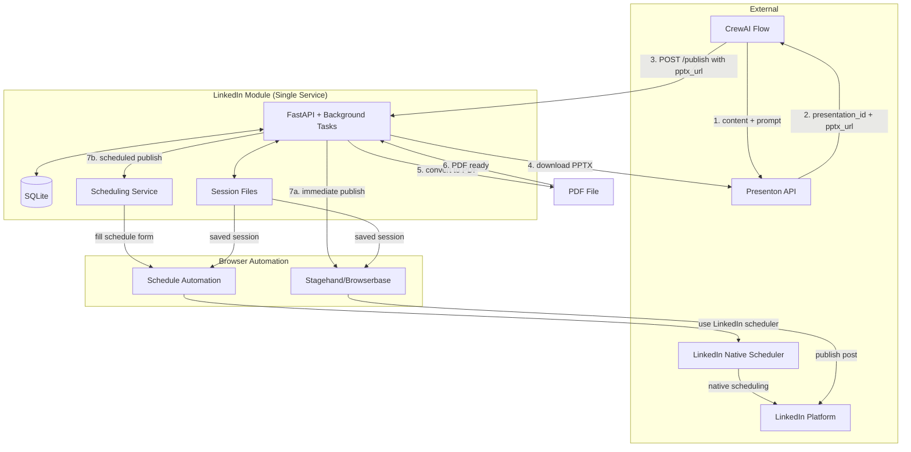
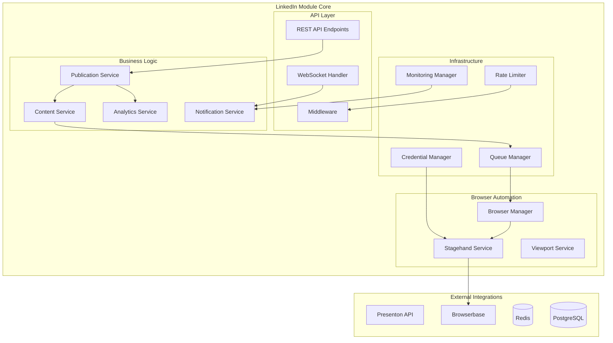

# LinkedIn Module dla Vector Wave - Kompletna Architektura

## 🎯 Overview Architektury

Moduł LinkedIn to mikrousługa integrująca się z ekosystemem Vector Wave, automatyzująca publikację karuzeli PDF na LinkedIn. Wykorzystuje browserbase/stagehand do automatyzacji przeglądarki z kluczową funkcją **manual session creation** dla omijania 2FA/CAPTCHA.

### Kluczowe komponenty:
- **CrewAI Flow** - generuje content, wywołuje Presenton API, następnie LinkedIn Module
- **Presenton API** - generuje prezentacje PPTX na podstawie AI content
- **LinkedIn Module** - otrzymuje pptx_url, pobiera PPTX, konwertuje do PDF i publikuje
- **browserbase/stagehand** - automatyzuje interakcje z LinkedIn
- **Manual Session Management** - persistent sessions (30+ dni) omijające 2FA

### 🔑 Kluczowe innowacje:

#### 1. Manual Session Creation
System wykorzystuje jednorazowe, ręczne logowanie do LinkedIn przez prawdziwą przeglądarkę, a następnie zapisuje tę sesję do wielokrotnego użytku. To eliminuje potrzebę obsługi 2FA/CAPTCHA przy każdej publikacji.

#### 2. Native LinkedIn Scheduling Integration
Wykorzystuje wbudowaną funkcję planowania LinkedIn zamiast własnego schedulera. Moduł automatycznie wypełnia LinkedIn's native scheduling UI, co zapewnia:
- **100% zgodność** z LinkedIn's scheduling policies
- **Lepszą niezawodność** - wykorzystuje natywne mechanizmy LinkedIn
- **Redukcję złożoności** - brak własnego scheduler systemu
- **Natural behavior** - identyczne z manualnym użyciem interfejsu

## 🏗️ Architektura Systemowa (Simplified)

### Diagram Przepływu Danych



### Simplified Architecture Components

```python
# Everything in one FastAPI app
app = FastAPI()

# Simple background tasks instead of Celery
from fastapi import BackgroundTasks

@app.post("/publish")
async def publish(content: PublishRequest, background_tasks: BackgroundTasks):
    job_id = create_job()
    background_tasks.add_task(publish_to_linkedin, job_id, content)
    return {"job_id": job_id}

# SQLite for persistence
DATABASE_URL = "sqlite:///./linkedin_module.db"

# File-based session storage
SESSION_DIR = "./sessions"
```

### Architektura Komponentów



## 📁 Struktura Projektu (Simplified)

```
/Users/hretheum/dev/bezrobocie/vector-wave/linkedin/
├── README.md
├── docker-compose.yml          # Simple 2-service setup
├── Dockerfile
├── requirements.txt
├── .env.example
├── main.py                     # Single FastAPI app
├── config.py                   # Simple config
├── models.py                   # SQLAlchemy models
├── services/
│   ├── __init__.py
│   ├── linkedin_publisher.py   # Main logic
│   ├── session_manager.py      # Session handling
│   └── presenton_client.py     # PDF generation
├── scripts/
│   ├── create_session.js       # Manual LinkedIn login
│   ├── publish_post.js         # Stagehand automation
│   └── check_session.py        # Session health check
├── data/
│   ├── linkedin.db            # SQLite database
│   └── sessions/              # Saved browser sessions
├── logs/
│   └── app.log               # Simple file logging
├── tests/
│   ├── test_api.py
│   └── test_session.py
└── docs/
    ├── QUICK_START.md
    └── SESSION_SETUP.md
```

### Minimal Dependencies

```txt
# requirements.txt
fastapi==0.104.1
uvicorn==0.24.0
sqlalchemy==2.0.23
sqlite3  # Built-in
pydantic==2.5.0
httpx==0.25.1  # For Presenton API
python-dotenv==1.0.0
loguru==0.7.2  # Simple logging

# Optional for production
sentry-sdk==1.38.0
gunicorn==21.2.0
```

```json
// package.json
{
  "dependencies": {
    "@browserbasehq/stagehand": "^1.0.0",
    "dotenv": "^16.3.1"
  },
  "scripts": {
    "create-session": "node scripts/create_session.js",
    "test-publish": "node scripts/publish_post.js test"
  }
}
```

## 🔌 API Endpoints

### Core Publication API

#### POST /api/v1/publish
Tworzy nowe zadanie publikacji na LinkedIn.

**Request Body:**
```json
{
  "content_text": "string",
  "pptx_url": "string (required - URL to PPTX from Presenton)",
  "hashtags": ["string"],
  "schedule_time": "ISO 8601 datetime (optional)",
  "use_native_scheduler": "boolean (default: true)",
  "scheduling_timezone": "string (optional, default: Europe/Warsaw)",
  "account_id": "string"
}
```

**Response:**
```json
{
  "job_id": "uuid",
  "status": "queued|processing|scheduled|completed|failed",
  "estimated_completion": "ISO 8601 datetime",
  "scheduling_method": "immediate|native_linkedin|custom",
  "scheduled_for": "ISO 8601 datetime (if scheduled)"
}
```

#### GET /api/v1/status/{job_id}
Pobiera status zadania publikacji.

**Response:**
```json
{
  "job_id": "uuid",
  "status": "string",
  "progress": 0-100,
  "result": {
    "linkedin_url": "string",
    "post_id": "string",
    "scheduling_method": "immediate|native_linkedin|custom",
    "scheduled_for": "ISO 8601 datetime (if scheduled)",
    "native_scheduler_used": "boolean"
  },
  "error": "string (optional)",
  "created_at": "ISO 8601",
  "completed_at": "ISO 8601"
}
```

### Session Management API

#### POST /api/v1/session/create
Inicjuje proces tworzenia manual session dla LinkedIn.

**Request Body:**
```json
{
  "account_id": "string",
  "browser_settings": {
    "timezone": "Europe/Warsaw",
    "locale": "pl-PL",
    "viewport": {
      "width": 1920,
      "height": 1080
    }
  }
}
```

**Response:**
```json
{
  "session_id": "browserbase_session_uuid",
  "browser_url": "https://browserbase.com/sessions/xxx",
  "status": "waiting_for_login",
  "instructions": "Please log in manually and complete 2FA"
}
```

#### GET /api/v1/session/{session_id}/status
Sprawdza status manual session.

**Response:**
```json
{
  "session_id": "string",
  "status": "pending|active|expired",
  "logged_in": true,
  "valid_until": "ISO 8601 datetime",
  "last_used": "ISO 8601 datetime"
}
```

#### POST /api/v1/session/{session_id}/validate
Waliduje istniejącą sesję.

**Response:**
```json
{
  "valid": true,
  "needs_refresh": false,
  "expires_in_days": 28
}
```

### Webhook Integration API

#### POST /api/v1/webhook/crewai-flow
Obsługuje webhooks z CrewAI Flow (po zakończeniu Presenton workflow).

**Request Body:**
```json
{
  "event_type": "content_ready|flow_complete",
  "job_id": "string",
  "content": {
    "text": "string",
    "pptx_url": "string (URL from Presenton)",
    "hashtags": ["string"]
  },
  "metadata": {
    "optimal_publication_time": "ISO 8601",
    "use_native_scheduler": "boolean (default: true)",
    "scheduling_timezone": "string (default: Europe/Warsaw)",
    "account_id": "string"
  }
}
```

## 🤖 Core Services Architecture

### 1. Publication Service
Główna usługa zarządzająca procesem publikacji:
- Kolejkowanie zadań publikacji
- Integracja z Presenton API dla generowania PDF
- Zarządzanie statusem zadań  
- **Native LinkedIn Scheduling** - wykorzystuje wbudowany scheduler LinkedIn
- Intelligent scheduling decision (immediate vs. scheduled)

### 1.5. LinkedIn Native Scheduling Service
Nowa usługa dedykowana do obsługi LinkedIn native schedulera:
- **Schedule Detection** - wykrywa czy czas publikacji wymaga schedulowania
- **Native UI Automation** - automatyzuje wypełnianie LinkedIn's scheduling form
- **Timezone Handling** - konwersja czasów z różnych stref czasowych
- **Schedule Validation** - weryfikuje poprawność zaplanowanych publikacji
- **Fallback Logic** - automatyczne przejście na immediate publish jeśli scheduler failuje

### 2. Presenton Service
Pobieranie i konwersja PPTX z Presenton:
- Pobieranie PPTX files z Presenton URLs
- Lokalna konwersja PPTX → PDF (LibreOffice)
- Walidacja i obsługa błędów pobierania
- Cleanup starych plików

### 3. Stagehand Service
Automatyzacja przeglądarki:
- Integracja z browserbase/stagehand
- Bezpieczne zarządzanie credentials
- Persistent session management
- Error recovery

### 4. Session Management Service
Zarządzanie sesjami LinkedIn:
- Manual session creation (omija 2FA/CAPTCHA)
- Session persistence (30+ dni)
- Session validation i warm-up
- Multi-session rotation
- Browser fingerprint consistency

### 5. Browser Automation Layer
Warstwa abstrakcji dla automatyzacji:
- LinkedIn-specific logic
- Multi-account support
- Session persistence
- Anti-detection measures
- Human-like behavior patterns

## 🔄 Background Tasks (Simplified)

### No Celery - Just FastAPI Background Tasks
```python
from fastapi import BackgroundTasks
import asyncio

# Simple in-memory queue for small scale
publish_queue = asyncio.Queue(maxsize=100)

@app.post("/publish")
async def publish(request: PublishRequest, background_tasks: BackgroundTasks):
    job_id = str(uuid.uuid4())
    
    # Save job to SQLite
    job = Job(id=job_id, status="queued", content=request.dict())
    db.add(job)
    db.commit()
    
    # Add to background tasks
    background_tasks.add_task(process_publication, job_id)
    
    return {"job_id": job_id, "status": "queued"}

async def process_publication(job_id: str):
    """Simple async task processor"""
    try:
        job = db.query(Job).filter(Job.id == job_id).first()
        job.status = "processing"
        db.commit()
        
        # Download PPTX and convert to PDF (required step)
        if job.pptx_url:
            presenton_service = get_presenton_service()
            result = await presenton_service.process_presenton_content(job.pptx_url)
            job.pdf_url = result['pdf_path']  # Local file path
        
        # Publish to LinkedIn
        result = await publish_to_linkedin(job)
        
        job.status = "completed"
        job.result = result
        db.commit()
        
    except Exception as e:
        job.status = "failed"
        job.error = str(e)
        db.commit()
```

### Scheduled Tasks
```python
# Use APScheduler for simple cron-like tasks
from apscheduler.schedulers.asyncio import AsyncIOScheduler

scheduler = AsyncIOScheduler()

@scheduler.scheduled_job('cron', hour=2)
async def cleanup_old_jobs():
    """Clean up jobs older than 7 days"""
    cutoff = datetime.now() - timedelta(days=7)
    db.query(Job).filter(Job.created_at < cutoff).delete()
    db.commit()

# Start scheduler with app
@app.on_event("startup")
async def startup_event():
    scheduler.start()
```

## 🔐 Security Architecture

### Credential Management
- **HashiCorp Vault** integration dla produkcji
- **Encrypted environment variables** dla developmentu
- **Per-account credential isolation**
- **Session data persistence** (30+ dni)

### Manual Session Creation Strategy
- **One-time manual login** z prawdziwą przeglądarką
- **2FA/CAPTCHA bypass** przez saved sessions
- **Session warm-up** dla naturalnego zachowania
- **Multi-session rotation** dla bezpieczeństwa
- **Browser fingerprint preservation**

### API Security
- **API Key authentication**
- **Rate limiting per account**
- **CORS configuration**
- **Request validation**

### LinkedIn Account Security
- **Persistent sessions** zamiast fresh login
- **Human-like behavior patterns**
- **Rate limiting compliance** (10 posts/minute max)
- **Multi-account isolation**
- **Session validation** przed każdą publikacją

## 📊 Monitoring & Observability (Simplified)

### Practical Monitoring for Small Scale

#### Option 1: Built-in Monitoring (Recommended)
```python
# Simple in-app metrics
class SimpleMetrics:
    def __init__(self):
        self.posts_today = 0
        self.posts_this_week = 0
        self.last_error = None
        self.session_valid_until = None
    
    def to_json(self):
        return {
            "health": "ok" if self.last_error is None else "error",
            "posts_today": self.posts_today,
            "posts_week": self.posts_this_week,
            "session_days_left": self.get_session_days_left(),
            "last_error": str(self.last_error)
        }

# Expose at /metrics endpoint
@app.get("/metrics")
async def metrics():
    return metrics_store.to_json()
```

#### Option 2: External Monitoring
- **Uptime Kuma** - Simple status page (included in docker-compose)
- **Sentry** - Error tracking (free tier sufficient)
- **Logrotate** - For log management
- **Email alerts** - For critical errors

### Key Metrics (Simplified)
1. **Posts published today/week/month**
2. **Last successful post timestamp**
3. **Session expiry countdown**
4. **Error count last 24h**
5. **Queue length**

### Monitoring Dashboard
```bash
# Simple CLI dashboard
$ python manage.py status

LinkedIn Module Status
=====================
✅ Health: OK
📊 Posts Today: 3
📊 Posts This Week: 12
🔐 Session Valid: 28 days remaining
⏱️ Last Post: 2 hours ago
🚨 Errors (24h): 0
📬 Queue: 2 pending
```

## 🚀 Deployment Strategy (Simplified)

### Deployment Options

#### Option 1: Single VPS (Recommended for <100 posts/week)
```bash
# Simple deployment on Digital Ocean/Hetzner VPS
- 1 VPS (2GB RAM, 1 vCPU) ~$10/month
- Docker Compose for all services
- SQLite instead of PostgreSQL
- Basic auth instead of complex RBAC
- Logs to files instead of ELK stack
```

#### Option 2: Minimal Docker Compose
```yaml
version: '3.8'
services:
  linkedin-app:
    build: .
    ports:
      - "8000:8000"
    volumes:
      - ./data:/app/data
      - ./logs:/app/logs
    environment:
      - DATABASE_URL=sqlite:///app/data/linkedin.db
      - REDIS_URL=redis://redis:6379
    depends_on:
      - redis

  redis:
    image: redis:7-alpine
    volumes:
      - redis_data:/data

  # Optional: Simple monitoring
  uptime-kuma:
    image: louislam/uptime-kuma:1
    ports:
      - "3001:3001"
    volumes:
      - uptime-kuma:/app/data

volumes:
  redis_data:
  uptime-kuma:
```

#### Option 3: Serverless Functions (For sporadic use)
- Vercel/Netlify Functions for API
- Upstash Redis for queue
- Supabase for database
- GitHub Actions for scheduled posts

### Simplified Architecture
- **No Kubernetes** - overkill for this scale
- **No Prometheus/Grafana** - use Uptime Kuma or Sentry
- **SQLite over PostgreSQL** - sufficient for <1000 posts/month
- **Single process** - Celery worker in same container
- **File-based sessions** - instead of complex session management

## 🔧 Integration Points

### CrewAI Flow Integration
```python
# CrewAI Flow steps:
# 1. Generate content and Presenton prompt
# 2. Call Presenton API to generate PPTX
# 3. Call LinkedIn Module API with pptx_url

class LinkedInPublisherTool(BaseTool):
    name = "linkedin_publisher"
    description = "Publishes content to LinkedIn with PPTX carousel"
    
    def _run(self, content_text, pptx_url, hashtags, schedule_time=None):
        # Call LinkedIn Module API with Presenton URL
        response = requests.post(
            "http://linkedin-module:8000/api/v1/publish",
            json={
                "content_text": content_text,
                "pptx_url": pptx_url,  # From Presenton
                "hashtags": hashtags,
                "schedule_time": schedule_time
            }
        )
        return response.json()
```

### Presenton API Integration
- Download PPTX presentations from Presenton URLs
- Local PPTX to PDF conversion (using LibreOffice/unoconv)
- Caching for converted PDF files
- Error handling for download and conversion failures

### Browserbase Integration
- Persistent browser sessions
- Automatic session recovery
- Multi-region support
- Cost optimization through session reuse

## 🎯 Success Criteria

### Performance Targets
- Publication success rate: >95%
- Average end-to-end time: <5 minutes
- Concurrent publications: 10+
- Error recovery time: <60 seconds

### Scalability Targets
- Support 100+ publications/hour
- Multi-account management (10+ accounts)
- Horizontal scaling capability
- Zero-downtime deployments

### Reliability Targets
- 99.5% uptime SLA
- Automatic failure recovery
- Data consistency guarantees
- Audit trail completeness

## 📝 Development Guidelines

### Code Organization
- Clean Architecture principles
- Domain-Driven Design
- Dependency injection
- Comprehensive testing

### Testing Strategy
- Unit tests: >80% coverage
- Integration tests for all APIs
- End-to-end flow testing
- Performance benchmarking

### Documentation Requirements
- API documentation (OpenAPI)
- Integration guides
- Troubleshooting guides
- Architecture decision records

## 🚨 Error Handling & Recovery

### Failure Scenarios
1. **PPTX Download Failure** - retry with backoff
2. **PDF Conversion Failure** - retry with different converter
3. **Session Expired** - alert for manual re-login
4. **Publication Timeout** - mark for manual review
5. **Rate Limit Hit** - queue for later
6. **2FA Challenge** - use persistent session
7. **CAPTCHA Required** - fallback to manual session

### Recovery Mechanisms
- Automatic retry with exponential backoff
- Circuit breaker pattern
- Dead letter queue for failed jobs
- Manual intervention interface
- Session rotation on failure
- Automatic session warm-up

## 📊 Status Implementacji

### FAZA 1: Foundation & Infrastructure Setup ✅ COMPLETED
- **Status**: ✅ 100% COMPLETED (2025-08-03)
- **Czas realizacji**: ✅ Ukończone w 1 dzień
- **Components**: 
  - ✅ Database layer (SQLite + models)
  - ✅ Configuration & logging
  - ✅ Native LinkedIn scheduling integration
  - ✅ Migration system z backward compatibility

### FAZA 2: API Layer & Business Logic ✅ COMPLETED
- **Status**: ✅ 100% COMPLETED (2025-08-03)  
- **Czas realizacji**: ✅ Ukończone w 1 dzień
- **Components**: 
  - ✅ FastAPI application (main.py)
  - ✅ Business services (services.py) 
  - ✅ Webhook integration (webhooks.py)
  - ✅ Comprehensive testing (33+ tests)
  - ✅ Rate limiting & security
  - ✅ Timezone handling dla wszystkich stref
  - ✅ Content validation & processing

### FAZA 3: Browser Automation & External Integrations 🚧 READY
- **Status**: 🚧 Ready to start - wymaga FAZY 1-2 ✅
- **Czas realizacji**: 4-5 dni  
- **Dependencies**: ✅ FAZA 1-2 completed, Browserbase account, Presenton integration
- **Components**: Browser automation, PDF generation, session management

### Overall Progress: 66% COMPLETED (2/3 major phases done)

## 🔄 Future Enhancements

### Phase 2 Features
- Multi-platform publishing (Twitter/X, Facebook)
- A/B testing for content
- Advanced scheduling algorithms
- AI-powered engagement prediction

### Phase 3 Features
- Real-time engagement tracking
- Automated response handling
- Content performance analytics
- Campaign management interface