# Complete User Workflow Architecture - Vector Wave

## 🎯 Real User Workflow Based on Detailed Requirements

```mermaid
flowchart TD
    %% Topic Discovery & Storage
    TopicDB[(📚 Topic Database<br/>ChromaDB Topics)]
    ManualTopics[✍️ Manual Topics] --> TopicDB
    AutoScraping[🕷️ Auto Scraping] --> TopicDB
    
    %% Editorial Service with Specialized Agents
    ES[⚖️ Editorial Service]
    SA[🎨 Style Agent<br/>Style Rules ChromaDB] 
    EA[📝 Editorial Agent<br/>Editorial Rules ChromaDB]
    ES --> SA
    ES --> EA
    
    %% Topic Suggestion Generation
    TopicDB --> ES
    ES --> TopicSuggestions[💡 Topic Suggestions<br/>with Platform Assignment]
    
    %% User Topic Selection
    User[👤 User] --> TopicChoice{🎯 Topic Selection}
    TopicSuggestions --> TopicChoice
    TopicChoice --> |Select from suggestions| SelectedTopic[✅ Selected Topic<br/>+ Platform]
    TopicChoice --> |Custom topic via chat| AIChat[💬 AI Assistant Chat]
    AIChat --> SelectedTopic
    
    %% Content Generation
    SelectedTopic --> WriterAgent[🤖 Writer Agent<br/>Dual Mode Execution]
    WriterAgent --> |AI-First Mode| Draft1[📄 Draft v1]
    WriterAgent --> |Human-Assisted Mode| Draft1
    
    %% User Draft Review & Editing
    Draft1 --> UserReview{👨‍💻 User Review}
    UserReview --> |Edit| AIChat
    AIChat --> Draft1
    UserReview --> |Regenerate| WriterAgent
    UserReview --> |Accept| QualityAgent[✅ Quality Agent<br/>Final QA]
    
    %% Publishing Workflow
    QualityAgent --> PublishService[🚀 Publishing Service]
    
    %% Scheduling Agent with Rules
    SchedulingAgent[📅 Scheduling Agent<br/>Scheduling Rules ChromaDB]
    PublishService --> SchedulingAgent
    SchedulingAgent --> TimeSlots[⏰ Available Time Slots<br/>Optimized Recommendations]
    
    %% User Publishing Decision
    TimeSlots --> UserPublish{📅 User Slot Selection}
    UserPublish --> |Select slot + platforms| PlatformGeneration[🎯 Platform Content Generation]
    
    %% Platform-Specific Content Generation
    PlatformGeneration --> TwitterContent[🐦 Twitter Content]
    PlatformGeneration --> SubstackContent[📧 Substack Content] 
    PlatformGeneration --> BeehiivContent[📬 Beehiiv Content]
    PlatformGeneration --> LinkedInDecision{💼 LinkedIn Content?}
    
    %% LinkedIn Special Handling
    LinkedInDecision --> |Text Post| LinkedInText[💼 LinkedIn Text]
    LinkedInDecision --> |Presentation| PresentorService[🎨 Presentor Service<br/>PPT Generation]
    PresentorService --> PPTDownload[📥 PPT/PDF Download<br/>Manual LinkedIn Upload]
    
    %% Publication Execution
    TwitterContent --> Publication[📢 Publication]
    SubstackContent --> Publication
    BeehiivContent --> Publication
    LinkedInText --> Publication
    
    %% Learning & Feedback Loop
    Publication --> TopicUpdate[📊 Topic Status Update<br/>Mark as Published]
    TopicUpdate --> TopicDB
    
    %% Analytics Blackbox
    Publication --> AnalyticsBlackbox[📊 Analytics Blackbox<br/>Future Implementation]
    AnalyticsBlackbox -.-> LearningSystem[🧠 System Learning<br/>User Preferences]
    LearningSystem -.-> ES
    
    %% Styling
    classDef user fill:#e3f2fd,stroke:#1976d2,stroke-width:3px,color:#000
    classDef database fill:#f3e5f5,stroke:#7b1fa2,stroke-width:2px,color:#000
    classDef agent fill:#e8f5e8,stroke:#388e3c,stroke-width:2px,color:#000
    classDef service fill:#fff3e0,stroke:#f57c00,stroke-width:2px,color:#000
    classDef content fill:#fce4ec,stroke:#c2185b,stroke-width:2px,color:#000
    classDef publishing fill:#e0f2f1,stroke:#00695c,stroke-width:2px,color:#000
    classDef blackbox fill:#f5f5f5,stroke:#9e9e9e,stroke-width:2px,color:#666,stroke-dasharray: 5 5
    
    class User,TopicChoice,UserReview,UserPublish user
    class TopicDB,SA,EA,SchedulingAgent database
    class WriterAgent,QualityAgent agent
    class ES,PublishService,PresentorService service
    class Draft1,TopicSuggestions,SelectedTopic,TimeSlots content
    class TwitterContent,SubstackContent,BeehiivContent,LinkedInText,LinkedInDecision,PlatformGeneration,Publication publishing
    class AnalyticsBlackbox,LearningSystem blackbox
```



## 🔧 Detailed Workflow Breakdown

### **1. Topic Discovery & Management**
| Component | Function | Data Source | Rules |
|-----------|----------|-------------|-------|
| **Topic Database** | Store all potential topics | Manual input + Auto scraping | ChromaDB collection |
| **Manual Topics** | User-curated topic ideas | Human research | Editorial guidelines |
| **Auto Scraping** | Automated topic discovery | Web scraping, RSS feeds | Relevance algorithms |

### **2. Editorial Service Architecture**
| Agent | Purpose | ChromaDB Collection | Output |
|-------|---------|-------------------|--------|
| **Style Agent** | Style consistency | `style_rules` | Style recommendations |
| **Editorial Agent** | Content structure | `editorial_rules` | Editorial guidelines |
| **Editorial Service** | Coordination hub | Both collections | Topic suggestions with platform assignments |

### **3. Content Generation Pipeline**
```
Topic Database → Editorial Service (Style + Editorial Agents) 
    ↓
Topic Suggestions (with Platform Assignment)
    ↓  
User Selection OR AI Chat Custom Topic
    ↓
Writer Agent (Dual Mode) → Draft Generation
    ↓
User Review Loop (Edit/Regenerate/Accept)
    ↓
Quality Agent → Publishing Service
```

### **4. Publishing & Scheduling Workflow**
| Component | Function | Data Source | User Interaction |
|-----------|----------|-------------|------------------|
| **Scheduling Agent** | Optimal slot recommendation | `scheduling_rules` ChromaDB | User selects preferred slot |
| **Platform Selection** | Content adaptation | Topic → Platform mapping | User confirms platforms |
| **Content Generation** | Platform-specific formatting | Platform rules | Automated adaptation |

### **5. LinkedIn Special Handling (PIVOT)**
```
LinkedIn Content Decision
├── Text Post → Direct LinkedIn text generation
└── Presentation → Presentor Service → PPT/PDF → Manual user upload
```
**Rationale**: Avoid LinkedIn account blocking risk by removing Browserbase automation.

### **6. Learning & Feedback System**
```
User Decisions (Accept/Reject) → Topic Database Status Updates
    ↓
Analytics Blackbox (Future) → System Learning
    ↓  
Updated Editorial Service Rules
```

## 📊 ChromaDB Collections Architecture

### **Core Collections**
| Collection | Purpose | Data Examples | Used By |
|------------|---------|---------------|---------|
| **Topics** | All potential topics | "AI in Marketing", "React Performance" | Editorial Service |
| **Style Rules** | Writing style guidelines | "Avoid jargon", "Use data-driven insights" | Style Agent |
| **Editorial Rules** | Content structure rules | "Hook in first paragraph", "Include examples" | Editorial Agent |
| **Scheduling Rules** | Optimal publishing times | "Tuesday 9AM best for LinkedIn", "Friday avoid" | Scheduling Agent |

### **Topic Database Schema**
```json
{
  "topic_id": "uuid",
  "title": "AI-Powered Code Review",
  "platform": "LinkedIn", 
  "status": "suggested|generated|published",
  "created_date": "2024-01-15",
  "user_rating": 0-5,
  "published_date": null,
  "performance_metrics": {}
}
```

## 🎯 User Interaction Points

### **Decision Points Where User Has Control**
1. **Topic Selection**: Choose from suggestions OR request custom via AI Chat
2. **Draft Review**: Edit, regenerate, or accept generated content  
3. **Publishing Slot**: Select optimal time slot from recommendations
4. **Platform Selection**: Confirm which platforms to publish to
5. **LinkedIn Format**: Text post OR presentation (PPT download)

### **Automated Components**
- Topic suggestions generation (Editorial Service)  
- Platform assignment recommendations
- Optimal scheduling slot calculations
- Content adaptation per platform
- Topic database status updates

## 🔄 Key Workflow Advantages  

### **User-Centric Design**
- **Multiple entry points**: Suggested topics OR custom topics via chat
- **Iterative refinement**: Edit and regenerate until satisfied
- **Optimal scheduling**: AI-recommended slots with user final choice
- **Platform flexibility**: Auto-suggestions with user override

### **Risk Mitigation** 
- **LinkedIn manual upload**: Avoids account blocking
- **Quality gates**: Human review at multiple stages  
- **Flexible scheduling**: User controls final publication timing

### **Learning System**
- **Topic performance tracking**: What gets accepted/published
- **User preference learning**: Style and topic preferences
- **Publishing optimization**: Best slot performance analysis

### **Scalable Architecture**
- **ChromaDB collections**: Separate concerns, independent scaling
- **Agent specialization**: Style, Editorial, Scheduling agents
- **Platform modularity**: Easy to add new publication channels

---

**Architecture Philosophy**: User maintains control at key decision points while AI optimizes suggestions, content generation, and scheduling recommendations.