# 🟢 TO-BE ARCHITECTURE: High Contrast Version

## SHARED EDITORIAL SERVICE (ChromaDB-Centric)

```mermaid
graph TB
    subgraph "📊 SHARED EDITORIAL SERVICE"
        ES[🌐 Editorial Service<br/>Port 8040<br/>FastAPI + Pydantic] 
        ES --> CDB[🔵 ChromaDB Server<br/>Port 8000<br/>Vector Database]
        CDB --> C1[📋 style_editorial_rules<br/>280+ validation rules]
        CDB --> C2[🎯 publication_platform_rules<br/>75+ platform constraints]
        ES --> CB[⚡ Circuit Breaker<br/>ChromaDB-sourced cache<br/>Resilience Pattern]
    end
    
    subgraph "🎯 PLANNING WORKFLOW - Kolegium"
        KP2[👥 Kolegium Planning<br/>Full AI Pipeline] --> VF1[🏭 ValidationStrategyFactory<br/>Strategy Pattern]
        VF1 --> CS[📊 ComprehensiveStrategy<br/>8-12 rules per validation]
        CS --> |HTTP POST| ES
        CS --> QC1[🔍 Query ChromaDB<br/>comprehensive mode<br/>vector search]
    end
    
    subgraph "✍️ CREATION WORKFLOW - AI Writing Flow"  
        AWF2[✏️ AI Writing Flow<br/>Human-Assisted] --> VF2[🏭 ValidationStrategyFactory<br/>Strategy Pattern]
        VF2 --> SS[🎯 SelectiveStrategy<br/>3-4 rules per checkpoint]
        SS --> |HTTP POST| ES
        SS --> QC2[🔍 Query ChromaDB<br/>selective mode<br/>checkpoint-based]
    end
    
    subgraph "🔧 EDITING WORKFLOW - Enhanced Orchestrator"
        EO2[🔧 Enhanced Orchestrator<br/>Publisher Service] --> API1[📡 HTTP Client<br/>REST API]
        API1 --> |POST /validate| ES
        API1 --> VM1[⚙️ Validation Mode<br/>selective/comprehensive<br/>dynamic selection]
    end
    
    subgraph "🔄 REGENERATION WORKFLOW - User Request"
        UR2[👤 User Regeneration<br/>On-Demand] --> API2[📡 HTTP Client<br/>REST API]
        API2 --> |POST /regenerate| ES
        CB --> CF[💾 ChromaDB Cache<br/>with origin metadata<br/>performance layer]
        CF --> RR[✅ Returns cached<br/>ChromaDB rules only<br/>zero hardcoded]
    end
    
    %% Styling for high contrast
    classDef editorialService fill:#2E8B57,stroke:#000,stroke-width:3px,color:#fff
    classDef chromaDB fill:#4169E1,stroke:#000,stroke-width:2px,color:#fff
    classDef circuitBreaker fill:#FF6347,stroke:#000,stroke-width:2px,color:#fff
    classDef kolegium fill:#9370DB,stroke:#000,stroke-width:2px,color:#fff
    classDef aiWriting fill:#32CD32,stroke:#000,stroke-width:2px,color:#000
    classDef orchestrator fill:#FF8C00,stroke:#000,stroke-width:2px,color:#fff
    classDef userRequest fill:#DC143C,stroke:#000,stroke-width:2px,color:#fff
    
    class ES editorialService
    class CDB,C1,C2 chromaDB
    class CB,CF circuitBreaker
    class KP2,VF1,CS,QC1 kolegium
    class AWF2,VF2,SS,QC2 aiWriting
    class EO2,API1,VM1 orchestrator
    class UR2,API2,RR userRequest
```

## 🔑 KEY ARCHITECTURAL COMPONENTS

### 🌐 **Shared Editorial Service (Port 8040)**
- **Technology**: FastAPI + Pydantic v2 + async/await
- **Purpose**: Central validation service for all workflows
- **Endpoints**: 
  - `POST /validate/comprehensive` (Kolegium)
  - `POST /validate/selective` (AI Writing Flow)
  - `POST /regenerate` (User requests)

### 🔵 **ChromaDB Vector Database (Port 8000)**
- **Collections**: 2 consolidated collections
  - `style_editorial_rules` (280+ rules)
  - `publication_platform_rules` (75+ platform rules)
- **Integration**: Vector similarity search with embeddings
- **Performance**: <200ms P95 query response time

### ⚡ **Circuit Breaker Pattern**
- **Purpose**: High availability during ChromaDB outages
- **Cache**: ChromaDB-sourced rules ONLY (zero hardcoded)
- **Recovery**: Automatic reconnection within 30s
- **Fallback**: Returns cached data or 503 (no hardcoded rules)

### 🏭 **Dual Strategy Pattern**
- **ComprehensiveStrategy**: 8-12 rules (Kolegium workflow)
- **SelectiveStrategy**: 3-4 rules (AI Writing Flow checkpoints)
- **Factory**: `ValidationStrategyFactory.create(mode)`
- **Consistency**: Same ChromaDB collections, different access patterns