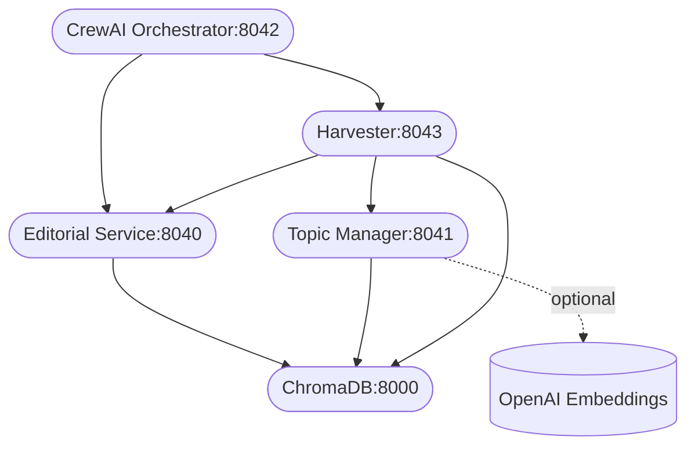

# Vector Wave Dependencies Map

This document maps internal microservices and their runtime dependencies (intra-service and external).

## Services and dependencies

- chromadb (port 8000)
  - Provides: Vector DB HTTP API (v1/v2)
  - Depends on: None

- editorial-service (port 8040)
  - Depends on: chromadb (CHROMADB_HOST/PORT)
  - Exposes: /health, /profile/score, /metrics

- topic-manager (port 8041)
  - Depends on: chromadb (CHROMADB_HOST/PORT)
  - Optional external: OpenAI embeddings (EMBEDDINGS_PROVIDER=openai)
  - Exposes: /health, /topics/*, /metrics

- crewai-orchestrator (port 8042)
  - Depends on: editorial-service (EDITORIAL_SERVICE_URL), harvester (HARVESTER_URL)
  - Exposes: /health, /api/triage/policy, /api/triage/seed

- harvester (port 8043)
  - Depends on: chromadb (CHROMADB_HOST/PORT), editorial-service (EDITORIAL_SERVICE_URL), topic-manager (TOPIC_MANAGER_URL)
  - Exposes: /health, /harvest/trigger, /triage/selective, /metrics

- publishing-orchestrator (profile: publishing)
  - Depends on: editorial-service
  - Exposes: N/A (internal)

## Ports and external endpoints

- chromadb: 8000 (HTTP)
- editorial-service: 8040 (HTTP)
- topic-manager: 8041 (HTTP)
- crewai-orchestrator: 8042 (HTTP)
- harvester: 8043 (HTTP)
- external: OpenAI API (only when EMBEDDINGS_PROVIDER=openai)

## Dependency graph (Mermaid)

