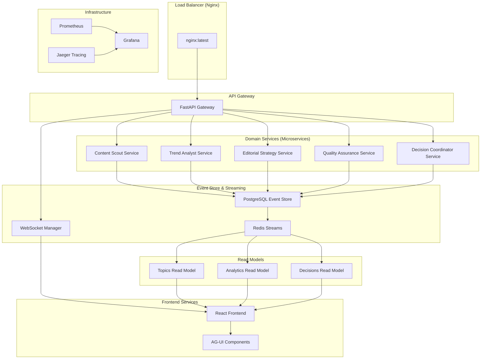

# Architektura Systemu - AI Kolegium Redakcyjne

## 🏗️ Clean Architecture + Event-Driven Microservices

### Główne Założenia Architektoniczne
1. **Event-First**: Wszystko komunikuje się przez AG-UI events
2. **Container-First**: Zero lokalnego budowania, wszystko w kontenerach
3. **Domain-Driven Design**: Wyraźne bounded contexts
4. **CQRS + Event Sourcing**: Pełna audytowalność decyzji redakcyjnych
5. **Microservices**: Loosely coupled, independently deployable

### Architektura na Poziomie Systemowym



### Clean Architecture - Struktura Folderów

```
src/
├── domains/                    # Domain Layer (Business Logic)
│   ├── content/
│   │   ├── domain/
│   │   │   ├── entities/       # Topic, Source, Keyword
│   │   │   ├── value_objects/  # TopicScore, SourceReliability
│   │   │   ├── repositories/   # ITopicRepository
│   │   │   └── services/       # ContentDiscoveryService
│   │   ├── application/
│   │   │   ├── use_cases/      # DiscoverTopicsUseCase
│   │   │   ├── handlers/       # TopicDiscoveredHandler
│   │   │   └── dto/           # TopicDTO, DiscoveryRequest
│   │   └── infrastructure/
│   │       ├── repositories/   # PostgreSQLTopicRepository
│   │       ├── services/       # RSSScrapingService
│   │       └── agents/         # ContentScoutAgent
│   ├── analytics/
│   │   ├── domain/
│   │   │   ├── entities/       # TrendAnalysis, SentimentScore
│   │   │   ├── value_objects/  # ViralPotential, TrendStrength
│   │   │   └── services/       # TrendAnalysisService
│   │   ├── application/
│   │   │   ├── use_cases/      # AnalyzeTrendUseCase
│   │   │   └── handlers/       # ContentAnalysisHandler
│   │   └── infrastructure/
│   │       ├── apis/          # GoogleTrendsAPI, SocialAPI
│   │       └── agents/        # TrendAnalystAgent
│   ├── editorial/
│   │   ├── domain/
│   │   │   ├── entities/       # EditorialDecision, Guidelines
│   │   │   ├── value_objects/  # ControversyLevel, DecisionCriteria
│   │   │   └── services/       # EditorialDecisionService
│   │   ├── application/
│   │   │   ├── use_cases/      # MakeEditorialDecisionUseCase
│   │   │   └── handlers/       # HumanInputRequestHandler
│   │   └── infrastructure/
│   │       └── agents/        # EditorialStrategistAgent
│   ├── quality/
│   │   ├── domain/
│   │   │   ├── entities/       # QualityAssessment, FactCheck
│   │   │   ├── value_objects/  # QualityScore, CredibilityRating
│   │   │   └── services/       # QualityAssessmentService
│   │   ├── application/
│   │   │   ├── use_cases/      # AssessQualityUseCase
│   │   │   └── handlers/       # QualityAssessmentHandler
│   │   └── infrastructure/
│   │       ├── apis/          # FactCheckingAPI, PlagiarismAPI
│   │       └── agents/        # QualityAssessorAgent
│   └── orchestration/
│       ├── domain/
│       │   ├── entities/       # Workflow, TaskCoordination
│       │   ├── value_objects/  # WorkflowStatus, CoordinationResult
│       │   └── services/       # OrchestrationService
│       ├── application/
│       │   ├── use_cases/      # CoordinateDecisionUseCase
│       │   └── handlers/       # TaskCompleteHandler
│       └── infrastructure/
│           └── agents/        # DecisionCoordinatorAgent
├── shared/                     # Shared Kernel
│   ├── domain/
│   │   ├── events/            # Domain Events
│   │   ├── exceptions/        # Domain Exceptions
│   │   └── value_objects/     # Money, DateTime, UserId
│   ├── infrastructure/
│   │   ├── agui/              # AG-UI Event System
│   │   ├── database/          # Event Store, Read Models
│   │   ├── cache/             # Redis Configuration
│   │   ├── monitoring/        # OpenTelemetry, Metrics
│   │   └── security/          # JWT, Rate Limiting
│   └── application/
│       ├── events/            # Event Bus, Handlers
│       └── services/          # Cross-cutting Services
├── interfaces/                 # Interface Layer
│   ├── api/
│   │   ├── controllers/       # REST Controllers
│   │   ├── websockets/        # WebSocket Handlers
│   │   └── dto/              # API DTOs
│   ├── events/
│   │   └── handlers/         # AG-UI Event Handlers
│   └── jobs/
│       └── schedulers/       # Background Jobs
└── main.py                    # Application Entry Point
```

### Warstwa AG-UI Events (Enhanced)

```python
# src/agui/events.py
from enum import Enum
from pydantic import BaseModel
from typing import Any, Dict, Optional
from datetime import datetime

class AGUIEventType(Enum):
    # Core messaging events
    MESSAGE = "message"
    MESSAGE_DELTA = "message_delta"
    
    # State management
    STATE_SYNC = "state_sync"
    STATE_UPDATE = "state_update"
    
    # Tool interaction
    TOOL_CALL = "tool_call"
    TOOL_RESULT = "tool_result"
    
    # UI generation
    UI_COMPONENT = "ui_component"
    UI_UPDATE = "ui_update"
    
    # Human interaction
    HUMAN_INPUT_REQUEST = "human_input_request"
    HUMAN_FEEDBACK = "human_feedback"
    
    # Progress tracking
    PROGRESS_UPDATE = "progress_update"
    TASK_COMPLETE = "task_complete"
    
    # Editorial specific extensions
    TOPIC_DISCOVERED = "topic_discovered"
    EDITORIAL_DECISION = "editorial_decision"
    CONTENT_ANALYSIS = "content_analysis"
    QUALITY_ASSESSMENT = "quality_assessment"

class AGUIEvent(BaseModel):
    type: AGUIEventType
    data: Dict[str, Any]
    agent_id: Optional[str] = None
    timestamp: Optional[datetime] = None
    session_id: Optional[str] = None
    correlation_id: Optional[str] = None
```
### AG-UI Middleware Layer

```python
# src/agui/middleware.py
from fastapi import FastAPI, WebSocket, HTTPException
from fastapi.responses import StreamingResponse
import asyncio
import json
from typing import AsyncGenerator, Set
from src.agui.events import AGUIEvent, AGUIEventType

class AGUIMiddleware:
    def __init__(self):
        self.connections: Set[WebSocket] = set()
        self.event_queue = asyncio.Queue()
        self.human_input_handlers = {}
        self.session_states = {}
    
    async def emit_event(self, event: AGUIEvent):
        """Emit event to all connected clients"""
        # Add timestamp if not present
        if not event.timestamp:
            event.timestamp = datetime.utcnow()
        
        await self.event_queue.put(event)
        
        # Broadcast to all WebSocket connections
        if self.connections:
            event_json = event.model_dump_json()
            dead_connections = set()
            
            for connection in self.connections:
                try:
                    await connection.send_text(event_json)
                except Exception:
                    dead_connections.add(connection)
            
            # Clean up dead connections
            self.connections -= dead_connections
```
    async def event_stream(self) -> AsyncGenerator[str, None]:
        """SSE stream for real-time events"""
        try:
            while True:
                event = await self.event_queue.get()
                yield f"data: {event.model_dump_json()}\n\n"
        except asyncio.CancelledError:
            pass
    
    async def websocket_handler(self, websocket: WebSocket):
        """WebSocket handler for bi-directional communication"""
        await websocket.accept()
        self.connections.add(websocket)
        
        try:
            while True:
                client_event = await websocket.receive_json()
                await self.handle_client_event(client_event)
        except Exception as e:
            print(f"WebSocket error: {e}")
        finally:
            self.connections.remove(websocket)
    
    async def handle_client_event(self, event_data):
        """Handle events from frontend"""
        event_type = event_data.get('type')
        
        if event_type == 'HUMAN_FEEDBACK':
            await self.process_human_feedback(event_data['data'])
        elif event_type == 'HUMAN_INPUT_RESPONSE':
            await self.process_human_input_response(event_data['data'])
        elif event_type == 'TOOL_CALL':
            await self.process_frontend_tool_call(event_data['data'])
```