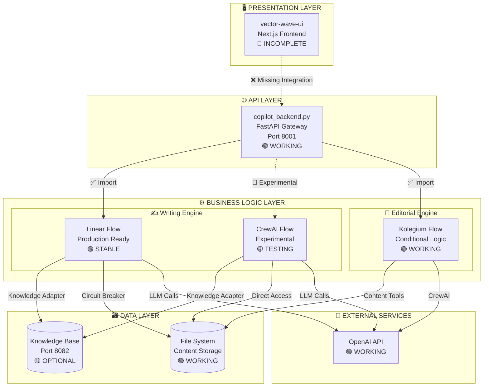
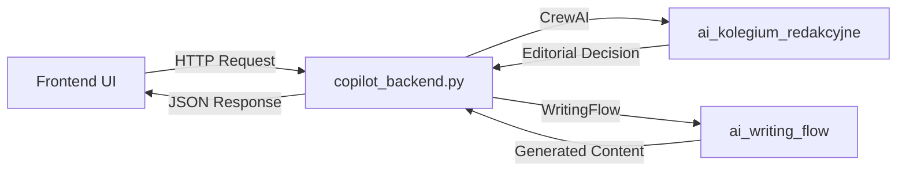

# 🔍 AI Writing Flow - Kompletna Analiza i Dokumentacja

## Spis Treści
1. [Raport z Analizy vs Diagram](#raport-z-analizy-vs-diagram)
2. [Architektura Systemu](#architektura-systemu)
3. [Szczegółowa Dokumentacja Modułów](#szczegółowa-dokumentacja-modułów)
4. [Problemy i Rekomendacje](#problemy-i-rekomendacje)

---

## 📊 Raport z Analizy vs Diagram

### 1. Stan Obecnej Implementacji

**Co mamy zrobione:**
- ✅ **Agenci podstawowi** - ResearchAgent, ContentAnalysisAgent, WriterAgent, StyleAgent, QualityAgent są zaimplementowani
- ✅ **Knowledge Base Integration** - Doskonała integracja przez KnowledgeAdapter z circuit breaker pattern
- ✅ **StandardContentFlow** - Implementuje sekwencyjny flow: Research → Audience → Writing → Style → Quality
- ✅ **Infrastruktura** - Logging, persistence, monitoring, error handling

**Struktura flows:**
- `StandardContentFlow` - główny flow z @start i @listen
- `ViralContentFlow`, `TechnicalContentFlow` - specjalistyczne warianty
- `HumanApprovalFlow` - obsługa UI ale jako osobny flow

### 2. Krytyczne Braki względem Diagramu

**Brak routingu ORIGINAL/EXTERNAL:**
- Diagram pokazuje kluczowe rozgałęzienie po Content Type Decision
- EXTERNAL → idzie do Deep Research
- ORIGINAL → pomija Research, idzie bezpośrednio do Audience
- **Obecna implementacja ZAWSZE wykonuje research** niezależnie od content_ownership

**Brak @router decorator:**
- StandardContentFlow używa tylko @start i @listen (liniowy flow)
- Potrzebny @router do obsługi rozgałęzień z diagramu
- Brak logiki warunkowej routing based on content type

**Brak Human Review Integration:**
- Diagram pokazuje Human Review checkpoint z 3 ścieżkami (Minor Edits, Content Changes, Direction Change)
- HumanApprovalFlow istnieje ale jest oddzielny, nie zintegrowany z głównym flow
- Brak revision loop z diagramu

### 3. Komponenty z Diagramu - Status

| Komponent | Status | Problem |
|-----------|--------|---------|
| Content Type Decision | ⚠️ Częściowo | Analiza jest, ale brak routing logic |
| Research Agent | ✅ Pełny | Działa, ale wykonuje się zawsze |
| Audience Mapper | ✅ Pełny | Zaimplementowany w ContentAnalysisAgent |
| Content Writer | ✅ Pełny | Działa poprawnie |
| Style Validator | ✅ Pełny | Implementacja kompletna |
| Quality Controller | ✅ Pełny | Multi-criteria scoring działa |
| Human Review UI | ❌ Brak | Nie zintegrowany z głównym flow |
| Revision Loop | ❌ Brak | Brak implementacji feedback loop |

### 4. Problem z linear_flow.py

Odkryłem że `linear_flow.py` faktycznie istnieje ale jest to **alternatywna implementacja** która:
- Nie używa CrewAI Flow decorators (@start, @listen, @router)
- Implementuje własną logikę sekwencyjną
- Ma `LinearDraftExecutor` który próbuje używać StandardContentFlow

To tworzy **konflikt architektoniczny** - mamy 2 konkurencyjne podejścia:
1. CrewAI Flow z decorators (StandardContentFlow)
2. Linear execution bez decorators (linear_flow.py)

### 5. Knowledge Base Integration

**To działa świetnie:**
- KnowledgeAdapter z multiple search strategies
- Circuit breaker protection
- Async support
- 4 dedykowane tools dla ResearchAgent
- 7 tools dla ContentAnalysisAgent

### 6. Główne Wnioski

**Problem fundamentalny:** Implementacja nie realizuje kluczowej logiki z diagramu - rozgałęzienia ORIGINAL/EXTERNAL. To powoduje że:
- ORIGINAL content niepotrzebnie przechodzi przez Research
- Brak optymalizacji flow dla różnych typów content
- UI nie może kontrolować flow execution

**Rekomendacja:** Potrzebna jest reimplementacja głównego flow z użyciem @router decorator i proper conditional logic zgodnie z diagramem.

---

## 🏗️ Architektura Systemu

### Przegląd Architektury

Projekt Kolegium to zaawansowana platforma do automatycznej generacji treści AI wykorzystująca wzorzec **Clean Architecture** z trzema głównymi modułami:

```
kolegium/
├── 🎬 ai_publishing_cycle/     # Backend & API Gateway  
├── ✍️ ai_writing_flow/         # Writing Flow Engine
├── 📰 ai_kolegium_redakcyjne/  # Editorial Decision Engine
└── 🖥️ vector-wave-ui/          # Frontend (Basic Next.js)
```

### Diagram Architektury Kompletnej



---

## 📚 Szczegółowa Dokumentacja Modułów

### 🎬 Moduł 1: AI Publishing Cycle

**Rola**: Backend serwer i API Gateway - łączy frontend z AI agents

#### Struktura Kluczowych Plików

```python
ai_publishing_cycle/src/ai_publishing_cycle/
├── copilot_backend.py          # 🌟 GŁÓWNY BACKEND SERVER
├── chat_handler.py             # Obsługa konwersacji  
├── simple_ui.py               # Prosty interfejs
├── ui_app.py                  # Streamlit UI
├── copilotkit_server.py       # CopilotKit integration
└── agents/topic_generator.py  # Agent generowania tematów
```

#### Kluczowe Cechy copilot_backend.py

```python
class FastAPI Backend:
    - FastAPI server na porcie 8001
    - CORS dla Next.js frontend (localhost:3000)
    - Łączy CrewAI crews z UI
    - Streaming responses (Server-Sent Events)
    - Emergency kill switch dla flow control
    - Content analysis + normalization pipeline
```

#### Główne Endpointy API

| Endpoint | Funkcja | Status |
|----------|---------|---------|
| `/chat` | Natural chat conversations | ✅ |
| `/api/analyze-folder` | Analiza folderów contentowych | ✅ |
| `/api/run-pipeline` | Uruchom editorial pipeline | ✅ |
| `/api/generate-draft` | Generuj draft z AI Writing Flow | ✅ |
| `/api/draft-status/{id}` | Status procesu generowania | ✅ |
| `/api/emergency/kill-all-flows` | 🚨 Emergency stop | ✅ |

#### Przepływ Danych



### ✍️ Moduł 2: AI Writing Flow

**Rola**: Silnik generowania treści z observability-first approach

#### Architektura Clean Architecture

```python
ai_writing_flow/src/ai_writing_flow/
├── 📋 models/                   # Domain Models
│   ├── flow_control_state.py   # 🌟 STATE MANAGEMENT
│   ├── flow_stage.py          # Stage definitions
│   └── stage_execution.py     # Execution tracking
├── 🎭 adapters/                # External integrations  
│   └── knowledge_adapter.py   # 🌟 KB INTEGRATION
├── 🔧 managers/               # Business Logic
│   └── stage_manager.py      # Stage orchestration
├── 📊 monitoring/             # Observability
│   ├── flow_metrics.py       # Real-time KPIs
│   ├── dashboard_api.py      # Metrics dashboard
│   └── alerting.py           # Multi-channel alerts
├── 🚦 utils/                  # Infrastructure  
│   ├── circuit_breaker.py    # Fault tolerance
│   └── retry_manager.py      # Retry logic
├── 🎯 crewai_flow/           # CrewAI Flow implementation
│   └── flows/ai_writing_flow.py  # 🌟 CREWAI FLOW
└── 📐 linear_flow.py         # Linear execution (fallback)
```

#### Implementacje Flow

Projekt zawiera **2 równoległe implementacje**:

##### 1. Linear Flow (Produkcja)
```python
# research_linear.py, style_linear.py, etc.
- Liniowa egzekucja bez loop risk
- Circuit breaker protection  
- Thread-safe state management
- Observability-first
```

##### 2. CrewAI Flow (Eksperymentalna)
```python
# crewai_flow/flows/ai_writing_flow.py
- @start/@listen decorators
- Automatic routing between agents
- Knowledge Base integration
- Phase 1 infrastructure compatibility
```

#### Flow Control State - Centralne Zarządzanie

```python
class FlowControlState(BaseModel):
    """Centralny state management z loop prevention"""
    
    # Core state
    current_stage: FlowStage = FlowStage.INPUT_VALIDATION
    completed_stages: Set[FlowStage] = Field(default_factory=set)
    execution_id: str = Field(default_factory=lambda: str(uuid4()))
    
    # Retry management
    retry_count: Dict[str, int] = Field(default_factory=dict)
    max_retries: Dict[str, int] = {...}
    
    # Circuit breaker states  
    circuit_breaker_state: Dict[str, CircuitBreakerState] = {...}
    
    # Loop prevention
    execution_history: List[StageTransition] = Field(default_factory=list)
    MAX_STAGE_EXECUTIONS: int = 10
```

#### Knowledge Adapter - Hybrid Pattern

```python
class KnowledgeAdapter:
    """Adapter Pattern z circuit breaker dla KB integration"""
    
    SearchStrategy:
        - KB_FIRST: Try KB first, fallback to files
        - FILE_FIRST: Files first, enrich with KB  
        - HYBRID: Combine both sources
        - KB_ONLY: Only Knowledge Base
    
    Features:
        ✅ Circuit breaker protection
        ✅ Async/await support
        ✅ Statistics tracking
        ✅ Multiple search strategies
        ✅ Connection pooling
```

### 📰 Moduł 3: AI Kolegium Redakcyjne

**Rola**: Editorial decision engine z conditional logic

#### Struktura

```python
ai_kolegium_redakcyjne/src/ai_kolegium_redakcyjne/
├── main.py                    # Entry point (Crew vs Flow)
├── crew.py                   # Original Crew implementation
├── kolegium_flow.py          # 🌟 CREWAI FLOW WITH ROUTING
├── normalizer_crew.py        # Content normalization
└── tools/                    # Specialized tools
    ├── content_writer.py     # Content generation
    ├── local_content_reader.py
    └── normalized_content_reader.py
```

#### Conditional Flow Logic

```python
class KolegiumEditorialFlow(Flow[EditorialState]):
    """Flow z conditional routing based on content ownership"""
    
    @start()
    def analyze_content_ownership(self):
        # Determine: ORIGINAL vs EXTERNAL content
        
    @router(analyze_content_ownership)  
    def route_by_content_ownership(self):
        if self.state.content_ownership == "ORIGINAL":
            return "validate_original_content"    # Skip source checking
        else:
            return "validate_external_content"    # Full source verification
    
    @listen("validate_original_content")
    def validate_original_content(self):
        # Lightweight validation for original content
        
    @listen("validate_external_content")  
    def validate_external_content(self):
        # Full validation including source verification
```

#### Editorial State Management

```python
class EditorialState(BaseModel):
    folder_path: str = ""
    content_type: str = "STANDALONE"  # SERIES or STANDALONE
    content_ownership: str = "EXTERNAL"  # ORIGINAL or EXTERNAL
    
    # Analysis results
    approved_topics: List[Dict[str, Any]] = []
    rejected_topics: List[Dict[str, Any]] = []
    human_review_queue: List[Dict[str, Any]] = []
```

### 🖥️ Moduł 4: Vector Wave UI

**Status**: 🚧 Basic Next.js setup - **NEEDS IMPLEMENTATION**

#### Obecna Struktura
```
vector-wave-ui/src/
├── app/
│   └── page.tsx              # Default Next.js landing page
└── components/               # Empty - needs components
```

#### Wymagane Komponenty (Missing)
```typescript
// Potrzebne komponenty:
- ContentAnalysisWidget      # Analiza folderów
- FlowStatusMonitor         # Status Writing Flow  
- EditorialDashboard        # Kolegium decisions
- DraftGenerator            # Content generation UI
- FlowDiagnostics          # Debug & monitoring
```

---

## 🚨 Problemy i Rekomendacje

### Zidentyfikowane Problemy Architektoniczne

#### 1. Frontend Integration Gap
```typescript
// Problem: UI nie ma integracji z backend API
// Location: vector-wave-ui/src/app/page.tsx

// Current:
export default function Home() {
  return <div>Next.js default page</div>
}

// Needed:  
export default function Home() {
  // Integration with copilot_backend endpoints
  // Real-time flow monitoring
  // Content analysis widgets
}
```

#### 2. Dual Flow Implementations
```python
# Problem: 2 równoległe implementacje flow
# ai_writing_flow/main.py - delegates to V2 vs legacy

# Linear Flow (Production):
- research_linear.py, style_linear.py
- Stable, circuit breaker protection

# CrewAI Flow (Experimental):  
- crewai_flow/flows/ai_writing_flow.py
- @start/@listen decorators
- More complex, potential loops
```

#### 3. Missing ORIGINAL/EXTERNAL Routing
```python
# Problem: Brak kluczowego routingu z diagramu
# StandardContentFlow zawsze wykonuje research

# Potrzebne:
@router(content_type_decision)
def route_by_ownership(decision):
    if decision['ownership'] == 'EXTERNAL':
        return 'research_agent'
    else:  # ORIGINAL
        return 'audience_mapper'
```

#### 4. State Management Complexity
```python
# Problem: Multiple state objects across modules

# ai_writing_flow/models.py:
class WritingFlowState(BaseModel):

# ai_writing_flow/models/flow_control_state.py:  
class FlowControlState(BaseModel):

# ai_kolegium_redakcyjne/kolegium_flow.py:
class EditorialState(BaseModel):

# Need: Unified state management strategy
```

### Rekomendacje Architektoniczne

#### 1. Frontend Development Priority
```typescript
// HIGH PRIORITY: Implement missing UI components
// File: vector-wave-ui/src/components/

1. ContentAnalysisWidget - connect to /api/analyze-folder
2. FlowStatusMonitor - connect to /api/draft-status  
3. EditorialDashboard - connect to kolegium results
4. DraftGenerator - full writing flow UI
```

#### 2. Implement Proper Routing
```python
# HIGH PRIORITY: Add ORIGINAL/EXTERNAL routing
# Create new MasterWritingFlow with:

@router(content_type_analysis)
def route_content_flow(analysis):
    if analysis['ownership'] == 'EXTERNAL':
        return 'research_phase'
    elif analysis['ownership'] == 'ORIGINAL':
        return 'audience_phase'
    else:
        return 'human_review'
```

#### 3. Consolidate Flow Implementations
```python
# MEDIUM PRIORITY: Choose one flow approach
# Option A: Full Linear (eliminate CrewAI Flow)
# Option B: Full CrewAI (eliminate Linear)
# Option C: Hybrid (router decides)

# Recommendation: Keep Linear for production stability
```

#### 4. Standardize State Management
```python  
# MEDIUM PRIORITY: Unified state across modules
# Create: shared/models/unified_state.py

class UnifiedFlowState(BaseModel):
    # Combine WritingFlowState + FlowControlState + EditorialState
    # Single source of truth for flow execution
```

### Ścieżka Rozwoju

#### Phase 1: Critical Fixes (Immediate)
- [ ] Implement ORIGINAL/EXTERNAL routing
- [ ] Fix circular imports in draft_linear.py
- [ ] Create basic UI components
- [ ] Add flow diagnostics to UI

#### Phase 2: Frontend Implementation (High Priority)
- [ ] Implement ContentAnalysisWidget
- [ ] Add FlowStatusMonitor with real-time updates
- [ ] Create EditorialDashboard
- [ ] Build DraftGenerator interface

#### Phase 3: Architecture Consolidation (Medium Priority)  
- [ ] Choose single Flow implementation
- [ ] Unify state management across modules
- [ ] Standardize error handling patterns
- [ ] Enhance integration test coverage

#### Phase 4: Production Hardening (Low Priority)
- [ ] Add comprehensive monitoring dashboard
- [ ] Implement distributed tracing
- [ ] Create deployment automation
- [ ] Build performance optimization

---

## 📊 Status Matrix

| Komponent | Implementation | Testing | Documentation | Production Ready |
|-----------|----------------|---------|---------------|------------------|
| **copilot_backend.py** | 🟢 Complete | 🟡 Partial | 🟢 Good | 🟢 Yes |
| **ai_writing_flow (Linear)** | 🟢 Complete | 🟢 Good | 🟢 Good | 🟢 Yes |
| **ai_writing_flow (CrewAI)** | 🟡 Beta | 🟡 Limited | 🟡 Partial | 🔴 No |
| **ai_kolegium_redakcyjne** | 🟢 Complete | 🟡 Partial | 🟡 Partial | 🟢 Yes |
| **vector-wave-ui** | 🔴 Stub | 🔴 None | 🔴 None | 🔴 No |
| **Knowledge Integration** | 🟡 Partial | 🟡 Limited | 🟡 Partial | 🟡 Optional |
| **ORIGINAL/EXTERNAL Router** | 🔴 Missing | 🔴 None | 🔴 None | 🔴 No |

---

## 🎯 Podsumowanie

Kolegium ma solidną architekturę backend z Clean Architecture patterns, observability-first approach i fault tolerance. 

**Główne problemy:**
1. **Brak implementacji frontend UI**
2. **Brak routingu ORIGINAL/EXTERNAL z diagramu**
3. **Dual flow implementations (Linear vs CrewAI)**
4. **Fragmentacja state management**

**Główne atuty:**
1. **Doskonała Knowledge Base integration**
2. **Circuit breaker i error handling**
3. **Comprehensive monitoring i alerting**
4. **Clean Architecture patterns**

Backend jest production-ready (z wyjątkiem routingu), frontend wymaga kompletnej implementacji.