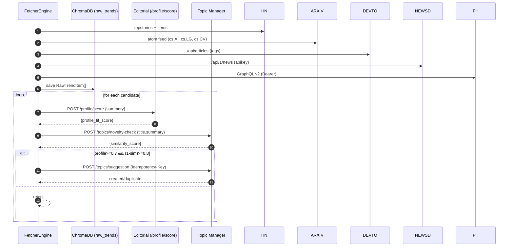

# Architektura Serwisu Trend-Harvester

## 1. Kontekst i Rola w Systemie

`Trend-Harvester` jest autonomicznym mikroserwisem, którego głównym zadaniem jest zasilanie ekosystemu Vector Wave w świeże, wysokiej jakości i wstępnie przefiltrowane tematy. Działa jako pierwsza linia "wywiadu", automatyzując proces, który wcześniej musiałby być wykonywany manualnie: przeglądanie dziesiątek źródeł w poszukiwaniu inspiracji.

Serwis realizuje następujące cele:
-   **Automatyzuje odkrywanie trendów.**
-   **Standaryzuje dane** z heterogenicznych źródeł.
-   **Redukuje szum informacyjny** dzięki inteligentnej, automatycznej ocenie.
-   **Wykorzystuje istniejące usługi** (`Editorial Service`, `Topic Manager`) jako źródło prawdy o profilu publikacji i historii tematów.

## 2. Diagram Architektury

```mermaid
graph TD
    subgraph External APIs
        API1[Hacker News]
        API2[ArXiv]
        API3[GitHub]
        API4[...]
    end

    subgraph Trend-Harvester Service (Port 8043)
        SCH[Scheduler (APScheduler)] --> FET[Fetcher Engine]
        FET --> NOR[Normalizer]
        NOR --> STO[Storage Service]
        STO --> TRI[Selective Triage Engine]
    end

    subgraph Core Vector Wave Services
        ES[Editorial Service]
        TM[Topic Manager]
        CDB[ChromaDB]
    end

    API1 & API2 & API3 & API4 --> FET

    STO -- Zapisuje do kolekcji 'raw_trends' --> CDB
    TRI -- Pyta o dopasowanie do profilu --> ES
    TRI -- Sprawdza duplikaty --> TM
    TRI -- Promuje temat --> TM
```

## 3. Komponenty Wewnętrzne

-   **Scheduler (APScheduler):** Odpowiedzialny za cykliczne uruchamianie procesu pobierania danych. Konfiguracja (np. "uruchamiaj co 6 godzin") znajduje się w pliku `config.yaml`.
-   **Fetcher Engine:** Moduł zawierający dedykowane "fetchery" dla każdego źródła API. Każdy fetcher jest odpowiedzialny za komunikację z jednym API i zwrócenie surowych danych.
-   **Normalizer (Pydantic Models):** Zestaw modeli Pydantic, które transformują surowe dane w ujednolicony format `RawTrendItem`. Zapewnia to spójność danych przed zapisem do bazy.
-   **Storage Service:** Prosta warstwa abstrakcji do komunikacji z ChromaDB, odpowiedzialna za zapisywanie i aktualizowanie statusu dokumentów w kolekcji `raw_trends`.
-   **Selective Triage Engine:** Lekka warstwa, która wykorzystuje istniejące usługi (`Editorial Service`, `Topic Manager`) do wyliczenia `profile_fit_score` i `novelty_score`, a następnie podejmuje decyzję (`PROMOTE` / `REJECT`) oraz opcjonalnie promuje temat przez `/topics/suggestion` z nagłówkiem `Idempotency-Key`.

## 4. Model Danych (ChromaDB)

-   **Kolekcja:** `raw_trends`
-   **Przykładowy Dokument:**
    ```json
    {
        "id": "hn-123456",
        "document": "A new open-source library 'Inferno' claims to be 5x faster than vLLM for LLM inference, focusing on AMD's RDNA architecture.",
        "metadata": {
            "source": "hacker-news",
            "title": "Show HN: Inferno - 5x faster LLM inference on consumer GPUs",
            "url": "https://example.com/inferno",
            "ingested_at": "2025-08-10T12:00:00Z",
            "status": "promoted",
            "triage_score": 0.88,
            "triage_reason": "High profile fit (GPU, performance, open-source) and high novelty."
        }
    }
    ```

## 5. Podejście "Container First"

Serwis od początku jest projektowany z myślą o konteneryzacji. `Dockerfile` i `docker-compose.service.yml` są kluczowymi artefaktami. Serwis posiada endpoint `/health` i jest zintegrowany z głównym `docker-compose.yml` za pomocą profilu `harvester`, co pozwala na jego opcjonalne uruchamianie.

---

## Uproszczona Architektura — skrót (2025-08-13)

Bez scraperów i bez wewnętrznych agentów. Pipeline oparty o stabilne API:

1) Równoległy fetch (HN, ArXiv, Dev.to, NewsData.io, Product Hunt)
2) Normalizacja do `RawTrendItem`
3) Zapis w `ChromaDB/raw_trends`
4) Selective Triage: `Editorial /profile/score` + `Topic Manager /topics/novelty-check`
5) Decyzja: `PROMOTE` → `Topic Manager /topics/suggestion` (z `Idempotency-Key`)


