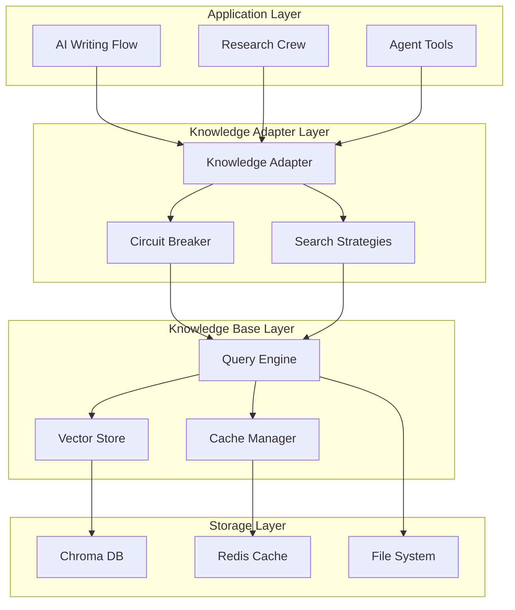
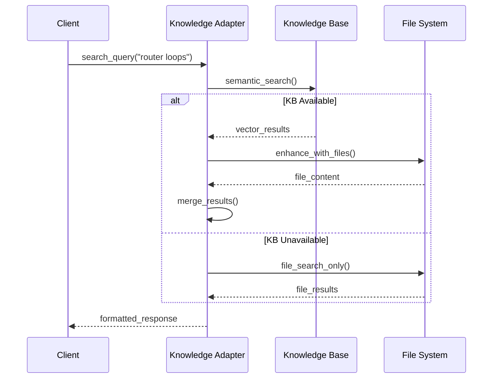

# Knowledge Base Integration Guide

Kompletny przewodnik integracji systemu Knowledge Base z CrewAI w Vector Wave.

## 🎯 Przegląd Architektury

### System Components



### Integration Patterns

1. **Knowledge Adapter Pattern**: Unified interface dla wszystkich źródeł wiedzy
2. **Circuit Breaker Pattern**: Automatic failover i protection
3. **Strategy Pattern**: Configurable search strategies  
4. **Cache-Aside Pattern**: Multi-layer caching dla performance
5. **Observer Pattern**: Event-driven updates i monitoring

## 🔧 Search Strategies Explained

### 1. HYBRID Strategy (Recommended)

**Opis**: Inteligentna kombinacja wszystkich źródeł z automatic fallback

**Flow**:


**Konfiguracja**:
```yaml
hybrid_strategy:
  kb_weight: 0.7          # Priorytet Knowledge Base
  file_weight: 0.3        # Priorytet file search
  merge_threshold: 0.5    # Próg mergowania wyników
  fallback_enabled: true  # Auto-fallback do files
```

**Użycie**:
```python
# Automatyczny hybrid search
response = search_crewai_knowledge(
    "CrewAI agent configuration best practices",
    strategy="HYBRID"
)
```

### 2. KB_FIRST Strategy

**Opis**: Priorytet semantic search z file enhancement

**Zalety**:
- Najlepsze wyniki dla complex queries
- Semantic similarity detection
- Comprehensive coverage

**Użycie**:
```python
# Dla complex conceptual queries
response = search_crewai_knowledge(
    "design patterns for multi-agent collaboration",
    strategy="KB_FIRST",
    score_threshold=0.6
)
```

### 3. FILE_FIRST Strategy

**Opis**: Fast local search z KB enhancement

**Zalety**:
- Szybsze response time
- Reliable offline operation
- Good dla simple lookups

**Użycie**:
```python
# Dla quick reference lookups
response = search_crewai_knowledge(
    "CrewAI installation steps",
    strategy="FILE_FIRST"
)
```

### 4. KB_ONLY Strategy

**Opis**: Pure vector search bez file fallback

**Zalety**:
- Najszybszy gdy KB działa
- Pure semantic search
- Best dla discovery queries

**Użycie**:
```python
# Dla exploratory semantic search
response = search_crewai_knowledge(
    "similar concepts to agent memory",
    strategy="KB_ONLY",
    limit=10
)
```

## ⚙️ Configuration Options

### Knowledge Adapter Configuration

```python
# src/adapters/knowledge_adapter.py configuration
ADAPTER_CONFIG = {
    "default_strategy": "HYBRID",
    "timeout_seconds": 30,
    "max_retries": 3,
    "circuit_breaker": {
        "failure_threshold": 5,      # Open after 5 failures
        "recovery_timeout": 60,      # Try recovery after 60s
        "success_threshold": 3       # Close after 3 successes
    },
    "cache": {
        "enabled": True,
        "ttl_seconds": 300,         # 5 minutes cache
        "max_size": 1000            # 1000 cached results
    }
}
```

### Knowledge Base Configuration

```yaml
# knowledge-base/config/knowledge_base.yaml
knowledge_base:
  performance:
    query_timeout_ms: 500
    cache_hit_target: 0.85
    max_concurrent_queries: 100
    
  vector_store:
    collection_name: "crewai_knowledge"
    embedding_function: "all-MiniLM-L6-v2"
    similarity_metric: "cosine"
    score_threshold: 0.35
    
  cache:
    memory:
      enabled: true
      max_size_mb: 512
      ttl_seconds: 300
    redis:
      enabled: true
      ttl_seconds: 3600
      max_connections: 20
```

### Search Parameters

```python
class SearchParams:
    query: str                    # Search query
    limit: int = 5               # Max results
    score_threshold: float = 0.7 # Min relevance score
    strategy: str = "HYBRID"     # Search strategy
    use_cache: bool = True       # Enable caching
    metadata_filters: dict = {}  # Filter by metadata
    include_snippets: bool = True # Include content snippets
    highlight_terms: bool = False # Highlight search terms
```

## 🚀 Performance Tuning Tips

### 1. Query Optimization

```python
# Optymalizacje dla różnych typów queries

# Dla specific technical queries
search_crewai_knowledge(
    "CrewAI @tool decorator syntax error",
    strategy="KB_FIRST",
    score_threshold=0.8,  # Higher threshold for precision
    limit=3               # Fewer, better results
)

# Dla broad conceptual queries  
search_crewai_knowledge(
    "agent collaboration patterns",
    strategy="HYBRID", 
    score_threshold=0.5,  # Lower threshold for recall
    limit=10              # More diverse results
)

# Dla quick reference
search_crewai_knowledge(
    "installation requirements",
    strategy="FILE_FIRST", # Fast file lookup
    use_cache=True        # Leverage cache
)
```

### 2. Cache Strategy

```python
# Cache warming dla popular queries
popular_queries = [
    "CrewAI installation",
    "agent configuration",
    "memory setup",
    "tool integration"
]

# Pre-populate cache
for query in popular_queries:
    search_crewai_knowledge(query, use_cache=True)
```

### 3. Circuit Breaker Tuning

```python
# Adjust thresholds based on usage patterns
circuit_breaker_config = {
    "failure_threshold": 3,     # Lower for sensitive apps
    "recovery_timeout": 30,     # Faster recovery for dev
    "success_threshold": 2      # Quick recovery verification
}
```

### 4. Monitoring Optimization

```python
# Get system statistics
stats = knowledge_system_stats()

# Adjust based on metrics
if stats.kb_availability < 0.9:
    # Increase circuit breaker tolerance
    config.circuit_breaker.failure_threshold = 10
    
if stats.average_response_time_ms > 1000:
    # Reduce query complexity
    default_limit = 3
    default_score_threshold = 0.8
```

## 🔍 Troubleshooting Common Issues

### Issue 1: Slow Query Performance

**Symptoms**:
- Query responses > 2 seconds
- High CPU usage
- Memory consumption growth

**Diagnosis**:
```python
# Check system statistics
stats = knowledge_system_stats()
print(f"Average response time: {stats.average_response_time_ms}ms")
print(f"KB availability: {stats.kb_availability:.1%}")

# Check circuit breaker status
if adapter.circuit_breaker.is_open():
    print("Circuit breaker is OPEN - KB unavailable")
```

**Solutions**:
```python
# 1. Increase score threshold
search_crewai_knowledge(query, score_threshold=0.8)

# 2. Reduce result limit
search_crewai_knowledge(query, limit=3)

# 3. Use FILE_FIRST strategy
search_crewai_knowledge(query, strategy="FILE_FIRST")

# 4. Enable caching
search_crewai_knowledge(query, use_cache=True)
```

### Issue 2: Circuit Breaker Frequently Opening

**Symptoms**:
- "Circuit breaker protection" errors
- Frequent fallback to file search
- KB unavailable warnings

**Diagnosis**:
```bash
# Check Knowledge Base health
curl http://localhost:8080/api/v1/knowledge/health

# Check Chroma DB status
curl http://localhost:8000/api/v1/heartbeat

# Check Redis connection
redis-cli ping
```

**Solutions**:
```python
# 1. Increase failure threshold
config.circuit_breaker.failure_threshold = 10

# 2. Reduce timeout
config.timeout_seconds = 10

# 3. Check resource limits
docker stats knowledge-base
```

### Issue 3: Low Search Relevance

**Symptoms**:
- Poor search results quality
- Low relevance scores
- Missing expected content

**Diagnosis**:
```python
# Test with known good queries
test_queries = [
    "CrewAI installation",
    "agent configuration", 
    "tool decorator"
]

for query in test_queries:
    response = search_crewai_knowledge(query, strategy="KB_ONLY")
    print(f"Query: {query}")
    print(f"Results: {len(response.results)}")
    if response.results:
        print(f"Top score: {response.results[0].score:.2f}")
```

**Solutions**:
```python
# 1. Lower score threshold
search_crewai_knowledge(query, score_threshold=0.3)

# 2. Use HYBRID strategy
search_crewai_knowledge(query, strategy="HYBRID")

# 3. Check embeddings update
# Run: python scripts/update_embeddings.py

# 4. Verify document indexing
# Check: /api/v1/knowledge/stats
```

### Issue 4: Cache Misses

**Symptoms**:
- High response times
- Low cache hit ratio
- Frequent KB queries

**Diagnosis**:
```python
stats = knowledge_system_stats()
cache_hit_ratio = stats.cache_hits / (stats.cache_hits + stats.cache_misses)
print(f"Cache hit ratio: {cache_hit_ratio:.1%}")
```

**Solutions**:
```python
# 1. Increase cache TTL
config.cache.ttl_seconds = 1800  # 30 minutes

# 2. Warm cache with popular queries
warm_cache_queries = ["installation", "configuration", "troubleshooting"]
for query in warm_cache_queries:
    search_crewai_knowledge(query)

# 3. Increase cache size
config.cache.max_size = 2000
```

## 📊 Performance Monitoring

### Key Metrics to Track

```python
# 1. Query Performance
- Average response time (target: <500ms)
- 95th percentile latency (target: <1000ms)  
- Query success rate (target: >98%)

# 2. System Health
- Knowledge Base availability (target: >99%)
- Circuit breaker open rate (target: <1%)
- Cache hit ratio (target: >85%)

# 3. Resource Usage
- Memory consumption (monitor growth)
- CPU utilization (target: <50%)
- Disk I/O for file searches
```

### Monitoring Dashboard

```python
# Custom monitoring endpoint
@app.get("/monitoring/dashboard")
def monitoring_dashboard():
    stats = knowledge_system_stats()
    
    return {
        "timestamp": datetime.now().isoformat(),
        "performance": {
            "avg_response_time_ms": stats.average_response_time_ms,
            "kb_availability": stats.kb_availability,
            "cache_hit_ratio": stats.cache_hit_ratio
        },
        "system": {
            "circuit_breaker_open": adapter.circuit_breaker.is_open(),
            "total_queries": stats.total_queries,
            "active_connections": stats.active_connections
        },
        "alerts": generate_alerts(stats)
    }
```

### Alert Thresholds

```python
def generate_alerts(stats):
    alerts = []
    
    if stats.average_response_time_ms > 1000:
        alerts.append({
            "level": "WARNING",
            "message": "High response time detected",
            "value": f"{stats.average_response_time_ms:.0f}ms"
        })
    
    if stats.kb_availability < 0.95:
        alerts.append({
            "level": "CRITICAL", 
            "message": "Knowledge Base availability low",
            "value": f"{stats.kb_availability:.1%}"
        })
    
    if stats.cache_hit_ratio < 0.8:
        alerts.append({
            "level": "INFO",
            "message": "Cache hit ratio below target", 
            "value": f"{stats.cache_hit_ratio:.1%}"
        })
    
    return alerts
```

## 🔧 Advanced Integration Patterns

### 1. Async Integration

```python
import asyncio
from ai_writing_flow.adapters.knowledge_adapter import get_adapter

async def async_knowledge_search(query: str):
    """Async knowledge search for better performance"""
    adapter = get_adapter("HYBRID")
    
    try:
        response = await adapter.search(query, limit=5)
        return response
    except Exception as e:
        logger.error(f"Async search failed: {e}")
        return None

# Usage in async context
async def research_task():
    results = await async_knowledge_search("CrewAI flow patterns")
    return process_results(results)
```

### 2. Batch Search

```python
async def batch_knowledge_search(queries: List[str]):
    """Batch multiple queries for efficiency"""
    adapter = get_adapter("HYBRID")
    
    tasks = [
        adapter.search(query, limit=3) 
        for query in queries
    ]
    
    results = await asyncio.gather(*tasks, return_exceptions=True)
    return results

# Usage
queries = [
    "agent configuration",
    "task orchestration", 
    "error handling"
]
batch_results = await batch_knowledge_search(queries)
```

### 3. Custom Search Filters

```python
def search_with_filters(query: str, category: str = None, difficulty: str = None):
    """Search with metadata filters"""
    
    metadata_filters = {}
    if category:
        metadata_filters["category"] = category
    if difficulty:
        metadata_filters["difficulty"] = difficulty
    
    return search_crewai_knowledge(
        query=query,
        strategy="HYBRID",
        metadata_filters=metadata_filters
    )

# Usage
results = search_with_filters(
    "agent patterns",
    category="core-concepts",
    difficulty="beginner"
)
```

### 4. Result Post-Processing

```python
def enhanced_search_with_processing(query: str):
    """Search with custom result processing"""
    
    response = search_crewai_knowledge(query, strategy="HYBRID")
    
    # Extract structured information
    processed_results = []
    for result in response.results:
        processed_result = {
            "title": result.title,
            "content": result.content[:500],  # Truncate
            "relevance": result.score,
            "source_type": result.source_type,
            "tags": extract_tags(result.content),
            "code_examples": extract_code_examples(result.content)
        }
        processed_results.append(processed_result)
    
    return processed_results
```

## 🚀 Production Deployment Considerations

### 1. Resource Requirements

```yaml
# Minimum production requirements
resources:
  knowledge_base:
    cpu: "1000m"         # 1 CPU core
    memory: "2Gi"        # 2GB RAM
    storage: "10Gi"      # 10GB storage
    
  chroma_db:
    cpu: "500m"          # 0.5 CPU core
    memory: "1Gi"        # 1GB RAM
    storage: "20Gi"      # 20GB storage
    
  redis:
    cpu: "200m"          # 0.2 CPU core  
    memory: "512Mi"      # 512MB RAM
    storage: "5Gi"       # 5GB storage
```

### 2. High Availability Setup

```yaml
# High availability configuration
high_availability:
  replicas: 3            # 3 KB instances
  load_balancer: nginx   # Load balancing
  health_checks:
    interval: 30s        # Health check frequency
    timeout: 10s         # Health check timeout
    retries: 3           # Retry attempts
  
  backup:
    frequency: "daily"   # Daily backups
    retention: "30d"     # 30 days retention
    storage: "s3://backup-bucket"
```

### 3. Security Considerations

```yaml
security:
  api_authentication: true    # Require API keys
  rate_limiting:
    enabled: true
    requests_per_minute: 100  # Rate limit
    burst_size: 20           # Burst allowance
  
  network:
    tls_enabled: true        # HTTPS only
    cors_origins: [          # CORS configuration
      "https://vectorwave.dev",
      "https://app.vectorwave.dev"
    ]
  
  data_privacy:
    log_queries: false       # Don't log sensitive queries
    anonymize_metrics: true  # Anonymize usage metrics
```

### 4. Monitoring & Alerting

```yaml
monitoring:
  prometheus:
    enabled: true
    port: 9090
    metrics_path: "/metrics"
  
  grafana:
    dashboard_id: "knowledge-base"
    alerts:
      - name: "High Response Time"
        condition: "avg_response_time > 1000ms"
        severity: "warning"
      
      - name: "Knowledge Base Down"
        condition: "kb_availability < 95%"
        severity: "critical"
      
      - name: "Low Cache Hit Ratio"
        condition: "cache_hit_ratio < 80%"
        severity: "info"
```

---

## 📚 Quick Reference

### Common Commands

```bash
# Health check
curl http://localhost:8080/api/v1/knowledge/health

# Search query
curl -X POST http://localhost:8080/api/v1/knowledge/query \
  -H "Content-Type: application/json" \
  -d '{"query": "CrewAI installation", "limit": 5}'

# System stats
curl http://localhost:8080/api/v1/knowledge/stats

# Manual sync
curl -X POST http://localhost:8080/api/v1/knowledge/sync
```

### Tool Quick Reference

```python
# Basic search
search_crewai_knowledge("query here")

# Advanced search
search_crewai_knowledge(
    query="complex query",
    strategy="HYBRID",
    limit=10,
    score_threshold=0.6
)

# Pattern examples
get_flow_examples("agent_patterns")

# Troubleshooting
troubleshoot_crewai("installation")

# System health
knowledge_system_stats()
```

### Configuration Files

- `/knowledge-base/config/knowledge_base.yaml` - Main configuration
- `/kolegium/ai_writing_flow/src/ai_writing_flow/adapters/knowledge_adapter.py` - Adapter config
- `/knowledge-base/docker/docker-compose.yml` - Docker setup

---

**Knowledge Base Integration** - Production-ready AI knowledge system for Vector Wave 🚀