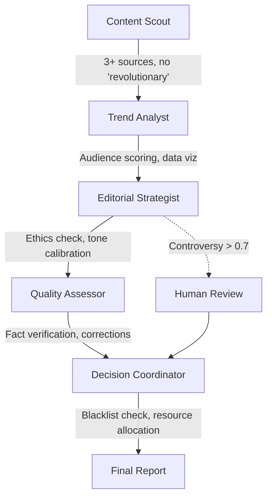

# Mapa Reguł Styleguide dla AI Kolegium Redakcyjne

## 🎯 Konkretne reguły styleguide dla każdego agenta kolegium

### 1. **CONTENT SCOUT** - Odkrywanie trendów

**Reguły do wdrożenia:**

```yaml
MISJA (z 01-foundation):
- "Test Everything" - każdy trend musi mieć źródła do weryfikacji
- "Show Our Work" - zapisuj skąd pochodzi informacja
- NIE używaj "revolutionary" bez dowodów rewolucji

ŹRÓDŁA (z 05-content):
- Minimum 3 primary sources dla każdego trendu
- Data < 6 months old (świeże źródła)
- Transparentna metodologia odkrywania

JĘZYK (z 04-language):
- Specificity Over Generality - konkretne liczby, nie "significant"
- NIE: "leverage", "cutting-edge", "game-changing"
- TAK: konkretne metryki wzrostu/spadku
```

**Implementacja:**
```python
discovery_rules = {
    "source_requirements": {
        "min_sources": 3,
        "max_age_days": 180,
        "must_include": ["primary_source", "data_point", "timestamp"]
    },
    "forbidden_descriptors": ["revolutionary", "game-changing", "cutting-edge"],
    "required_metrics": ["growth_rate", "adoption_numbers", "market_size"]
}
```

**Konkretne instrukcje do prompta:**
```
MANDATORY RULES:
1. Each topic MUST have minimum 3 primary sources
2. Include exact metrics (not "significant growth" but "245% YoY growth")
3. Record: source_url, source_type, data_timestamp for each claim
4. FORBIDDEN words: revolutionary, game-changing, cutting-edge, leverage
5. If you can't find 3 sources, DON'T include the topic
```

---

### 2. **TREND ANALYST** - Analiza wiralności

**Reguły do wdrożenia:**

```yaml
AUDIENCE MAPPING (z 02-audience):
- Technical Founder (35%) - strategic insights potrzebne
- Senior Engineer (30%) - głęboka analiza techniczna
- Decision Maker (25%) - business implications
- Skeptical Learner (10%) - uczciwe porady

DATA PRESENTATION (z 05-content):
- Zero-based axes (chyba że uzasadnione)
- Source data included
- Accessible colors
- Raw data downloadable

METRYKI (z 07-performance):
- Completion rate (>70%) jako cel
- Time on page vs. read time
- Technical comment quality
```

**Implementacja:**
```python
viral_analysis_rules = {
    "audience_scoring": {
        "technical_founder": {"weight": 0.35, "needs": ["strategic", "contrarian"]},
        "senior_engineer": {"weight": 0.30, "needs": ["technical_depth", "patterns"]},
        "decision_maker": {"weight": 0.25, "needs": ["business_impact", "accessible"]},
        "skeptical_learner": {"weight": 0.10, "needs": ["honest", "learning_path"]}
    },
    "data_requirements": {
        "benchmarks": True,
        "version_numbers": True,
        "performance_data": True
    }
}
```

**Konkretne instrukcje do prompta:**
```
Score each topic for audience fit:
- Technical Founder (35%): Needs strategic insights, contrarian takes
- Senior Engineer (30%): Needs technical depth, architecture patterns  
- Decision Maker (25%): Needs business implications, accessible depth
- Skeptical Learner (10%): Needs honest advice, learning paths

Include in output: audience_fit_scores: {founder: 0.8, engineer: 0.6...}
```

---

### 3. **EDITORIAL STRATEGIST** - Decyzje redakcyjne

**Reguły do wdrożenia:**

```yaml
VOICE & TONE (z 03-voice):
- Obsessively Specific - szczegóły mają znaczenie
- Confidently Uncertain - silne opinie, luźno trzymane
- Professionally Irreverent - poważni o rzemieśle, nie status

ETHICS CHECKLIST (z 06-operational):
- Is this our story to tell?
- Have we verified harm claims?
- Are we punching up, not down?
- Have we sought comment?
- Would we publish this about ourselves?

CONTROVERSY THRESHOLD (z 06-operational):
- >0.7 = human review required
- Sensitive topics: AI ethics, deepfakes, manipulation
- No anonymous sources for positive claims
```

**Implementacja:**
```python
editorial_rules = {
    "tone_calibration": {
        "formality": "professional_irreverent",
        "confidence": "strong_opinions_loosely_held",
        "specificity": "obsessive"
    },
    "ethics_gates": [
        "is_our_story",
        "verified_harm",
        "punching_up",
        "sought_comment",
        "self_test"
    ],
    "auto_escalate": {
        "controversy_threshold": 0.7,
        "sensitive_topics": ["synthetic_media", "memetic_engineering", "manipulation"]
    }
}
```

**Konkretne instrukcje do prompta:**
```
Run ETHICS CHECKLIST for each topic:
□ Is this our story to tell?
□ Have we verified any harm claims?
□ Are we punching up, not down?
□ Did we seek comment from involved parties?
□ Would we publish this about ourselves?

If ANY answer is NO → flag for human_review with reason
```

---

### 4. **QUALITY ASSESSOR** - Kontrola jakości

**Reguły do wdrożenia:**

```yaml
TECHNICAL ACCURACY (z 05-content):
- Every claim sourced/tested
- Code runs in fresh environment
- Version numbers required
- Benchmarks for performance claims

RESEARCH STANDARDS (z 05-content):
- 3+ primary sources minimum
- Peer review for Deep Analysis
- Transparent methodology
- Data < 6 months old

CORRECTIONS (z 06-operational):
- Same prominence as error
- "CORRECTION:" in title
- Explain what and why changed
- Strike through, don't delete
```

**Implementacja:**
```python
quality_rules = {
    "fact_check_requirements": {
        "min_sources": 3,
        "source_types": ["primary", "peer_reviewed", "official_docs"],
        "code_verification": "fresh_environment",
        "version_tracking": True
    },
    "correction_protocol": {
        "visibility": "same_as_original",
        "format": "CORRECTION: [what] [why]",
        "preserve_original": True
    },
    "rejection_triggers": {
        "untested_code": True,
        "no_sources": True,
        "stale_data": ">6_months"
    }
}
```

**Konkretne instrukcje do prompta:**
```
VERIFICATION REQUIREMENTS:
- Find and verify EVERY numerical claim
- Check if code would run in fresh environment
- Verify all version numbers are current
- Flag any data older than 6 months
- If untested code found → quality_approved = False
```

---

### 5. **DECISION COORDINATOR** - Koordynacja finalna

**Reguły do wdrożenia:**

```yaml
CONTENT LIFECYCLE (z 07-performance):
- 3 months: Performance review
- 6 months: Accuracy check
- 12 months: Update or archive
- 24 months: Retire or rewrite

RESOURCE ALLOCATION (z editorial_report):
- Feature Writers dla high-controversy topics
- Reporters dla technical deep dives
- Editorial Review Board dla >0.7 controversy
- Fact-check Team dla viral predictions

BLACKLIST CHECK (z 07-performance):
- "In today's fast-paced world" = instant rejection
- "AI will replace all developers" = rejection
- Untested code = rejection
- Hidden sponsored content = rejection
```

**Implementacja:**
```python
coordination_rules = {
    "final_validation": {
        "blacklist_phrases": [
            "in today's fast-paced world",
            "leverage", "seamless", "revolutionary",
            "AI will replace all", "ultimate guide"
        ],
        "content_gates": {
            "tested_code": True,
            "disclosed_sponsorship": True,
            "evidence_based": True
        }
    },
    "calendar_planning": {
        "high_priority": "controversy < 0.3 AND viral_score > 0.8",
        "human_review": "controversy > 0.7",
        "resource_match": {
            "technical_depth": "senior_writers",
            "breaking_news": "reporters",
            "controversy": "editorial_board"
        }
    }
}
```

**Konkretne instrukcje do prompta:**
```
FINAL BLACKLIST CHECK:
Instant rejection if contains:
- "In today's fast-paced world"
- "AI will replace all developers"  
- Untested code examples
- Generic "best practices" without context

Add to rejected_topics with reason: "blacklist_violation"
```

---

## 📊 Przepływ reguł przez proces



## 🔑 Kluczowe punkty implementacji

### 1. **Walidacja na każdym kroku**
- Każdy agent ma swoje reguły walidacji
- Output jednego agenta jest sprawdzany przez następnego
- Finalna walidacja przez Decision Coordinator

### 2. **Automatyczne odrzucanie**
- Brak 3 źródeł → odrzucenie przez Content Scout
- Forbidden phrases → odrzucenie przez Decision Coordinator
- Untested code → odrzucenie przez Quality Assessor

### 3. **Human-in-the-loop triggers**
- Controversy > 0.7
- Failed ethics checklist
- Sensitive topics (AI ethics, deepfakes)

### 4. **Metryki sukcesu**
- 80%+ completion rate dla approved topics
- <2% correction frequency
- 15-25% human intervention rate (optimal)

## 📝 Checklist implementacyjny

- [ ] Zaktualizować prompty agentów o konkretne reguły
- [ ] Dodać walidację do Pydantic models
- [ ] Stworzyć styleguide_context dla crew inputs
- [ ] Zaimplementować blacklist checker
- [ ] Dodać audience scoring do viral analysis
- [ ] Włączyć ethics gates do editorial review
- [ ] Skonfigurować source tracking w discovery
- [ ] Ustawić automatic rejection rules

---

**Uwaga**: Te reguły powinny być zaimplementowane bezpośrednio w:
1. Agent prompts (backstory/goal w agents.yaml)
2. Task descriptions (w tasks.yaml)
3. Output validation (Pydantic models w models.py)
4. Context passed between agents (crew configuration)