# 🤖 CrewAI Integration Architecture - Vector Wave

## 🎯 Overview

This document provides **concrete CrewAI implementation specifications** for Vector Wave Target Architecture, addressing the integration gap between CrewAI agents and ChromaDB-first Editorial Service.

## 🏗️ CrewAI Agent Architecture Overview

```mermaid
flowchart TB
    subgraph "CREWAI AGENT LAYER"
        RA[🔍 Research Agent<br/>CrewAI + ChromaDB Tools]
        AA[👥 Audience Agent<br/>CrewAI + Platform Rules]
        WA[✍️ Writer Agent<br/>CrewAI + Style Integration]
        SA[🎨 Style Agent<br/>CrewAI + Validation Tools]
        QA[✅ Quality Agent<br/>CrewAI + Quality Rules]
    end
    
    subgraph "EDITORIAL SERVICE HTTP CLIENT"
        ESC[⚖️ EditorialServiceClient<br/>HTTP Integration Layer]
        
        subgraph "ChromaDB Tools"
            RT[🔍 Research Tools<br/>Topic Discovery & Validation]
            AT[👥 Audience Tools<br/>Platform Optimization]
            WT[✍️ Writer Tools<br/>Style Guidelines]
            ST[🎨 Style Tools<br/>Rule Validation]
            QT[✅ Quality Tools<br/>Final Review]
        end
        
        ESC --> RT
        ESC --> AT
        ESC --> WT
        ESC --> ST
        ESC --> QT
    end
    
    subgraph "EDITORIAL SERVICE API - Port 8040"
        ES[⚖️ Editorial Service<br/>ChromaDB Gateway]
        
        subgraph "ChromaDB Collections"
            C1[📋 style_editorial_rules]
            C2[🎯 publication_platform_rules] 
            C3[📚 topics]
            C4[📅 scheduling_optimization]
            C5[👥 user_preferences]
        end
        
        ES --> C1
        ES --> C2
        ES --> C3
        ES --> C4
        ES --> C5
    end
    
    %% Agent Integration
    RA --> ESC
    AA --> ESC
    WA --> ESC
    SA --> ESC
    QA --> ESC
    
    %% Service Communication
    ESC --> ES
    
    subgraph "CREWAI FLOW EXECUTION"
        KF[🚀 Kolegium CrewAI Flow<br/>Linear Sequential Execution]
        HAF[👨‍💻 Human-Assisted Flow<br/>Interactive Checkpoints]
        
        KF --> RA
        HAF --> RA
    end
```



## 🔧 Core HTTP Client Implementation

### EditorialServiceClient

```python
import httpx
from typing import Dict, List, Any, Optional
import asyncio
from crewai_tools import BaseTool

class EditorialServiceClient:
    """HTTP client for CrewAI agents to access Editorial Service"""
    
    def __init__(self, base_url: str = "http://localhost:8040"):
        self.base_url = base_url
        self.client = httpx.AsyncClient(timeout=30.0)
        
    async def validate_comprehensive(self, content: str, platform: str = "general") -> Dict[str, Any]:
        """Comprehensive validation (8-12 rules) for AI-first workflow"""
        response = await self.client.post(
            f"{self.base_url}/validate/comprehensive",
            json={
                "content": content,
                "platform": platform,
                "mode": "comprehensive"
            }
        )
        response.raise_for_status()
        return response.json()
        
    async def validate_selective(self, content: str, checkpoint: str, platform: str = "general") -> Dict[str, Any]:
        """Selective validation (3-4 rules) for human-assisted workflow"""
        response = await self.client.post(
            f"{self.base_url}/validate/selective",
            json={
                "content": content,
                "checkpoint": checkpoint,
                "platform": platform,
                "mode": "selective"
            }
        )
        response.raise_for_status()
        return response.json()
        
    async def query_topics(self, query: str, limit: int = 10) -> List[Dict[str, Any]]:
        """Query topic database for suggestions"""
        response = await self.client.post(
            f"{self.base_url}/topics/query",
            json={
                "query": query,
                "limit": limit,
                "status": "suggested"
            }
        )
        response.raise_for_status()
        return response.json()["topics"]
        
    async def get_platform_rules(self, platform: str) -> Dict[str, Any]:
        """Get platform-specific rules and constraints"""
        response = await self.client.get(
            f"{self.base_url}/platforms/{platform}/rules"
        )
        response.raise_for_status()
        return response.json()
        
    async def get_style_patterns(self, category: str = "all") -> List[Dict[str, Any]]:
        """Get style patterns for content analysis"""
        response = await self.client.get(
            f"{self.base_url}/style/patterns",
            params={"category": category}
        )
        response.raise_for_status()
        return response.json()["patterns"]
```

## 🔍 Research Agent Implementation

### ResearchAgent with ChromaDB Tools

```python
from crewai import Agent, Task, Crew
from crewai_tools import BaseTool
from typing import Dict, List, Any

class ChromaDBResearchTools:
    """Research-specific tools using Editorial Service"""
    
    def __init__(self, editorial_client: EditorialServiceClient):
        self.client = editorial_client
    
    @BaseTool
    def discover_trending_topics(self, domain: str, limit: int = 20) -> str:
        """
        Discover trending topics in specified domain using ChromaDB topic database
        
        Args:
            domain: Domain to search (e.g., "AI", "Web Development", "DevOps")
            limit: Number of topics to return
        """
        loop = asyncio.get_event_loop()
        topics = loop.run_until_complete(
            self.client.query_topics(f"trending topics in {domain}", limit=limit)
        )
        
        formatted_topics = []
        for topic in topics:
            formatted_topics.append(f"• {topic['title']} (Score: {topic.get('trending_score', 0)})")
            
        return f"Trending topics in {domain}:\n" + "\n".join(formatted_topics)
    
    @BaseTool
    def validate_topic_quality(self, topic_title: str, target_platform: str) -> str:
        """
        Validate topic quality using ChromaDB editorial rules
        
        Args:
            topic_title: Topic to validate
            target_platform: Platform for content (LinkedIn, Twitter, etc.)
        """
        loop = asyncio.get_event_loop()
        
        # Get platform rules
        platform_rules = loop.run_until_complete(
            self.client.get_platform_rules(target_platform)
        )
        
        # Validate topic against editorial standards
        validation = loop.run_until_complete(
            self.client.validate_comprehensive(
                content=f"Topic: {topic_title}",
                platform=target_platform
            )
        )
        
        quality_score = validation.get("quality_score", 0)
        issues = validation.get("issues", [])
        
        result = f"Topic Quality Analysis for '{topic_title}':\n"
        result += f"Quality Score: {quality_score}/10\n"
        result += f"Platform: {target_platform}\n"
        
        if issues:
            result += "Issues identified:\n"
            for issue in issues:
                result += f"• {issue}\n"
        else:
            result += "✅ No issues found - topic is publication ready\n"
            
        return result
    
    @BaseTool  
    def research_topic_depth(self, topic: str, depth_level: str = "comprehensive") -> str:
        """
        Research topic depth using ChromaDB knowledge base
        
        Args:
            topic: Topic to research
            depth_level: "quick", "standard", or "comprehensive"
        """
        loop = asyncio.get_event_loop()
        
        # Query for related topics and content
        related_topics = loop.run_until_complete(
            self.client.query_topics(f"related to {topic}", limit=10)
        )
        
        # Get style patterns for research analysis
        style_patterns = loop.run_until_complete(
            self.client.get_style_patterns("research")
        )
        
        result = f"Research Analysis: {topic}\n"
        result += f"Depth Level: {depth_level}\n\n"
        
        if related_topics:
            result += "Related Topics:\n"
            for rt in related_topics[:5]:
                result += f"• {rt['title']} (Relevance: {rt.get('relevance_score', 0)})\n"
        
        result += f"\nResearch Guidelines:\n"
        for pattern in style_patterns[:3]:
            result += f"• {pattern.get('guideline', 'Ensure thorough research')}\n"
            
        return result

def create_research_agent(editorial_client: EditorialServiceClient) -> Agent:
    """Create Research Agent with ChromaDB tools"""
    
    research_tools = ChromaDBResearchTools(editorial_client)
    
    return Agent(
        role="Senior Research Specialist", 
        goal="Discover trending topics and validate content opportunities using ChromaDB intelligence",
        backstory="""You are an expert researcher who leverages the ChromaDB topic database 
        and editorial rules to identify high-quality content opportunities. You validate 
        topic quality against platform-specific requirements and ensure research depth 
        meets Vector Wave editorial standards.""",
        tools=[
            research_tools.discover_trending_topics,
            research_tools.validate_topic_quality,
            research_tools.research_topic_depth
        ],
        verbose=True,
        allow_delegation=False,
        max_iter=3
    )
```

## 👥 Audience Agent Implementation

### AudienceAgent with Platform Optimization

```python
class ChromaDBAudienceTools:
    """Audience analysis tools using Editorial Service"""
    
    def __init__(self, editorial_client: EditorialServiceClient):
        self.client = editorial_client
    
    @BaseTool
    def analyze_target_audience(self, topic: str, platform: str) -> str:
        """
        Analyze target audience using ChromaDB user preferences and platform data
        
        Args:
            topic: Content topic
            platform: Target platform (LinkedIn, Twitter, etc.)
        """
        loop = asyncio.get_event_loop()
        
        # Get platform-specific audience rules
        platform_rules = loop.run_until_complete(
            self.client.get_platform_rules(platform)
        )
        
        audience_data = platform_rules.get("audience_insights", {})
        
        result = f"Target Audience Analysis - {topic} on {platform}:\n\n"
        result += f"Primary Demographics:\n"
        result += f"• Age Range: {audience_data.get('age_range', 'Professional adults')}\n"
        result += f"• Industry Focus: {audience_data.get('industry', 'Technology')}\n"
        result += f"• Engagement Pattern: {audience_data.get('engagement_pattern', 'Professional content')}\n"
        
        result += f"\nContent Preferences:\n"
        preferences = audience_data.get("content_preferences", [])
        for pref in preferences[:3]:
            result += f"• {pref}\n"
            
        return result
    
    @BaseTool
    def optimize_for_platform(self, content_angle: str, platform: str) -> str:
        """
        Optimize content angle for specific platform using ChromaDB rules
        
        Args:
            content_angle: Proposed content angle
            platform: Target platform
        """
        loop = asyncio.get_event_loop()
        
        # Validate content angle against platform rules
        validation = loop.run_until_complete(
            self.client.validate_comprehensive(
                content=content_angle,
                platform=platform
            )
        )
        
        platform_rules = loop.run_until_complete(
            self.client.get_platform_rules(platform)
        )
        
        result = f"Platform Optimization for {platform}:\n\n"
        result += f"Original Angle: {content_angle}\n\n"
        
        # Platform-specific recommendations
        optimization = platform_rules.get("optimization", {})
        result += f"Recommended Adjustments:\n"
        
        if validation.get("issues"):
            for issue in validation["issues"][:3]:
                result += f"• {issue}\n"
        
        result += f"\nPlatform Best Practices:\n"
        practices = optimization.get("best_practices", [])
        for practice in practices[:3]:
            result += f"• {practice}\n"
            
        return result
    
    @BaseTool
    def suggest_content_angles(self, topic: str, audience_type: str, platform: str) -> str:
        """
        Suggest content angles using ChromaDB audience intelligence
        
        Args:
            topic: Main topic
            audience_type: Type of audience (developers, executives, etc.)
            platform: Target platform
        """
        loop = asyncio.get_event_loop()
        
        # Query for successful content patterns
        platform_rules = loop.run_until_complete(
            self.client.get_platform_rules(platform)
        )
        
        style_patterns = loop.run_until_complete(
            self.client.get_style_patterns("angles")
        )
        
        result = f"Content Angle Suggestions - {topic}:\n"
        result += f"Audience: {audience_type} on {platform}\n\n"
        
        angles = []
        audience_data = platform_rules.get("audience_insights", {})
        
        # Generate angles based on ChromaDB patterns
        if "technical" in audience_type.lower():
            angles.append(f"Deep technical dive into {topic} implementation")
            angles.append(f"Best practices and pitfalls in {topic}")
            angles.append(f"Real-world case study: {topic} in production")
        elif "executive" in audience_type.lower():
            angles.append(f"Business impact of {topic} adoption")
            angles.append(f"ROI analysis: investing in {topic}")
            angles.append(f"Strategic considerations for {topic}")
        else:
            angles.append(f"Getting started with {topic}")
            angles.append(f"Common misconceptions about {topic}")
            angles.append(f"Future trends in {topic}")
        
        result += "Suggested Angles:\n"
        for i, angle in enumerate(angles, 1):
            result += f"{i}. {angle}\n"
            
        return result

def create_audience_agent(editorial_client: EditorialServiceClient) -> Agent:
    """Create Audience Agent with ChromaDB tools"""
    
    audience_tools = ChromaDBAudienceTools(editorial_client)
    
    return Agent(
        role="Audience Strategy Expert",
        goal="Analyze target audiences and optimize content for maximum platform engagement using ChromaDB insights",
        backstory="""You are a specialist in audience analysis who leverages ChromaDB 
        platform rules and user preference data to optimize content for specific audiences. 
        You understand platform-specific engagement patterns and can suggest content angles 
        that resonate with different audience segments.""",
        tools=[
            audience_tools.analyze_target_audience,
            audience_tools.optimize_for_platform,
            audience_tools.suggest_content_angles
        ],
        verbose=True,
        allow_delegation=False,
        max_iter=3
    )
```

## ✍️ Writer Agent Implementation

### WriterAgent with Style Integration

```python
class ChromaDBWriterTools:
    """Writer-specific tools using Editorial Service"""
    
    def __init__(self, editorial_client: EditorialServiceClient):
        self.client = editorial_client
    
    @BaseTool
    def generate_content_draft(self, topic: str, angle: str, platform: str, audience: str) -> str:
        """
        Generate content draft following ChromaDB style guidelines
        
        Args:
            topic: Main topic
            angle: Content angle
            platform: Target platform
            audience: Target audience
        """
        loop = asyncio.get_event_loop()
        
        # Get style guidelines from ChromaDB
        style_patterns = loop.run_until_complete(
            self.client.get_style_patterns("writing")
        )
        
        platform_rules = loop.run_until_complete(
            self.client.get_platform_rules(platform)
        )
        
        # Draft structure based on ChromaDB rules
        draft = f"# {topic}: {angle}\n\n"
        
        # Add hook based on platform rules
        hook_style = platform_rules.get("hook_requirements", {})
        if hook_style.get("type") == "question":
            draft += f"What if I told you that {topic} could revolutionize how you work?\n\n"
        elif hook_style.get("type") == "statistic":
            draft += f"According to recent data, 73% of professionals are leveraging {topic} incorrectly.\n\n"
        else:
            draft += f"Here's what most people get wrong about {topic}...\n\n"
        
        # Add main content following style guidelines
        draft += f"## The Reality of {topic}\n\n"
        draft += f"When approaching {topic} from the angle of {angle}, "
        draft += f"it's crucial for {audience} to understand the fundamental principles.\n\n"
        
        draft += f"## Key Insights\n\n"
        draft += f"1. **Practical Application**: How {topic} applies in real-world scenarios\n"
        draft += f"2. **Common Pitfalls**: What to avoid when implementing {topic}\n"
        draft += f"3. **Best Practices**: Proven strategies for success with {topic}\n\n"
        
        draft += f"## Action Steps\n\n"
        draft += f"Based on the analysis above, here are concrete next steps:\n"
        draft += f"• Start by evaluating your current approach to {topic}\n"
        draft += f"• Implement the strategies outlined above\n"
        draft += f"• Monitor results and iterate based on feedback\n\n"
        
        # Add platform-specific closing
        closing = platform_rules.get("closing_requirements", {})
        if closing.get("call_to_action"):
            draft += f"What's your experience with {topic}? Share your thoughts in the comments.\n"
        
        return draft
    
    @BaseTool
    def apply_style_guidelines(self, content: str, validation_mode: str = "comprehensive") -> str:
        """
        Apply style guidelines using ChromaDB validation
        
        Args:
            content: Content to validate and improve
            validation_mode: "comprehensive" or "selective"
        """
        loop = asyncio.get_event_loop()
        
        if validation_mode == "comprehensive":
            validation = loop.run_until_complete(
                self.client.validate_comprehensive(content, platform="general")
            )
        else:
            validation = loop.run_until_complete(
                self.client.validate_selective(content, checkpoint="style", platform="general")
            )
        
        result = f"Style Guidelines Applied:\n\n"
        
        quality_score = validation.get("quality_score", 0)
        result += f"Quality Score: {quality_score}/10\n\n"
        
        if validation.get("issues"):
            result += "Issues Found and Addressed:\n"
            for issue in validation["issues"]:
                result += f"• {issue}\n"
            result += "\n"
        
        suggestions = validation.get("suggestions", [])
        if suggestions:
            result += "Style Improvements Applied:\n"
            for suggestion in suggestions:
                result += f"• {suggestion}\n"
            result += "\n"
        
        result += "Style Guidelines Status: ✅ Compliant with ChromaDB rules\n"
        
        return result
    
    @BaseTool
    def optimize_for_engagement(self, content: str, platform: str) -> str:
        """
        Optimize content for engagement using ChromaDB platform rules
        
        Args:
            content: Content to optimize
            platform: Target platform
        """
        loop = asyncio.get_event_loop()
        
        platform_rules = loop.run_until_complete(
            self.client.get_platform_rules(platform)
        )
        
        validation = loop.run_until_complete(
            self.client.validate_comprehensive(content, platform=platform)
        )
        
        result = f"Engagement Optimization for {platform}:\n\n"
        
        # Platform-specific optimizations
        engagement = platform_rules.get("engagement_optimization", {})
        
        result += f"Platform Requirements:\n"
        for req in engagement.get("requirements", [])[:3]:
            result += f"• {req}\n"
        
        result += f"\nOptimization Suggestions:\n"
        for suggestion in validation.get("engagement_suggestions", [])[:3]:
            result += f"• {suggestion}\n"
        
        predicted_engagement = validation.get("engagement_score", 7.5)
        result += f"\nPredicted Engagement Score: {predicted_engagement}/10\n"
        
        return result

def create_writer_agent(editorial_client: EditorialServiceClient) -> Agent:
    """Create Writer Agent with ChromaDB tools"""
    
    writer_tools = ChromaDBWriterTools(editorial_client)
    
    return Agent(
        role="Senior Content Writer",
        goal="Create compelling, high-quality content that follows ChromaDB style guidelines and maximizes platform engagement",
        backstory="""You are an expert content writer who creates engaging content 
        following strict editorial standards stored in ChromaDB. You understand how to 
        adapt writing style for different platforms while maintaining quality and 
        consistency with Vector Wave's editorial guidelines.""",
        tools=[
            writer_tools.generate_content_draft,
            writer_tools.apply_style_guidelines,
            writer_tools.optimize_for_engagement
        ],
        verbose=True,
        allow_delegation=False,
        max_iter=3
    )
```

## 🎨 Style Agent Implementation

### StyleAgent with Comprehensive ChromaDB Rules

```python
class ChromaDBStyleTools:
    """Style validation tools using Editorial Service"""
    
    def __init__(self, editorial_client: EditorialServiceClient):
        self.client = editorial_client
    
    @BaseTool
    def validate_style_compliance(self, content: str, platform: str = "general") -> str:
        """
        Comprehensive style validation using ChromaDB rules (replaces hardcoded forbidden_phrases)
        
        Args:
            content: Content to validate
            platform: Target platform for platform-specific rules
        """
        loop = asyncio.get_event_loop()
        
        # Get comprehensive validation (8-12 rules from ChromaDB)
        validation = loop.run_until_complete(
            self.client.validate_comprehensive(content, platform=platform)
        )
        
        result = f"Style Compliance Report:\n"
        result += f"Platform: {platform}\n"
        result += f"Quality Score: {validation.get('quality_score', 0)}/10\n\n"
        
        # Style violations (replaces hardcoded forbidden_phrases check)
        violations = validation.get("violations", [])
        if violations:
            result += f"❌ Style Violations Found ({len(violations)}):\n"
            for violation in violations:
                result += f"• {violation.get('rule', 'Style issue')}: {violation.get('description', 'See editorial guidelines')}\n"
                if violation.get("suggestions"):
                    result += f"  → Suggestion: {violation['suggestions'][0]}\n"
        else:
            result += "✅ No style violations found\n"
        
        # Positive style elements
        strengths = validation.get("strengths", [])
        if strengths:
            result += f"\n✅ Style Strengths ({len(strengths)}):\n"
            for strength in strengths:
                result += f"• {strength}\n"
        
        # ChromaDB rule coverage
        rules_applied = validation.get("rules_applied", [])
        result += f"\nChromatDB Rules Applied: {len(rules_applied)}\n"
        for rule in rules_applied[:3]:  # Show first 3
            result += f"• {rule.get('rule_name', 'Editorial rule')}\n"
        
        return result
    
    @BaseTool
    def check_forbidden_elements(self, content: str) -> str:
        """
        Check for forbidden elements using ChromaDB style patterns (replaces hardcoded style_patterns)
        
        Args:
            content: Content to analyze
        """
        loop = asyncio.get_event_loop()
        
        # Get style patterns from ChromaDB (replaces hardcoded regex patterns)
        style_patterns = loop.run_until_complete(
            self.client.get_style_patterns("forbidden")
        )
        
        # Validate against ChromaDB patterns
        validation = loop.run_until_complete(
            self.client.validate_comprehensive(content, platform="general")
        )
        
        result = f"Forbidden Elements Analysis:\n\n"
        
        # Pattern violations from ChromaDB
        pattern_issues = validation.get("pattern_violations", [])
        if pattern_issues:
            result += f"❌ Pattern Issues Found ({len(pattern_issues)}):\n"
            for issue in pattern_issues:
                result += f"• {issue.get('pattern', 'Style pattern')}: {issue.get('count', 0)} occurrences\n"
                result += f"  Example: \"{issue.get('example', 'N/A')}\"\n"
        else:
            result += "✅ No forbidden patterns detected\n"
        
        # ChromaDB pattern analysis
        result += f"\nStyle Pattern Coverage:\n"
        for pattern in style_patterns[:3]:
            pattern_name = pattern.get("name", "Editorial pattern")
            result += f"• {pattern_name}: Checked\n"
        
        overall_score = validation.get("pattern_score", 8.5)
        result += f"\nOverall Pattern Score: {overall_score}/10\n"
        
        return result
    
    @BaseTool
    def analyze_writing_patterns(self, content: str) -> str:
        """
        Analyze writing patterns using ChromaDB editorial intelligence
        
        Args:
            content: Content to analyze
        """
        loop = asyncio.get_event_loop()
        
        # Get comprehensive analysis
        validation = loop.run_until_complete(
            self.client.validate_comprehensive(content, platform="general")
        )
        
        style_patterns = loop.run_until_complete(
            self.client.get_style_patterns("analysis")
        )
        
        result = f"Writing Pattern Analysis:\n\n"
        
        # Readability metrics from ChromaDB
        metrics = validation.get("readability_metrics", {})
        result += f"Readability Metrics:\n"
        result += f"• Sentence Complexity: {metrics.get('complexity_score', 7)}/10\n"
        result += f"• Paragraph Flow: {metrics.get('flow_score', 8)}/10\n"
        result += f"• Technical Depth: {metrics.get('technical_depth', 6)}/10\n"
        
        # Writing style analysis
        style_analysis = validation.get("style_analysis", {})
        result += f"\nStyle Analysis:\n"
        result += f"• Voice Consistency: {style_analysis.get('voice_score', 8.5)}/10\n"
        result += f"• Engagement Level: {style_analysis.get('engagement_score', 7.5)}/10\n"
        result += f"• Brand Alignment: {style_analysis.get('brand_score', 9)}/10\n"
        
        # Improvement suggestions from ChromaDB
        suggestions = validation.get("pattern_suggestions", [])
        if suggestions:
            result += f"\n💡 Pattern Improvement Suggestions:\n"
            for suggestion in suggestions[:3]:
                result += f"• {suggestion}\n"
        
        return result

def create_style_agent(editorial_client: EditorialServiceClient) -> Agent:
    """Create Style Agent with ChromaDB tools (replaces hardcoded forbidden_phrases)"""
    
    style_tools = ChromaDBStyleTools(editorial_client)
    
    return Agent(
        role="Style Validation Specialist",
        goal="Ensure content meets Vector Wave style standards using comprehensive ChromaDB rules validation",
        backstory="""You are a meticulous style expert who validates content against 
        Vector Wave's comprehensive editorial standards stored in ChromaDB. You catch 
        style violations, forbidden elements, and writing pattern issues that could 
        compromise content quality. You replace all hardcoded rule checking with 
        dynamic ChromaDB-sourced validation.""",
        tools=[
            style_tools.validate_style_compliance,
            style_tools.check_forbidden_elements,
            style_tools.analyze_writing_patterns
        ],
        verbose=True,
        allow_delegation=False,
        max_iter=3
    )
```

## ✅ Quality Agent Implementation

### QualityAgent with Full Validation Suite

```python
class ChromaDBQualityTools:
    """Quality assurance tools using Editorial Service"""
    
    def __init__(self, editorial_client: EditorialServiceClient):
        self.client = editorial_client
    
    @BaseTool
    def comprehensive_quality_check(self, content: str, platform: str, content_type: str = "article") -> str:
        """
        Comprehensive quality validation using all ChromaDB rules
        
        Args:
            content: Content to validate
            platform: Target platform
            content_type: Type of content (article, post, thread, etc.)
        """
        loop = asyncio.get_event_loop()
        
        # Get comprehensive validation (all ChromaDB rules)
        validation = loop.run_until_complete(
            self.client.validate_comprehensive(content, platform=platform)
        )
        
        platform_rules = loop.run_until_complete(
            self.client.get_platform_rules(platform)
        )
        
        result = f"Comprehensive Quality Report:\n"
        result += f"Content Type: {content_type}\n"
        result += f"Platform: {platform}\n"
        result += f"Overall Quality Score: {validation.get('quality_score', 0)}/10\n\n"
        
        # Quality dimensions from ChromaDB
        dimensions = validation.get("quality_dimensions", {})
        
        result += f"Quality Dimensions:\n"
        result += f"• Content Accuracy: {dimensions.get('accuracy', 8)}/10\n"
        result += f"• Style Compliance: {dimensions.get('style', 7)}/10\n"
        result += f"• Platform Optimization: {dimensions.get('platform', 8)}/10\n"
        result += f"• Engagement Potential: {dimensions.get('engagement', 7.5)}/10\n"
        result += f"• Technical Depth: {dimensions.get('technical', 6.5)}/10\n"
        
        # Critical issues
        critical_issues = validation.get("critical_issues", [])
        if critical_issues:
            result += f"\n❌ Critical Issues ({len(critical_issues)}):\n"
            for issue in critical_issues:
                result += f"• {issue}\n"
        
        # Quality gate status
        quality_gate = validation.get("quality_gate", {})
        min_score = platform_rules.get("quality_threshold", 8.5)
        current_score = validation.get('quality_score', 0)
        
        result += f"\nQuality Gate:\n"
        result += f"• Minimum Required: {min_score}/10\n"
        result += f"• Current Score: {current_score}/10\n"
        result += f"• Status: {'✅ PASSED' if current_score >= min_score else '❌ NEEDS IMPROVEMENT'}\n"
        
        return result
    
    @BaseTool  
    def validate_evidence_requirements(self, content: str) -> str:
        """
        Validate evidence and data requirements using ChromaDB editorial rules
        
        Args:
            content: Content to validate for evidence
        """
        loop = asyncio.get_event_loop()
        
        validation = loop.run_until_complete(
            self.client.validate_comprehensive(content, platform="general")
        )
        
        # Get evidence patterns from ChromaDB
        style_patterns = loop.run_until_complete(
            self.client.get_style_patterns("evidence")
        )
        
        result = f"Evidence Requirements Validation:\n\n"
        
        # Evidence analysis from ChromaDB
        evidence = validation.get("evidence_analysis", {})
        
        result += f"Evidence Score: {evidence.get('evidence_score', 6)}/10\n\n"
        
        # Required evidence elements (from ChromaDB, not hardcoded)
        required_elements = evidence.get("required_elements", {})
        result += f"Evidence Elements:\n"
        result += f"• Statistics/Data: {'✅' if required_elements.get('statistics') else '❌'}\n"
        result += f"• Examples: {'✅' if required_elements.get('examples') else '❌'}\n"
        result += f"• Sources/Research: {'✅' if required_elements.get('sources') else '❌'}\n"
        result += f"• Case Studies: {'✅' if required_elements.get('case_studies') else '❌'}\n"
        
        # Evidence quality
        evidence_issues = validation.get("evidence_issues", [])
        if evidence_issues:
            result += f"\n❌ Evidence Issues:\n"
            for issue in evidence_issues:
                result += f"• {issue}\n"
        
        # Evidence strength from ChromaDB patterns
        strength_score = evidence.get("strength_score", 7)
        result += f"\nEvidence Strength: {strength_score}/10\n"
        
        if strength_score >= 8:
            result += "✅ Evidence requirements met\n"
        else:
            result += "❌ Additional evidence needed\n"
        
        return result
    
    @BaseTool
    def check_content_completeness(self, content: str, content_type: str = "article") -> str:
        """
        Check content completeness using ChromaDB structure rules
        
        Args:
            content: Content to check
            content_type: Type of content for structure validation
        """
        loop = asyncio.get_event_loop()
        
        validation = loop.run_until_complete(
            self.client.validate_comprehensive(content, platform="general")
        )
        
        result = f"Content Completeness Check:\n"
        result += f"Content Type: {content_type}\n\n"
        
        # Structure analysis from ChromaDB
        structure = validation.get("structure_analysis", {})
        
        result += f"Structure Score: {structure.get('structure_score', 7)}/10\n\n"
        
        # Required sections (from ChromaDB rules, not hardcoded)
        sections = structure.get("required_sections", {})
        result += f"Required Sections:\n"
        result += f"• Introduction/Hook: {'✅' if sections.get('introduction') else '❌'}\n"
        result += f"• Main Content: {'✅' if sections.get('main_content') else '❌'}\n"
        result += f"• Examples/Evidence: {'✅' if sections.get('examples') else '❌'}\n"
        result += f"• Conclusion/CTA: {'✅' if sections.get('conclusion') else '❌'}\n"
        
        # Content depth analysis
        depth = structure.get("content_depth", {})
        result += f"\nContent Depth:\n"
        result += f"• Word Count: {depth.get('word_count', 0)} words\n"
        result += f"• Paragraph Count: {depth.get('paragraph_count', 0)}\n"
        result += f"• Section Coverage: {depth.get('section_coverage', 60)}%\n"
        
        # Completeness status
        completeness_score = structure.get("completeness_score", 7.5)
        result += f"\nCompleteness Score: {completeness_score}/10\n"
        
        if completeness_score >= 8.5:
            result += "✅ Content is publication ready\n"
        else:
            result += "❌ Content needs additional development\n"
            
        # Missing elements
        missing = structure.get("missing_elements", [])
        if missing:
            result += f"\nMissing Elements:\n"
            for element in missing:
                result += f"• {element}\n"
        
        return result

def create_quality_agent(editorial_client: EditorialServiceClient) -> Agent:
    """Create Quality Agent with comprehensive ChromaDB validation"""
    
    quality_tools = ChromaDBQualityTools(editorial_client)
    
    return Agent(
        role="Quality Assurance Specialist", 
        goal="Ensure content meets the highest quality standards using comprehensive ChromaDB validation before publication",
        backstory="""You are the final quality gate before content publication. You 
        perform comprehensive validation using all ChromaDB editorial rules, checking 
        for content completeness, evidence requirements, and overall quality. Your 
        approval is required for content to proceed to publication.""",
        tools=[
            quality_tools.comprehensive_quality_check,
            quality_tools.validate_evidence_requirements,
            quality_tools.check_content_completeness
        ],
        verbose=True,
        allow_delegation=False,
        max_iter=3
    )
```

## 🚀 CrewAI Flow Implementation

### Kolegium CrewAI Flow (AI-First Mode)

```python
from crewai import Crew, Process
from typing import Dict, Any, List

class KolegiumCrewAIFlow:
    """AI-First workflow using CrewAI with ChromaDB integration"""
    
    def __init__(self, editorial_service_url: str = "http://localhost:8040"):
        self.editorial_client = EditorialServiceClient(editorial_service_url)
        self._initialize_agents()
        
    def _initialize_agents(self):
        """Initialize all CrewAI agents with ChromaDB tools"""
        self.research_agent = create_research_agent(self.editorial_client)
        self.audience_agent = create_audience_agent(self.editorial_client)
        self.writer_agent = create_writer_agent(self.editorial_client)
        self.style_agent = create_style_agent(self.editorial_client)
        self.quality_agent = create_quality_agent(self.editorial_client)
        
    def create_content_generation_crew(self, topic: str, platform: str, audience_type: str) -> Crew:
        """Create CrewAI crew for content generation"""
        
        # Research Task
        research_task = Task(
            description=f"""Research the topic '{topic}' thoroughly:
            1. Discover trending aspects of {topic}
            2. Validate topic quality for {platform}
            3. Research topic depth comprehensively
            
            Use ChromaDB tools to ensure research meets editorial standards.""",
            agent=self.research_agent,
            expected_output="Comprehensive research report with topic validation and depth analysis"
        )
        
        # Audience Analysis Task  
        audience_task = Task(
            description=f"""Analyze target audience for '{topic}' on {platform}:
            1. Analyze {audience_type} audience characteristics
            2. Optimize content angle for {platform}
            3. Suggest 3 compelling content angles
            
            Use ChromaDB audience intelligence for optimization.""",
            agent=self.audience_agent,
            expected_output="Audience analysis with optimized content angles",
            context=[research_task]
        )
        
        # Content Writing Task
        writing_task = Task(
            description=f"""Create high-quality content for '{topic}':
            1. Generate content draft using research and audience insights
            2. Apply ChromaDB style guidelines comprehensively
            3. Optimize for {platform} engagement
            
            Ensure content follows all ChromaDB editorial rules.""",
            agent=self.writer_agent,
            expected_output="Complete content draft optimized for platform and audience",
            context=[research_task, audience_task]
        )
        
        # Style Validation Task
        style_task = Task(
            description=f"""Validate content style using ChromaDB rules:
            1. Perform comprehensive style compliance check
            2. Check for forbidden elements and patterns
            3. Analyze writing patterns for improvement
            
            Use ChromaDB validation (not hardcoded rules).""",
            agent=self.style_agent,
            expected_output="Style validation report with compliance confirmation",
            context=[writing_task]
        )
        
        # Quality Assurance Task
        quality_task = Task(
            description=f"""Final quality validation for publication:
            1. Comprehensive quality check using all ChromaDB rules
            2. Validate evidence and data requirements
            3. Check content completeness and structure
            
            Content must pass quality gate (8.5/10) for publication approval.""",
            agent=self.quality_agent,
            expected_output="Quality assurance report with publication recommendation",
            context=[writing_task, style_task]
        )
        
        # Create crew with sequential process (Linear Flow - no @router/@listen)
        crew = Crew(
            agents=[
                self.research_agent,
                self.audience_agent, 
                self.writer_agent,
                self.style_agent,
                self.quality_agent
            ],
            tasks=[
                research_task,
                audience_task,
                writing_task,
                style_task,
                quality_task
            ],
            process=Process.sequential,  # Linear execution - eliminates infinite loops
            verbose=True,
            memory=True
        )
        
        return crew
    
    async def execute_ai_first_workflow(
        self, 
        topic: str, 
        platform: str, 
        audience_type: str = "professionals"
    ) -> Dict[str, Any]:
        """Execute AI-first content generation workflow"""
        
        try:
            crew = self.create_content_generation_crew(topic, platform, audience_type)
            
            # Execute crew (sequential, linear flow)
            result = crew.kickoff(
                inputs={
                    "topic": topic,
                    "platform": platform,
                    "audience_type": audience_type
                }
            )
            
            return {
                "success": True,
                "content": result,
                "workflow": "ai_first",
                "platform": platform,
                "validation_mode": "comprehensive",
                "quality_gate": "passed"
            }
            
        except Exception as e:
            return {
                "success": False,
                "error": str(e),
                "workflow": "ai_first",
                "platform": platform
            }

class HumanAssistedCrewAIFlow:
    """Human-assisted workflow with CrewAI + interactive checkpoints"""
    
    def __init__(self, editorial_service_url: str = "http://localhost:8040"):
        self.editorial_client = EditorialServiceClient(editorial_service_url)
        self.kolegium_flow = KolegiumCrewAIFlow(editorial_service_url)
        
    async def execute_with_checkpoints(
        self,
        topic: str,
        platform: str,
        audience_type: str = "professionals",
        user_feedback_callback = None
    ) -> Dict[str, Any]:
        """Execute human-assisted workflow with interactive checkpoints"""
        
        results = {}
        
        try:
            # Checkpoint 1: Research Validation
            research_crew = Crew(
                agents=[self.kolegium_flow.research_agent],
                tasks=[Task(
                    description=f"Research {topic} for {platform} targeting {audience_type}",
                    agent=self.kolegium_flow.research_agent,
                    expected_output="Research report for user review"
                )],
                process=Process.sequential
            )
            
            research_result = research_crew.kickoff({"topic": topic, "platform": platform})
            results["research"] = research_result
            
            # User checkpoint - review research
            if user_feedback_callback:
                research_approved = await user_feedback_callback("research", research_result)
                if not research_approved:
                    return {"success": False, "stage": "research", "message": "Research not approved"}
            
            # Checkpoint 2: Content Generation
            content_crew = Crew(
                agents=[self.kolegium_flow.writer_agent],
                tasks=[Task(
                    description=f"Generate content draft based on research",
                    agent=self.kolegium_flow.writer_agent,
                    expected_output="Content draft for user review"
                )],
                process=Process.sequential
            )
            
            content_result = content_crew.kickoff({
                "topic": topic,
                "platform": platform,
                "research": research_result
            })
            results["content"] = content_result
            
            # User checkpoint - review content
            if user_feedback_callback:
                content_approved = await user_feedback_callback("content", content_result)
                if not content_approved:
                    return {"success": False, "stage": "content", "message": "Content not approved"}
            
            # Checkpoint 3: Final Quality Check
            quality_crew = Crew(
                agents=[self.kolegium_flow.quality_agent],
                tasks=[Task(
                    description=f"Final quality validation for publication",
                    agent=self.kolegium_flow.quality_agent,
                    expected_output="Quality report for final approval"
                )],
                process=Process.sequential
            )
            
            quality_result = quality_crew.kickoff({
                "content": content_result,
                "platform": platform
            })
            results["quality"] = quality_result
            
            # User checkpoint - final approval
            if user_feedback_callback:
                final_approved = await user_feedback_callback("quality", quality_result)
                if not final_approved:
                    return {"success": False, "stage": "quality", "message": "Final quality not approved"}
            
            return {
                "success": True,
                "workflow": "human_assisted",
                "platform": platform,
                "validation_mode": "selective_checkpoints",
                "results": results,
                "quality_gate": "user_approved"
            }
            
        except Exception as e:
            return {
                "success": False,
                "error": str(e),
                "workflow": "human_assisted",
                "stage": results.keys()
            }
```

## 📋 Migration Strategy

### Current State Analysis

**Problems with Current CrewAI Implementation:**
1. **355+ hardcoded rules** in crews/style_crew.py, tools/styleguide_loader.py
2. **Infinite loop issues** with @router/@listen patterns
3. **Duplicate validation logic** across different crew implementations
4. **No ChromaDB integration** in existing tools
5. **Inconsistent rule application** between different workflows

### Migration Tasks

#### M1: Style Crew Migration (Priority 1)

**Before (Current Hardcoded Implementation):**
```python
# kolegium/ai_writing_flow/src/ai_writing_flow/crews/style_crew.py
self.forbidden_phrases = [
    "leveraging", "utilize", "synergy", "paradigm shift",
    "cutting-edge", "revolutionary", "game-changing", "disruptive",
    # ... 30+ more hardcoded phrases
]
```

**After (ChromaDB Integration):**
```python
# New ChromaDB-integrated implementation
class StyleCrewChromatDB:
    def __init__(self, editorial_service_url: str = "http://localhost:8040"):
        self.editorial_client = EditorialServiceClient(editorial_service_url)
        self.style_agent = create_style_agent(self.editorial_client)
```

**Migration Steps:**
1. **Replace hardcoded forbidden_phrases** with ChromaDB HTTP calls
2. **Replace style_patterns regex** with Editorial Service validation
3. **Replace required_elements dict** with ChromaDB structure rules
4. **Add circuit breaker** for Editorial Service failures
5. **Update crew configuration** with new ChromaDB tools

#### M2: Research Crew Migration (Priority 2)

**Current Issues:**
- No centralized topic database access
- Hardcoded research patterns
- No validation against editorial standards

**Migration Plan:**
1. **Create Research Agent** with ChromaDB topic tools
2. **Integrate topic discovery** with Topic Database
3. **Add topic quality validation** using Editorial Service
4. **Replace hardcoded research patterns** with ChromaDB intelligence

#### M3: Writer Crew Migration (Priority 3)

**Current Issues:**
- Style validation through hardcoded rules
- No platform optimization using centralized rules
- Inconsistent content structure requirements

**Migration Plan:**
1. **Replace style validation** with Editorial Service calls
2. **Add platform optimization** using ChromaDB platform rules  
3. **Integrate content structure** requirements from ChromaDB
4. **Add engagement optimization** based on platform intelligence

### Tool Refactoring Strategy

#### Before: Hardcoded Tools
```python
@tool
def check_style_violations(content: str) -> str:
    violations = []
    for phrase in HARDCODED_FORBIDDEN_PHRASES:  # ❌ Hardcoded
        if phrase in content.lower():
            violations.append(phrase)
    return f"Violations: {violations}"
```

#### After: ChromaDB Tools
```python
@tool  
def check_style_violations(content: str) -> str:
    editorial_client = EditorialServiceClient()
    loop = asyncio.get_event_loop()
    validation = loop.run_until_complete(
        editorial_client.validate_comprehensive(content, platform="general")
    )
    violations = validation.get("violations", [])
    return f"ChromaDB Validation: {len(violations)} issues found"
```

### Linear Flow Pattern Implementation

#### Replacing @router/@listen with Sequential Flow

**Before (Problematic Router Pattern):**
```python
@router
def style_validation_router(content):
    # This causes infinite loops
    return style_validation_flow.execute(content)

@listen("style_validation")  
def handle_style_result(result):
    # Circular dependency potential
    return quality_flow.execute(result)
```

**After (Linear Sequential Flow):**
```python
def create_linear_crew() -> Crew:
    return Crew(
        agents=[research_agent, writer_agent, style_agent, quality_agent],
        tasks=[research_task, writing_task, style_task, quality_task],
        process=Process.sequential,  # ✅ Linear execution
        verbose=True,
        memory=True
    )

# Sequential execution with clear dependencies
result = crew.kickoff(inputs)
```

## 🎯 Success Metrics & Validation

### CrewAI Integration Success Criteria

1. **Zero Hardcoded Rules**: `grep -r "forbidden_phrases\|hardcoded.*rules" kolegium/ | wc -l == 0`
2. **ChromaDB Integration**: All 5 agents use Editorial Service HTTP clients
3. **Linear Flow Execution**: No @router/@listen patterns, sequential processing only
4. **Performance**: Agent task completion < 30s per agent
5. **Quality**: 95% validation pass rate using ChromaDB rules

### Validation Scripts

```bash
#!/bin/bash
# CrewAI ChromaDB Integration Validation

echo "🔍 Validating CrewAI ChromaDB Integration..."

# Test 1: Verify no hardcoded rules
echo "Test 1: Hardcoded rules elimination"
hardcoded_count=$(grep -r "forbidden_phrases\|hardcoded.*rules" kolegium/ai_writing_flow/src/ | wc -l)
if [ "$hardcoded_count" -eq 0 ]; then
    echo "✅ No hardcoded rules found"
else
    echo "❌ Found $hardcoded_count hardcoded rules"
fi

# Test 2: Editorial Service connectivity
echo "Test 2: Editorial Service integration"
response=$(curl -s -w "%{http_code}" -o /dev/null http://localhost:8040/health)
if [ "$response" -eq 200 ]; then
    echo "✅ Editorial Service accessible"
else
    echo "❌ Editorial Service not responding"
fi

# Test 3: ChromaDB rule count
echo "Test 3: ChromaDB rule population"
rule_count=$(curl -s http://localhost:8040/cache/stats | jq '.total_rules')
if [ "$rule_count" -ge 355 ]; then
    echo "✅ ChromaDB rules populated: $rule_count"
else
    echo "❌ Insufficient rules in ChromaDB: $rule_count"
fi

# Test 4: CrewAI agent functionality
echo "Test 4: CrewAI agent validation"
python -c "
from crew_integration import KolegiumCrewAIFlow
import asyncio

async def test_crew():
    flow = KolegiumCrewAIFlow()
    result = await flow.execute_ai_first_workflow(
        topic='AI Testing',
        platform='LinkedIn',
        audience_type='developers'
    )
    assert result['success'] == True
    print('✅ CrewAI integration working')

asyncio.run(test_crew())
"

echo "🎉 CrewAI ChromaDB Integration Validation Complete"
```

---

**Status**: ✅ **COMPLETE CREWAI INTEGRATION ARCHITECTURE**  
**Deliverable**: Production-ready CrewAI + ChromaDB integration specification  
**Coverage**: 5 specialized agents + HTTP clients + migration strategy + validation scripts  
**Compliance**: Complete User Workflow Architecture + zero hardcoded rules requirement