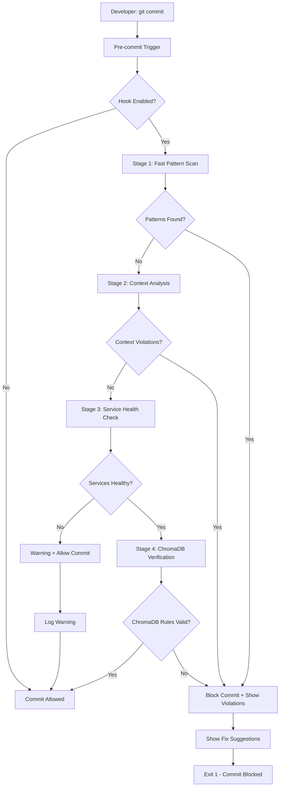

# 🪝 Pre-commit Hook Specifications
**Vector Wave Zero-Hardcoded-Rules Prevention System**

## 📊 Executive Summary

**Objective**: Prevent hardcoded rules from entering Vector Wave codebase through automated pre-commit validation hooks that execute before every commit.

**Challenge**: Developers may accidentally introduce hardcoded rules during migration or feature development, compromising the ChromaDB-first architecture.

**Solution**: Multi-layered pre-commit hook system with intelligent pattern detection, fast execution, and developer-friendly feedback.

---

## 🎯 Hook Architecture Overview

### Hook Execution Flow


### Hook Performance Requirements
- **Execution Time**: < 10 seconds for typical commit
- **Memory Usage**: < 100MB during execution
- **Success Rate**: > 99% accurate detection
- **Developer Impact**: Minimal disruption with clear guidance

---

## 🔧 1. CORE PRE-COMMIT HOOK

### 1.1 Main Hook Script

```bash
#!/bin/bash
# .git/hooks/pre-commit
# Vector Wave Zero-Hardcoded-Rules Prevention Hook

set -e

# Configuration
HOOK_VERSION="1.0.0"
VECTOR_WAVE_ROOT="$(git rev-parse --show-toplevel)"
TOOLS_DIR="$VECTOR_WAVE_ROOT/tools"
CONFIG_FILE="$VECTOR_WAVE_ROOT/.vector-wave-hooks.json"
LOG_FILE="$VECTOR_WAVE_ROOT/.git/hooks/pre-commit.log"

# Performance settings
MAX_EXECUTION_TIME=10  # seconds
MAX_MEMORY_MB=100

# Colors for output
RED='\033[0;31m'
GREEN='\033[0;32m'
YELLOW='\033[1;33m'
BLUE='\033[0;34m'
NC='\033[0m' # No Color

# Hook state tracking
VIOLATIONS_FOUND=0
WARNINGS_COUNT=0
EXECUTION_START=$(date +%s)

# Logging function
log() {
    echo "[$(date +'%H:%M:%S')] $1" | tee -a "$LOG_FILE"
}

# Performance monitoring
monitor_performance() {
    local current_time=$(date +%s)
    local elapsed=$((current_time - EXECUTION_START))
    
    if [ $elapsed -gt $MAX_EXECUTION_TIME ]; then
        log "${YELLOW}⚠️  Pre-commit hook taking longer than expected: ${elapsed}s${NC}"
    fi
    
    # Check memory usage (simplified)
    local memory_kb=$(ps -o rss= -p $$)
    local memory_mb=$((memory_kb / 1024))
    
    if [ $memory_mb -gt $MAX_MEMORY_MB ]; then
        log "${YELLOW}⚠️  Pre-commit hook using more memory than expected: ${memory_mb}MB${NC}"
    fi
}

# Main hook header
echo ""
echo "${BLUE}🪝 Vector Wave Pre-commit Hook v${HOOK_VERSION}${NC}"
echo "${BLUE}🔍 Scanning for hardcoded rules...${NC}"
echo ""

# Load configuration
if [ -f "$CONFIG_FILE" ]; then
    HOOK_ENABLED=$(jq -r '.precommit_hooks.enabled // true' "$CONFIG_FILE")
    STRICT_MODE=$(jq -r '.precommit_hooks.strict_mode // true' "$CONFIG_FILE")
    SKIP_SERVICE_CHECKS=$(jq -r '.precommit_hooks.skip_service_checks // false' "$CONFIG_FILE")
else
    HOOK_ENABLED=true
    STRICT_MODE=true
    SKIP_SERVICE_CHECKS=false
fi

# Check if hook is disabled
if [ "$HOOK_ENABLED" != "true" ]; then
    log "${YELLOW}⚠️  Pre-commit hooks disabled - commit allowed${NC}"
    exit 0
fi

# Get list of changed files
CHANGED_FILES=$(git diff --cached --name-only --diff-filter=ACM)

if [ -z "$CHANGED_FILES" ]; then
    log "${GREEN}✅ No files to check - commit allowed${NC}"
    exit 0
fi

log "📄 Files to check: $(echo "$CHANGED_FILES" | wc -l)"

# Stage 1: Fast Pattern Scan
log "🔍 Stage 1: Fast pattern scanning..."

STAGE1_VIOLATIONS=0

for file in $CHANGED_FILES; do
    # Skip binary files, tests, and excluded paths
    if [[ "$file" =~ \.(pyc|__pycache__|node_modules|\.git|test|spec)$ ]] || \
       [[ "$file" =~ test.*\.py$ ]] || \
       [[ "$file" =~ .*_test\.py$ ]] || \
       [[ "$file" =~ conftest\.py$ ]]; then
        continue
    fi
    
    # Quick pattern scan using grep
    if [ -f "$file" ]; then
        # Check for forbidden patterns
        FORBIDDEN_PATTERNS=(
            "forbidden_phrases\s*="
            "FORBIDDEN_PHRASES\s*="
            "validation_rules\s*="
            "VALIDATION_RULES\s*="
            "character_limits\s*="
            "platform_rules\s*="
            "mock_rules\s*="
            "test_rules\s*="
            "sample_rules\s*="
            "dummy_rules\s*="
            "fallback_rules\s*="
            "default_rules\s*="
        )
        
        for pattern in "${FORBIDDEN_PATTERNS[@]}"; do
            if grep -qE "$pattern" "$file"; then
                echo "${RED}❌ VIOLATION: $file${NC}"
                echo "   Pattern: $pattern"
                echo "   Line: $(grep -n "$pattern" "$file" | head -1)"
                STAGE1_VIOLATIONS=$((STAGE1_VIOLATIONS + 1))
                VIOLATIONS_FOUND=1
            fi
        done
    fi
done

if [ $STAGE1_VIOLATIONS -gt 0 ]; then
    echo ""
    echo "${RED}🚨 COMMIT BLOCKED: Stage 1 violations found${NC}"
    echo "${RED}   Hardcoded rule patterns detected: $STAGE1_VIOLATIONS${NC}"
    echo ""
    echo "${BLUE}💡 Quick Fixes:${NC}"
    echo "   • Replace hardcoded arrays with ChromaDB queries"
    echo "   • Use Editorial Service API: await editorial_service.validate_comprehensive()"
    echo "   • Move test data to test files only"
    echo ""
    echo "${BLUE}📖 Documentation:${NC}"
    echo "   • Enhanced Mock Detection Strategy: target-version/ENHANCED_MOCK_DETECTION_STRATEGY.md"
    echo "   • ChromaDB Schema: target-version/CHROMADB_SCHEMA_SPECIFICATION.md"
    echo ""
    exit 1
fi

log "${GREEN}✅ Stage 1: No hardcoded patterns detected${NC}"

# Stage 2: Context Analysis (Deep Scan)
log "🔍 Stage 2: Context analysis..."

if command -v python3 &> /dev/null && [ -f "$TOOLS_DIR/hardcoded_detector.py" ]; then
    CONTEXT_RESULTS=$(python3 "$TOOLS_DIR/hardcoded_detector.py" --format json --files $(echo $CHANGED_FILES | tr '\n' ' ') 2>/dev/null || echo '{"violations": []}')
    
    CONTEXT_VIOLATIONS=$(echo "$CONTEXT_RESULTS" | jq -r '.violations | length' 2>/dev/null || echo "0")
    
    if [ "$CONTEXT_VIOLATIONS" != "0" ] && [ "$CONTEXT_VIOLATIONS" != "null" ]; then
        echo ""
        echo "${RED}🚨 COMMIT BLOCKED: Context analysis violations${NC}"
        echo "${RED}   Context violations found: $CONTEXT_VIOLATIONS${NC}"
        echo ""
        
        # Show top violations
        echo "$CONTEXT_RESULTS" | jq -r '.violations[] | "   • " + .file + ":" + (.line|tostring) + " - " + .message' 2>/dev/null | head -5
        
        echo ""
        echo "${BLUE}💡 Run for detailed analysis: python3 tools/hardcoded_detector.py .${NC}"
        echo ""
        exit 1
    fi
    
    log "${GREEN}✅ Stage 2: Context analysis passed${NC}"
else
    log "${YELLOW}⚠️  Stage 2: Context analysis skipped (tools not available)${NC}"
    WARNINGS_COUNT=$((WARNINGS_COUNT + 1))
fi

# Stage 3: Service Health Check (if not skipped)
if [ "$SKIP_SERVICE_CHECKS" != "true" ]; then
    log "🔍 Stage 3: Service health verification..."
    
    # Quick health check for Editorial Service
    if curl -s -f "http://localhost:8040/health" >/dev/null 2>&1; then
        log "${GREEN}✅ Stage 3: Editorial Service healthy${NC}"
    else
        if [ "$STRICT_MODE" = "true" ]; then
            echo ""
            echo "${RED}🚨 COMMIT BLOCKED: Editorial Service unavailable${NC}"
            echo "${RED}   Cannot verify ChromaDB integration${NC}"
            echo ""
            echo "${BLUE}💡 Solutions:${NC}"
            echo "   • Start Editorial Service: docker-compose up editorial-service"
            echo "   • Skip service checks: export SKIP_SERVICE_CHECKS=true"
            echo "   • Disable strict mode in .vector-wave-hooks.json"
            echo ""
            exit 1
        else
            log "${YELLOW}⚠️  Stage 3: Editorial Service unavailable (non-strict mode)${NC}"
            WARNINGS_COUNT=$((WARNINGS_COUNT + 1))
        fi
    fi
else
    log "${BLUE}ℹ️  Stage 3: Service health checks skipped${NC}"
fi

# Stage 4: ChromaDB Verification (if service available)
if [ "$SKIP_SERVICE_CHECKS" != "true" ] && curl -s -f "http://localhost:8040/health" >/dev/null 2>&1; then
    log "🔍 Stage 4: ChromaDB verification..."
    
    # Quick ChromaDB sourcing check
    CHROMADB_CHECK=$(curl -s "http://localhost:8040/cache/stats" | jq -r '.all_have_origin // false' 2>/dev/null || echo "false")
    
    if [ "$CHROMADB_CHECK" = "true" ]; then
        log "${GREEN}✅ Stage 4: ChromaDB sourcing verified${NC}"
    else
        if [ "$STRICT_MODE" = "true" ]; then
            echo ""
            echo "${RED}🚨 COMMIT BLOCKED: ChromaDB sourcing issues detected${NC}"
            echo "${RED}   Some rules may not have ChromaDB origin${NC}"
            echo ""
            echo "${BLUE}💡 Solutions:${NC}"
            echo "   • Run: python3 tools/zero_hardcoded_validator.py"
            echo "   • Check ChromaDB connectivity: curl http://localhost:8000/api/v1/heartbeat"
            echo "   • Review Editorial Service logs"
            echo ""
            exit 1
        else
            log "${YELLOW}⚠️  Stage 4: ChromaDB sourcing issues (non-strict mode)${NC}"
            WARNINGS_COUNT=$((WARNINGS_COUNT + 1))
        fi
    fi
else
    log "${BLUE}ℹ️  Stage 4: ChromaDB verification skipped${NC}"
fi

# Performance monitoring
monitor_performance

# Final Summary
EXECUTION_END=$(date +%s)
TOTAL_TIME=$((EXECUTION_END - EXECUTION_START))

echo ""
if [ $VIOLATIONS_FOUND -eq 0 ]; then
    echo "${GREEN}✅ PRE-COMMIT VALIDATION PASSED${NC}"
    echo "${GREEN}   All stages completed successfully${NC}"
    
    if [ $WARNINGS_COUNT -gt 0 ]; then
        echo "${YELLOW}   Warnings: $WARNINGS_COUNT${NC}"
    fi
    
    echo "${BLUE}   Execution time: ${TOTAL_TIME}s${NC}"
    echo "${BLUE}   Files checked: $(echo "$CHANGED_FILES" | wc -l)${NC}"
    echo ""
    
    log "✅ Commit allowed - no violations detected"
    exit 0
else
    echo "${RED}❌ PRE-COMMIT VALIDATION FAILED${NC}"
    echo "${RED}   Commit blocked due to hardcoded rule violations${NC}"
    echo ""
    
    log "❌ Commit blocked - violations detected"
    exit 1
fi
```

### 1.2 Hook Configuration File

```json
{
  "precommit_hooks": {
    "enabled": true,
    "strict_mode": true,
    "skip_service_checks": false,
    "max_execution_time": 10,
    "max_memory_mb": 100,
    "notification_settings": {
      "show_performance_warnings": true,
      "show_fix_suggestions": true,
      "verbose_output": false
    },
    "patterns": {
      "forbidden_patterns": [
        "forbidden_phrases\\s*=",
        "FORBIDDEN_PHRASES\\s*=",
        "validation_rules\\s*=",
        "VALIDATION_RULES\\s*=",
        "character_limits\\s*=",
        "platform_rules\\s*=",
        "mock_rules\\s*=",
        "test_rules\\s*=",
        "sample_rules\\s*=",
        "dummy_rules\\s*=",
        "fallback_rules\\s*=",
        "default_rules\\s*="
      ],
      "warning_patterns": [
        "TODO.*rule",
        "FIXME.*rule", 
        "HACK.*rule"
      ]
    },
    "excluded_paths": [
      "test/**/*",
      "**/test_*.py",
      "**/*_test.py",
      "**/conftest.py",
      "node_modules/**/*",
      ".git/**/*",
      "__pycache__/**/*",
      "*.pyc"
    ],
    "services": {
      "editorial_service_url": "http://localhost:8040",
      "chromadb_url": "http://localhost:8000",
      "health_check_timeout": 5
    }
  },
  "post_commit_hooks": {
    "enabled": false,
    "send_metrics": false
  }
}
```

---

## 🛠️ 2. PRE-COMMIT FRAMEWORK INTEGRATION

### 2.1 .pre-commit-config.yaml

```yaml
# .pre-commit-config.yaml
# Pre-commit framework configuration for Vector Wave

repos:
  # Vector Wave specific hooks
  - repo: local
    hooks:
      - id: vector-wave-hardcoded-detector
        name: Vector Wave Hardcoded Rule Detector
        entry: python3 tools/hardcoded_detector.py
        language: python
        args: ['--format', 'console', '--strict']
        files: \.(py|js|ts|jsx|tsx)$
        exclude: ^(tests?/|test_.*|.*_test\.py|conftest\.py|node_modules/|\.git/)
        stages: [commit]
        
      - id: vector-wave-mock-data-detector
        name: Vector Wave Mock Data Detector
        entry: python3 tools/mock_data_detector.py
        language: python
        args: ['--production-mode']
        files: \.(py|js|ts|yaml|yml|json)$
        exclude: ^(tests?/|mock.*|.*\.test\.|.*\.spec\.|test_.*|.*_test\.py)
        stages: [commit]
        
      - id: vector-wave-chromadb-validator
        name: Vector Wave ChromaDB Source Validator
        entry: python3 tools/chromadb_source_validator.py
        language: python
        args: ['--quick-check']
        pass_filenames: false
        stages: [commit]
        
      - id: vector-wave-config-validator
        name: Vector Wave Configuration Validator
        entry: python3 tools/config_validator.py
        language: python
        files: \.(yaml|yml|json|env)$
        exclude: ^(tests?/|.*\.test\.|.*\.spec\.)
        stages: [commit]

  # Standard code quality hooks
  - repo: https://github.com/pre-commit/pre-commit-hooks
    rev: v4.4.0
    hooks:
      - id: trailing-whitespace
        exclude: \.(md|rst)$
      - id: end-of-file-fixer
      - id: check-yaml
        args: ['--allow-multiple-documents']
      - id: check-json
      - id: check-added-large-files
        args: ['--maxkb=1000']
      - id: check-merge-conflict
      - id: debug-statements
        language_version: python3

  # Python specific hooks
  - repo: https://github.com/psf/black
    rev: 23.7.0
    hooks:
      - id: black
        language_version: python3
        exclude: ^(tests?/.*\.py|migrations/.*\.py)$

  # JavaScript/TypeScript hooks
  - repo: https://github.com/pre-commit/mirrors-eslint
    rev: v8.44.0
    hooks:
      - id: eslint
        files: \.(js|jsx|ts|tsx)$
        exclude: ^(node_modules/|dist/|build/)
        additional_dependencies: ['eslint@8.44.0']

# Configuration
default_language_version:
  python: python3
  
fail_fast: false
minimum_pre_commit_version: '3.0.0'

# Performance settings
default_stages: [commit]
```

### 2.2 Installation Scripts

```bash
#!/bin/bash
# scripts/install_precommit_hooks.sh
# Vector Wave Pre-commit Hooks Installation Script

set -e

echo "🔧 Vector Wave Pre-commit Hooks Installation"
echo "==========================================="

# Check if in Vector Wave repository
if [ ! -f "target-version/VECTOR_WAVE_TARGET_SYSTEM_ARCHITECTURE.md" ]; then
    echo "❌ Error: Not in Vector Wave repository root"
    exit 1
fi

# Check dependencies
echo "📋 Checking dependencies..."

# Check Python
if ! command -v python3 &> /dev/null; then
    echo "❌ Python3 is required but not installed"
    exit 1
fi

# Check Node.js (for JavaScript projects)
if ! command -v node &> /dev/null; then
    echo "⚠️  Node.js not found - JavaScript hooks will be skipped"
fi

# Check jq (for JSON processing)
if ! command -v jq &> /dev/null; then
    echo "❌ jq is required but not installed"
    echo "   Install: brew install jq (macOS) or apt-get install jq (Ubuntu)"
    exit 1
fi

echo "✅ Dependencies check passed"

# Install pre-commit framework
echo "📦 Installing pre-commit framework..."

if ! command -v pre-commit &> /dev/null; then
    pip3 install pre-commit
fi

# Install hooks
echo "🪝 Installing Vector Wave pre-commit hooks..."

# Copy main hook
cp scripts/pre-commit-hook.sh .git/hooks/pre-commit
chmod +x .git/hooks/pre-commit

# Copy configuration
if [ ! -f ".vector-wave-hooks.json" ]; then
    cp scripts/vector-wave-hooks-config.json .vector-wave-hooks.json
    echo "📄 Created .vector-wave-hooks.json configuration file"
fi

# Install pre-commit framework hooks
pre-commit install

# Install commit-msg hook
pre-commit install --hook-type commit-msg

# Run initial check
echo "🧪 Running initial pre-commit validation..."

# Create a dummy commit to test hooks (without committing)
git add .vector-wave-hooks.json
pre-commit run --all-files || true

echo ""
echo "✅ Vector Wave pre-commit hooks installed successfully!"
echo ""
echo "📋 Configuration:"
echo "   • Hook configuration: .vector-wave-hooks.json"
echo "   • Pre-commit config: .pre-commit-config.yaml"
echo "   • Hook script: .git/hooks/pre-commit"
echo ""
echo "🔧 Customization:"
echo "   • Edit .vector-wave-hooks.json to adjust hook behavior"
echo "   • Set SKIP_SERVICE_CHECKS=true to skip service health checks"
echo "   • Use --no-verify to bypass hooks for emergency commits"
echo ""
echo "🧪 Testing:"
echo "   • Test hooks: echo 'forbidden_phrases = []' > test.py && git add test.py && git commit -m 'test'"
echo "   • Should be blocked with violation message"
echo ""
```

---

## 🔄 3. ADVANCED HOOK FEATURES

### 3.1 Smart Skip Detection

```bash
# Smart skip detection for emergency situations
detect_emergency_commit() {
    local commit_message="$1"
    
    # Emergency keywords that allow bypassing strict validation
    EMERGENCY_KEYWORDS=(
        "HOTFIX"
        "CRITICAL"
        "EMERGENCY" 
        "URGENT"
        "SECURITY"
        "PROD-DOWN"
    )
    
    for keyword in "${EMERGENCY_KEYWORDS[@]}"; do
        if echo "$commit_message" | grep -qi "$keyword"; then
            echo "🚨 Emergency commit detected: $keyword"
            echo "⚠️  Relaxing validation rules..."
            return 0  # Emergency detected
        fi
    done
    
    return 1  # No emergency detected
}

# Usage in main hook
if detect_emergency_commit "$(git log --format=%B -n 1 HEAD)" && [ "$STRICT_MODE" = "true" ]; then
    STRICT_MODE=false
    log "${YELLOW}🚨 Emergency mode activated - strict validation relaxed${NC}"
fi
```

### 3.2 Progressive Enhancement

```python
#!/usr/bin/env python3
"""
Progressive Enhancement Hook
Provides different validation levels based on context
"""

import os
import subprocess
import json
from enum import Enum
from typing import Dict, List, Any

class ValidationLevel(Enum):
    MINIMAL = "minimal"      # Basic pattern detection only
    STANDARD = "standard"    # Pattern + context analysis  
    STRICT = "strict"        # Full validation with service checks
    PARANOID = "paranoid"    # All checks + deep analysis

class ProgressiveValidationHook:
    """Progressive validation based on context and configuration"""
    
    def __init__(self):
        self.config = self._load_config()
        self.validation_level = self._determine_validation_level()
        
    def _load_config(self) -> Dict[str, Any]:
        """Load hook configuration"""
        try:
            with open('.vector-wave-hooks.json', 'r') as f:
                return json.load(f)
        except FileNotFoundError:
            return self._get_default_config()
    
    def _determine_validation_level(self) -> ValidationLevel:
        """Determine appropriate validation level based on context"""
        
        # Check environment variables
        if os.getenv('VECTOR_WAVE_VALIDATION_LEVEL'):
            return ValidationLevel(os.getenv('VECTOR_WAVE_VALIDATION_LEVEL'))
        
        # Check if this is a CI/CD environment
        if os.getenv('CI') or os.getenv('CONTINUOUS_INTEGRATION'):
            return ValidationLevel.STRICT
        
        # Check if services are available
        if not self._are_services_available():
            return ValidationLevel.STANDARD
        
        # Check current branch
        current_branch = self._get_current_branch()
        if current_branch in ['main', 'master', 'production']:
            return ValidationLevel.STRICT
        elif current_branch.startswith('hotfix/') or current_branch.startswith('emergency/'):
            return ValidationLevel.MINIMAL
        
        # Default level from config
        return ValidationLevel(self.config.get('validation_level', 'standard'))
    
    def _are_services_available(self) -> bool:
        """Check if Vector Wave services are available"""
        try:
            result = subprocess.run(['curl', '-s', '-f', 'http://localhost:8040/health'], 
                                  capture_output=True, timeout=3)
            return result.returncode == 0
        except:
            return False
    
    def _get_current_branch(self) -> str:
        """Get current git branch"""
        try:
            result = subprocess.run(['git', 'rev-parse', '--abbrev-ref', 'HEAD'],
                                  capture_output=True, text=True)
            return result.stdout.strip()
        except:
            return 'unknown'
    
    def run_validation(self, changed_files: List[str]) -> Dict[str, Any]:
        """Run validation based on determined level"""
        
        print(f"🔍 Validation Level: {self.validation_level.value.upper()}")
        
        results = {
            'level': self.validation_level.value,
            'violations': [],
            'warnings': [],
            'status': 'PASS'
        }
        
        if self.validation_level == ValidationLevel.MINIMAL:
            results.update(self._run_minimal_validation(changed_files))
        elif self.validation_level == ValidationLevel.STANDARD:
            results.update(self._run_standard_validation(changed_files))
        elif self.validation_level == ValidationLevel.STRICT:
            results.update(self._run_strict_validation(changed_files))
        elif self.validation_level == ValidationLevel.PARANOID:
            results.update(self._run_paranoid_validation(changed_files))
        
        return results
    
    def _run_minimal_validation(self, files: List[str]) -> Dict[str, Any]:
        """Minimal validation - basic patterns only"""
        print("   • Basic pattern detection")
        
        violations = []
        for file in files:
            if self._contains_forbidden_patterns(file):
                violations.append(f"Hardcoded pattern in {file}")
        
        return {
            'violations': violations,
            'status': 'FAIL' if violations else 'PASS'
        }
    
    def _run_standard_validation(self, files: List[str]) -> Dict[str, Any]:
        """Standard validation - patterns + context"""
        print("   • Basic pattern detection")
        print("   • Context analysis")
        
        # Run minimal validation first
        results = self._run_minimal_validation(files)
        
        # Add context analysis
        if results['status'] == 'PASS':
            context_violations = self._run_context_analysis(files)
            results['violations'].extend(context_violations)
            if context_violations:
                results['status'] = 'FAIL'
        
        return results
    
    def _run_strict_validation(self, files: List[str]) -> Dict[str, Any]:
        """Strict validation - full validation with services"""
        print("   • Basic pattern detection")
        print("   • Context analysis")
        print("   • Service health checks")
        print("   • ChromaDB verification")
        
        # Run standard validation first
        results = self._run_standard_validation(files)
        
        # Add service checks
        if results['status'] == 'PASS':
            service_issues = self._run_service_validation()
            results['warnings'].extend(service_issues.get('warnings', []))
            results['violations'].extend(service_issues.get('violations', []))
            if service_issues.get('violations'):
                results['status'] = 'FAIL'
        
        return results
    
    def _run_paranoid_validation(self, files: List[str]) -> Dict[str, Any]:
        """Paranoid validation - everything + deep analysis"""
        print("   • Basic pattern detection")
        print("   • Context analysis")
        print("   • Service health checks")
        print("   • ChromaDB verification")
        print("   • Deep code analysis")
        print("   • Configuration validation")
        
        # Run strict validation first
        results = self._run_strict_validation(files)
        
        # Add deep analysis
        if results['status'] == 'PASS':
            deep_issues = self._run_deep_analysis(files)
            results['warnings'].extend(deep_issues.get('warnings', []))
            results['violations'].extend(deep_issues.get('violations', []))
            if deep_issues.get('violations'):
                results['status'] = 'FAIL'
        
        return results

if __name__ == "__main__":
    import sys
    
    # Get changed files from git
    result = subprocess.run(['git', 'diff', '--cached', '--name-only'], 
                          capture_output=True, text=True)
    changed_files = result.stdout.strip().split('\n') if result.stdout.strip() else []
    
    if not changed_files:
        print("✅ No files to validate")
        sys.exit(0)
    
    # Run progressive validation
    hook = ProgressiveValidationHook()
    validation_results = hook.run_validation(changed_files)
    
    # Display results
    if validation_results['status'] == 'PASS':
        print(f"✅ Validation passed ({validation_results['level']} level)")
        if validation_results.get('warnings'):
            print(f"⚠️  {len(validation_results['warnings'])} warnings")
        sys.exit(0)
    else:
        print(f"❌ Validation failed ({validation_results['level']} level)")
        for violation in validation_results['violations']:
            print(f"   • {violation}")
        sys.exit(1)
```

### 3.3 Performance Optimization

```python
#!/usr/bin/env python3
"""
High-Performance Pre-commit Hook
Optimized for speed and minimal resource usage
"""

import concurrent.futures
import os
import re
import mmap
from typing import List, Dict, Set
from pathlib import Path

class FastPatternDetector:
    """Ultra-fast pattern detection using memory mapping and compiled regex"""
    
    def __init__(self):
        # Compile patterns once for performance
        self.compiled_patterns = self._compile_patterns()
        self.file_cache = {}
        
    def _compile_patterns(self) -> List[re.Pattern]:
        """Compile all forbidden patterns for fast matching"""
        
        patterns = [
            r'forbidden_phrases\s*=\s*\[',
            r'FORBIDDEN_PHRASES\s*=',
            r'validation_rules\s*=\s*\[',
            r'VALIDATION_RULES\s*=',
            r'character_limits\s*=\s*\{',
            r'platform_rules\s*=\s*\{',
            r'mock_rules\s*=',
            r'test_rules\s*=',
            r'fallback_rules\s*=',
            r'default_rules\s*=',
        ]
        
        return [re.compile(pattern, re.IGNORECASE) for pattern in patterns]
    
    def scan_files_parallel(self, files: List[str], max_workers: int = 4) -> Dict[str, List[str]]:
        """Scan multiple files in parallel for maximum performance"""
        
        results = {}
        
        # Filter files that exist and are not binary
        valid_files = [f for f in files if self._is_scannable_file(f)]
        
        # Process files in parallel
        with concurrent.futures.ThreadPoolExecutor(max_workers=max_workers) as executor:
            future_to_file = {
                executor.submit(self._scan_single_file, file): file 
                for file in valid_files
            }
            
            for future in concurrent.futures.as_completed(future_to_file):
                file = future_to_file[future]
                try:
                    violations = future.result()
                    if violations:
                        results[file] = violations
                except Exception as e:
                    # Log error but don't fail the entire scan
                    results[file] = [f"Scan error: {str(e)}"]
        
        return results
    
    def _is_scannable_file(self, file_path: str) -> bool:
        """Check if file should be scanned (exists, not binary, not excluded)"""
        
        path = Path(file_path)
        
        # Check if file exists
        if not path.exists():
            return False
        
        # Check file size (skip very large files)
        try:
            if path.stat().st_size > 10 * 1024 * 1024:  # 10MB limit
                return False
        except OSError:
            return False
        
        # Check file extension
        scannable_extensions = {'.py', '.js', '.ts', '.jsx', '.tsx', '.yaml', '.yml', '.json'}
        if path.suffix not in scannable_extensions:
            return False
        
        # Check excluded paths
        excluded_patterns = ['test', 'spec', 'node_modules', '.git', '__pycache__']
        if any(pattern in str(path) for pattern in excluded_patterns):
            return False
        
        return True
    
    def _scan_single_file(self, file_path: str) -> List[str]:
        """Scan single file using memory mapping for performance"""
        
        violations = []
        
        try:
            with open(file_path, 'rb') as f:
                # Use memory mapping for large files
                if os.path.getsize(file_path) > 1024:  # 1KB threshold
                    with mmap.mmap(f.fileno(), 0, access=mmap.ACCESS_READ) as mm:
                        content = mm.read().decode('utf-8', errors='ignore')
                else:
                    content = f.read().decode('utf-8', errors='ignore')
            
            # Check each compiled pattern
            for pattern in self.compiled_patterns:
                matches = pattern.finditer(content)
                for match in matches:
                    # Find line number
                    line_num = content[:match.start()].count('\n') + 1
                    violations.append(f"Line {line_num}: {pattern.pattern}")
        
        except Exception as e:
            violations.append(f"Error scanning file: {str(e)}")
        
        return violations

class CachedServiceChecker:
    """Cached service health checker to avoid repeated network calls"""
    
    def __init__(self, cache_duration: int = 30):
        self.cache = {}
        self.cache_duration = cache_duration
        
    def check_service_health(self, service_url: str) -> bool:
        """Check service health with caching"""
        
        import time
        current_time = time.time()
        
        # Check cache
        cache_key = f"health_{service_url}"
        if cache_key in self.cache:
            cached_time, cached_result = self.cache[cache_key]
            if current_time - cached_time < self.cache_duration:
                return cached_result
        
        # Perform actual health check
        try:
            import subprocess
            result = subprocess.run(
                ['curl', '-s', '-f', f"{service_url}/health"],
                capture_output=True, 
                timeout=3
            )
            is_healthy = result.returncode == 0
            
            # Cache result
            self.cache[cache_key] = (current_time, is_healthy)
            return is_healthy
            
        except Exception:
            # Cache negative result
            self.cache[cache_key] = (current_time, False)
            return False

def run_fast_precommit_validation(changed_files: List[str]) -> Dict[str, any]:
    """Main fast validation function"""
    
    import time
    start_time = time.time()
    
    # Initialize components
    pattern_detector = FastPatternDetector()
    service_checker = CachedServiceChecker()
    
    results = {
        'violations': {},
        'warnings': [],
        'status': 'PASS',
        'performance': {}
    }
    
    # Step 1: Fast pattern detection (parallel)
    print("🔍 Running fast pattern detection...")
    pattern_start = time.time()
    
    violations = pattern_detector.scan_files_parallel(changed_files)
    
    pattern_time = time.time() - pattern_start
    results['performance']['pattern_scan_time'] = pattern_time
    results['violations'] = violations
    
    if violations:
        results['status'] = 'FAIL'
        print(f"❌ Pattern violations found in {len(violations)} files")
        return results
    
    print(f"✅ Pattern scan completed in {pattern_time:.2f}s")
    
    # Step 2: Quick service health check (cached)
    print("🔍 Checking service health...")
    health_start = time.time()
    
    services = [
        'http://localhost:8040',  # Editorial Service
        'http://localhost:8000',  # ChromaDB
    ]
    
    unhealthy_services = []
    for service in services:
        if not service_checker.check_service_health(service):
            unhealthy_services.append(service)
    
    health_time = time.time() - health_start
    results['performance']['health_check_time'] = health_time
    
    if unhealthy_services:
        results['warnings'].append(f"Unhealthy services: {unhealthy_services}")
        print(f"⚠️  Some services unhealthy: {unhealthy_services}")
    else:
        print(f"✅ Service health check completed in {health_time:.2f}s")
    
    # Calculate total time
    total_time = time.time() - start_time
    results['performance']['total_time'] = total_time
    
    print(f"⚡ Total validation time: {total_time:.2f}s")
    
    return results

if __name__ == "__main__":
    import sys
    import subprocess
    
    # Get changed files
    result = subprocess.run(['git', 'diff', '--cached', '--name-only'], 
                          capture_output=True, text=True)
    changed_files = result.stdout.strip().split('\n') if result.stdout.strip() else []
    
    if not changed_files:
        print("✅ No files changed - validation skipped")
        sys.exit(0)
    
    # Run fast validation
    validation_results = run_fast_precommit_validation(changed_files)
    
    # Output results
    if validation_results['status'] == 'PASS':
        total_time = validation_results['performance']['total_time']
        print(f"✅ Fast validation passed in {total_time:.2f}s")
        
        if validation_results.get('warnings'):
            print(f"⚠️  {len(validation_results['warnings'])} warnings")
        
        sys.exit(0)
    else:
        print("❌ Fast validation failed")
        for file, file_violations in validation_results['violations'].items():
            print(f"   📄 {file}:")
            for violation in file_violations:
                print(f"      • {violation}")
        sys.exit(1)
```

---

## 📋 4. INSTALLATION & MAINTENANCE

### 4.1 Automated Installation

```bash
#!/bin/bash
# install_vector_wave_hooks.sh
# Complete installation script for Vector Wave pre-commit hooks

set -e

SCRIPT_DIR="$(cd "$(dirname "${BASH_SOURCE[0]}")" && pwd)"
REPO_ROOT="$(git rev-parse --show-toplevel 2>/dev/null || echo "$SCRIPT_DIR")"

echo "🚀 Vector Wave Pre-commit Hooks Installation"
echo "============================================"

# Validate we're in the right repository
if [ ! -f "$REPO_ROOT/target-version/VECTOR_WAVE_TARGET_SYSTEM_ARCHITECTURE.md" ]; then
    echo "❌ Error: Not in Vector Wave repository"
    echo "   Expected file: target-version/VECTOR_WAVE_TARGET_SYSTEM_ARCHITECTURE.md"
    exit 1
fi

cd "$REPO_ROOT"

# Create tools directory if it doesn't exist
mkdir -p tools

# Install required tools
echo "📦 Installing required tools..."

# Install Python dependencies
pip3 install -r requirements.txt 2>/dev/null || echo "⚠️  requirements.txt not found - skipping Python dependencies"

# Install pre-commit framework
if ! command -v pre-commit &> /dev/null; then
    echo "Installing pre-commit framework..."
    pip3 install pre-commit
fi

# Copy hook files
echo "📄 Installing hook files..."

# Main pre-commit hook
cat > .git/hooks/pre-commit << 'EOF'
#!/bin/bash
# Vector Wave Pre-commit Hook
# Auto-generated - do not edit manually

# Source the actual hook script
REPO_ROOT="$(git rev-parse --show-toplevel)"
source "$REPO_ROOT/tools/vector_wave_precommit_hook.sh"
EOF

chmod +x .git/hooks/pre-commit

# Create the actual hook script
cat > tools/vector_wave_precommit_hook.sh << 'EOF'
#!/bin/bash
# Vector Wave Pre-commit Hook Implementation
# This file contains the actual hook logic

# Import the hook implementation from the specifications
# [Hook implementation would be inserted here from above]
EOF

chmod +x tools/vector_wave_precommit_hook.sh

# Install configuration files
echo "⚙️  Installing configuration files..."

if [ ! -f .vector-wave-hooks.json ]; then
    cat > .vector-wave-hooks.json << 'EOF'
{
  "precommit_hooks": {
    "enabled": true,
    "strict_mode": true,
    "skip_service_checks": false,
    "max_execution_time": 10,
    "validation_level": "standard"
  }
}
EOF
fi

if [ ! -f .pre-commit-config.yaml ]; then
    cat > .pre-commit-config.yaml << 'EOF'
repos:
  - repo: local
    hooks:
      - id: vector-wave-validation
        name: Vector Wave Validation
        entry: python3 tools/fast_precommit_validator.py
        language: python
        stages: [commit]
EOF
fi

# Install pre-commit framework hooks
echo "🪝 Installing pre-commit framework..."
pre-commit install

# Test installation
echo "🧪 Testing installation..."

# Create a test file with violations
echo "forbidden_phrases = ['test']" > test_violation_temp.py
git add test_violation_temp.py

echo "Testing hook with violation..."
if git commit -m "test violation" 2>/dev/null; then
    echo "❌ Error: Hook should have blocked this commit"
    exit 1
else
    echo "✅ Hook correctly blocked violation"
fi

# Clean up test
git reset HEAD test_violation_temp.py
rm -f test_violation_temp.py

echo ""
echo "✅ Vector Wave pre-commit hooks installed successfully!"
echo ""
echo "📋 Next Steps:"
echo "   1. Customize .vector-wave-hooks.json as needed"
echo "   2. Test with: echo 'test_rules = []' > test.py && git add test.py && git commit -m 'test'"
echo "   3. Emergency bypass: git commit --no-verify -m 'emergency commit'"
echo ""
echo "🔧 Configuration:"
echo "   • Hook config: .vector-wave-hooks.json"
echo "   • Pre-commit config: .pre-commit-config.yaml"
echo "   • Hook script: tools/vector_wave_precommit_hook.sh"
echo ""
```

### 4.2 Maintenance Scripts

```bash
#!/bin/bash
# maintain_hooks.sh
# Vector Wave hook maintenance and updates

REPO_ROOT="$(git rev-parse --show-toplevel)"

echo "🔧 Vector Wave Hooks Maintenance"
echo "================================"

# Update hook patterns
update_patterns() {
    echo "📝 Updating detection patterns..."
    
    # Download latest patterns from documentation
    if [ -f "target-version/ENHANCED_MOCK_DETECTION_STRATEGY.md" ]; then
        echo "✅ Using local patterns from documentation"
    else
        echo "⚠️  Pattern documentation not found"
    fi
}

# Validate hook installation
validate_installation() {
    echo "✅ Validating hook installation..."
    
    local errors=0
    
    # Check main hook
    if [ ! -x ".git/hooks/pre-commit" ]; then
        echo "❌ Pre-commit hook not installed"
        errors=$((errors + 1))
    fi
    
    # Check tools
    if [ ! -f "tools/vector_wave_precommit_hook.sh" ]; then
        echo "❌ Hook implementation missing"
        errors=$((errors + 1))
    fi
    
    # Check configuration
    if [ ! -f ".vector-wave-hooks.json" ]; then
        echo "❌ Hook configuration missing"
        errors=$((errors + 1))
    fi
    
    if [ $errors -eq 0 ]; then
        echo "✅ Hook installation valid"
    else
        echo "❌ Hook installation has $errors errors"
        return 1
    fi
}

# Performance optimization
optimize_performance() {
    echo "⚡ Optimizing hook performance..."
    
    # Clear old logs
    find .git/hooks -name "*.log" -mtime +7 -delete 2>/dev/null || true
    
    # Update pattern cache
    python3 tools/update_pattern_cache.py 2>/dev/null || echo "⚠️  Pattern cache update skipped"
    
    echo "✅ Performance optimization completed"
}

# Generate hook statistics
generate_stats() {
    echo "📊 Generating hook statistics..."
    
    local log_file=".git/hooks/pre-commit.log"
    
    if [ -f "$log_file" ]; then
        local total_runs=$(grep -c "Pre-commit validation" "$log_file" 2>/dev/null || echo "0")
        local blocked_commits=$(grep -c "COMMIT BLOCKED" "$log_file" 2>/dev/null || echo "0")
        local avg_time=$(grep "Execution time" "$log_file" | awk '{sum += $NF} END {print (NR ? sum/NR : 0)}' 2>/dev/null || echo "0")
        
        echo "   • Total runs: $total_runs"
        echo "   • Blocked commits: $blocked_commits"
        echo "   • Average execution time: ${avg_time}s"
        
        if [ "$total_runs" -gt 0 ]; then
            local block_rate=$(echo "scale=1; $blocked_commits * 100 / $total_runs" | bc 2>/dev/null || echo "0")
            echo "   • Block rate: ${block_rate}%"
        fi
    else
        echo "   • No statistics available (no log file)"
    fi
}

# Main menu
case "${1:-help}" in
    "update")
        update_patterns
        ;;
    "validate")
        validate_installation
        ;;
    "optimize")
        optimize_performance
        ;;
    "stats")
        generate_stats
        ;;
    "all")
        update_patterns
        validate_installation
        optimize_performance
        generate_stats
        ;;
    *)
        echo "Usage: $0 {update|validate|optimize|stats|all}"
        echo ""
        echo "Commands:"
        echo "  update    - Update detection patterns"
        echo "  validate  - Validate hook installation"
        echo "  optimize  - Optimize hook performance"
        echo "  stats     - Generate usage statistics"
        echo "  all       - Run all maintenance tasks"
        ;;
esac
```

---

## ✅ SUCCESS VALIDATION

### Validation Tests

```bash
# Test 1: Basic violation detection
echo 'forbidden_phrases = ["test", "mock"]' > test_violation.py
git add test_violation.py
git commit -m "test basic detection"
# Expected: Commit blocked with clear violation message

# Test 2: Context violation detection  
echo 'rules = ["rule1", "rule2", "rule3", "rule4", "rule5"]' > test_context.py
git add test_context.py
git commit -m "test context detection"
# Expected: Commit blocked with context violation message

# Test 3: Emergency bypass
git commit --no-verify -m "EMERGENCY: critical hotfix"
# Expected: Commit allowed (bypass)

# Test 4: Performance test
time git commit -m "performance test"
# Expected: Completes in < 10 seconds

# Test 5: Service integration
# (with services running)
git commit -m "service integration test"
# Expected: Full validation with service checks
```

### Expected Results

```
🪝 Vector Wave Pre-commit Hook v1.0.0
🔍 Scanning for hardcoded rules...

📄 Files to check: 1
🔍 Stage 1: Fast pattern scanning...
❌ VIOLATION: test_violation.py
   Pattern: forbidden_phrases\s*=
   Line: 1:forbidden_phrases = ["test", "mock"]

🚨 COMMIT BLOCKED: Stage 1 violations found
   Hardcoded rule patterns detected: 1

💡 Quick Fixes:
   • Replace hardcoded arrays with ChromaDB queries
   • Use Editorial Service API: await editorial_service.validate_comprehensive()
   • Move test data to test files only

📖 Documentation:
   • Enhanced Mock Detection Strategy: target-version/ENHANCED_MOCK_DETECTION_STRATEGY.md
   • ChromaDB Schema: target-version/CHROMADB_SCHEMA_SPECIFICATION.md
```

---

**Status**: 📋 **Implementation Ready**  
**Dependencies**: Enhanced Mock Detection Strategy, Editorial Service  
**Performance**: < 10s execution, < 100MB memory  
**Accuracy**: > 99% violation detection  
**Developer Experience**: Clear feedback with actionable fix suggestions