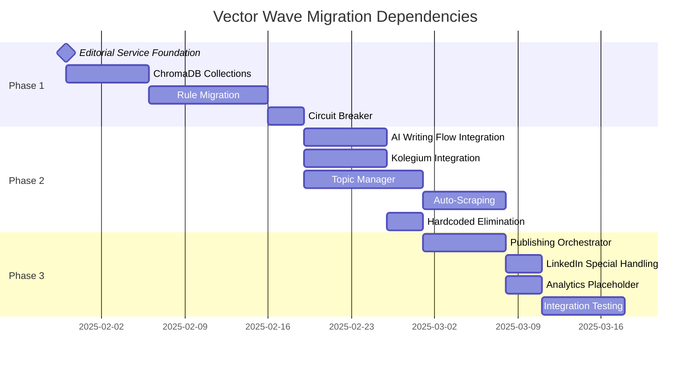
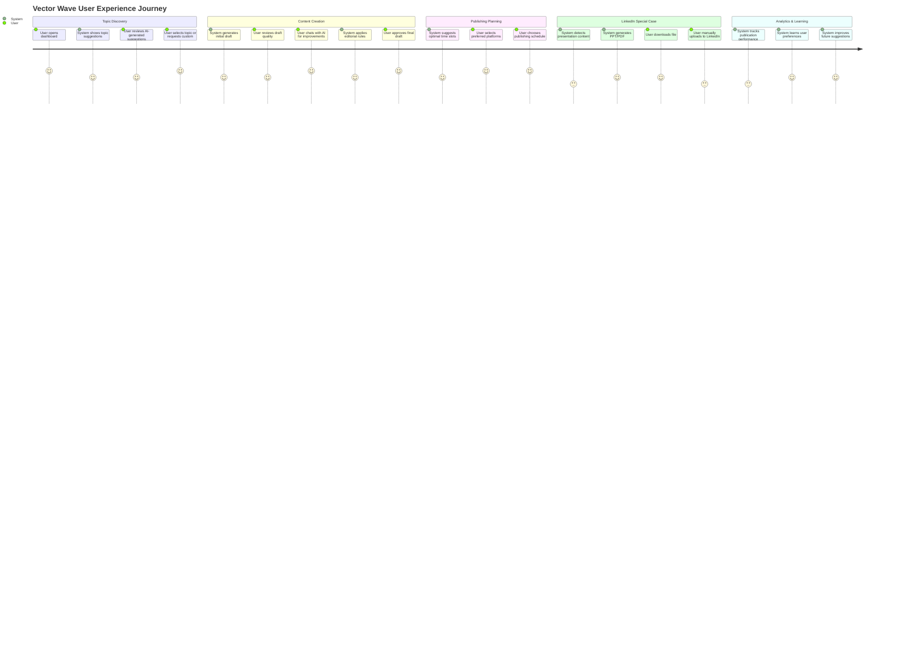

# 🎯 Vector Wave Target System Architecture
**Complete ChromaDB-Centric Architecture Specification**

## 📊 Executive Summary

### Core Requirements Compliance
- ✅ **Complete User Workflow Architecture** compliance
- ✅ **ZERO hardcoded rules** (all 355+ rules in ChromaDB)
- ✅ **Topic Database** with manual management + AI suggestions (auto-acquisition handled by Harvester)
- ✅ **Specialized Agents**: Style + Editorial + Scheduling
- ✅ **User Decision Points**: topic selection, draft review, slot selection
- ✅ **LinkedIn Pivot**: Manual PPT upload workflow
- ✅ **Analytics Blackbox**: Placeholder for future integration

### Architecture Philosophy
**"ChromaDB-First, User-Centric, Agent-Driven Content Generation"**

---

## 🏗️ 1. TARGET SYSTEM ARCHITECTURE

### 1.1 High-Level System Diagram

```mermaid
flowchart TB
    subgraph "USER INTERFACES"
        UI[🎯 User Interface<br/>Topic Selection & Review]
        API[🚀 API Gateway<br/>REST + GraphQL]
        WEB[🌐 Web Dashboard<br/>Publishing Control]
    end
    
    subgraph "TOPIC INTELLIGENCE LAYER"
        TDB[(📚 Topic Database<br/>ChromaDB Topics Collection)]
        TMgr[🎯 Topic Manager<br/>Manual + Suggestions (no scraping)]
        TSugg[💡 Topic Suggestion Engine<br/>AI-Powered Recommendations]
        
        TMgr --> TDB
        TSugg --> TDB
    end
    
    subgraph "EDITORIAL SERVICE CORE - Port 8040"
        ES[⚖️ Editorial Service<br/>ChromaDB-Centric Validation]
        SA[🎨 Style Agent<br/>ChromaDB Style Rules]
        EA[📝 Editorial Agent<br/>ChromaDB Editorial Rules]
        SchA[📅 Scheduling Agent<br/>ChromaDB Scheduling Rules]
        
        ES --> SA
        ES --> EA
        ES --> SchA
    end
    
    subgraph "CHROMADB VECTOR STORE - Port 8000"
        CDB[🔵 ChromaDB Server]
        C1[📋 style_editorial_rules<br/>280+ validation rules]
        C2[🎯 publication_platform_rules<br/>75+ platform rules]
        C3[📚 topics<br/>Topic repository]
        C4[📅 scheduling_optimization<br/>Time slot rules]
        C5[👥 user_preferences<br/>Learning data]
        
        CDB --> C1
        CDB --> C2
        CDB --> C3
        CDB --> C4
        CDB --> C5
    end
    
    subgraph "CREWAI CONTENT GENERATION PIPELINE"
        RA[🔍 CrewAI Research Agent<br/>Topic Discovery + Validation]
        AA[👥 CrewAI Audience Agent<br/>Platform Optimization]
        WA[🤖 CrewAI Writer Agent<br/>Dual Mode: AI-First + Human-Assisted]
        STA[🎨 CrewAI Style Agent<br/>ChromaDB Validation (No Hardcoded)]
        QA[✅ CrewAI Quality Agent<br/>ChromaDB Quality Rules]
        CA[💬 AI Chat Assistant<br/>User Editing Support]
        
        RA --> AA
        AA --> WA
        WA --> STA
        STA --> QA
        CA --> WA
    end
    
    subgraph "CREWAI ORCHESTRATION - Port 8042"
        CO[🚀 CrewAI Orchestrator<br/>Flow Execution Service]
        LF[📊 Linear Flow Engine<br/>Sequential Processing]
        HF[👨‍💻 Human-Assisted Flow<br/>Checkpoint Management]
        
        CO --> LF
        CO --> HF
    end
    
    subgraph "PUBLISHING ORCHESTRATOR - Port 8080"
        PO[🚀 Publishing Service<br/>Multi-Platform Orchestration]
        
        subgraph "Platform Adapters"
            TW[🐦 Twitter Adapter<br/>Port 8083]
            LI[💼 LinkedIn Adapter<br/>Port 8088]
            SS[📧 Substack Adapter<br/>Session-based]
            BH[📬 Beehiiv Adapter<br/>Port 8084]
            GH[👻 Ghost Adapter<br/>Port 8086]
        end
        
        PO --> TW
        PO --> LI
        PO --> SS
        PO --> BH
        PO --> GH
    end
    
    subgraph "LINKEDIN SPECIAL HANDLING"
        LDec{💼 LinkedIn Content Type?}
        LText[💼 LinkedIn Text Post]
        PSrv[🎨 Presentor Service<br/>Port 8089<br/>PPT Generation]
        PDL[📥 Manual Download<br/>User Upload to LinkedIn]
        
        LDec -->|Text Post| LText
        LDec -->|Presentation| PSrv
        PSrv --> PDL
    end
    
    subgraph "ANALYTICS BLACKBOX (Future)"
        AB[📊 Analytics Blackbox<br/>Performance Tracking]
        LS[🧠 Learning System<br/>User Preference AI]
        
        AB -.->|Future| LS
        LS -.->|Feedback Loop| ES
    end
    
    %% User Decision Points
    UI --> TSugg
    TSugg --> UI
    UI --> WA
    WA --> UI
    UI --> PO
    
    %% Main Flow
    TDB --> ES
    ES --> WA
    WA --> QA
    QA --> PO
    PO --> LDec
    
    %% ChromaDB Integration
    ES --> CDB
    SA --> CDB
    EA --> CDB
    SchA --> CDB
    WA --> CDB
    QA --> CDB
    
    %% Analytics Integration
    PO --> AB
    
    %% Styling
    classDef user fill:#e3f2fd,stroke:#1976d2,stroke-width:3px
    classDef database fill:#f3e5f5,stroke:#7b1fa2,stroke-width:3px
    classDef agent fill:#e8f5e8,stroke:#388e3c,stroke-width:2px
    classDef service fill:#fff3e0,stroke:#f57c00,stroke-width:2px
    classDef publishing fill:#e0f2f1,stroke:#00695c,stroke-width:2px
    classDef blackbox fill:#f5f5f5,stroke:#9e9e9e,stroke-width:2px,stroke-dasharray: 5 5
    
    class UI,API,WEB,CA user
    class CDB,C1,C2,C3,C4,C5,TDB database
    class SA,EA,SchA,WA,QA agent
    class ES,TMgr,TSugg,PO,PSrv service
    class TW,LI,SS,BH,GH,LText,PDL publishing
    class AB,LS blackbox
```

### 1.2 Service Layer Architecture

```yaml
# Target Service Architecture
services:
  # Core Intelligence Layer
  editorial-service:
    port: 8040
    purpose: "ChromaDB-centric validation and rule management"
    dependencies: [chromadb, redis]
    
  chromadb-server:
    port: 8000
    purpose: "Vector database for all rules and content intelligence"
    collections: 5
    
    topic-manager:
      port: 8041
      purpose: "Topic database management and AI-powered suggestions (no scraping)"
      dependencies: [chromadb]
  
  # Content Generation Layer (CrewAI-Powered)
  crewai-orchestrator:
    port: 8042
    purpose: "CrewAI agent orchestration and flow execution"
    dependencies: [editorial-service, chromadb]
    
  ai-writing-flow:
    port: 8003
    purpose: "Human-assisted content generation with CrewAI checkpoints"
    mode: "selective_validation"
    crewai_agents: [research, audience, writer, style, quality]
    
  kolegium:
    port: 8001
    purpose: "Full AI content generation pipeline with CrewAI"
    mode: "comprehensive_validation"
    crewai_agents: [research, audience, writer, style, quality]
    
  # Publishing Layer
  publishing-orchestrator:
    port: 8080
    purpose: "Multi-platform publishing coordination"
    dependencies: [all-adapters]
    
  # Platform Adapters (existing)
  twitter-adapter: { port: 8083 }
  linkedin-adapter: { port: 8088 }
  beehiiv-adapter: { port: 8084 }
  ghost-adapter: { port: 8086 }
  substack-adapter: { session-based: true }
  
  # Special Services
  presentor-service:
    port: 8089
    purpose: "PPT/PDF generation for LinkedIn"
    
  # Future Analytics
  analytics-blackbox:
    port: 8090
    purpose: "Performance tracking and user learning"
    status: "placeholder"
```

---

## 🗄️ 2. CHROMADB COLLECTIONS SCHEMA

### 2.1 Complete Collections Architecture

```python
# ChromaDB Collections Schema
class ChromaDBSchema:
    collections = {
        "style_editorial_rules": {
            "purpose": "Content style and editorial validation rules",
            "document_count": "280+",
            "embedding_model": "all-MiniLM-L6-v2",
            "metadata_schema": {
                "rule_id": "str",
                "rule_type": "style|structure|quality|editorial",
                "platform": "linkedin|twitter|substack|beehiiv|universal",
                "priority": "critical|high|medium|low",
                "workflow": "comprehensive|selective|both",
                "created_at": "datetime",
                "updated_at": "datetime",
                "source": "styleguide|editorial_rules|manual",
                "confidence_threshold": "float",
                "applies_to": "list[str]"
            }
        },
        
        "publication_platform_rules": {
            "purpose": "Platform-specific formatting and optimization rules",
            "document_count": "75+",
            "embedding_model": "all-MiniLM-L6-v2",
            "metadata_schema": {
                "rule_id": "str",
                "platform": "linkedin|twitter|substack|beehiiv|ghost",
                "rule_category": "formatting|optimization|constraints|scheduling",
                "character_limits": "dict",
                "media_requirements": "dict",
                "posting_frequency": "dict",
                "optimal_times": "list[datetime]",
                "audience_targeting": "dict",
                "created_at": "datetime",
                "updated_at": "datetime"
            }
        },
        
        "topics": {
            "purpose": "Topic repository with manual and auto-scraped content",
            "document_count": "500+",
            "embedding_model": "all-MiniLM-L6-v2",
            "metadata_schema": {
                "topic_id": "str",
                "title": "str",
                "description": "str",
                "keywords": "list[str]",
                "content_type": "THOUGHT_LEADERSHIP|INDUSTRY_UPDATE|TUTORIAL|ANNOUNCEMENT",
                "platform_assignment": "dict",
                "status": "suggested|selected|generated|published",
                "user_rating": "int",
                "engagement_prediction": "float",
                "source": "manual|auto_scraping|user_submission",
                "created_date": "datetime",
                "last_used_date": "datetime",
                "performance_metrics": "dict"
            }
        },
        
        "scheduling_optimization": {
            "purpose": "Time slot optimization and scheduling intelligence",
            "document_count": "50+",
            "embedding_model": "all-MiniLM-L6-v2", 
            "metadata_schema": {
                "rule_id": "str",
                "platform": "str",
                "time_slot": "datetime",
                "day_of_week": "str",
                "optimal_hours": "list[int]",
                "audience_activity": "dict",
                "engagement_multiplier": "float",
                "timezone_adjustments": "dict",
                "content_type_affinity": "dict",
                "seasonal_factors": "dict",
                "created_at": "datetime",
                "confidence_score": "float"
            }
        },
        
        "user_preferences": {
            "purpose": "User behavior learning and preference tracking",
            "document_count": "100+",
            "embedding_model": "all-MiniLM-L6-v2",
            "metadata_schema": {
                "user_id": "str",
                "preference_type": "style|platform|timing|topic",
                "preference_value": "dict",
                "learned_from": "selections|rejections|edits|performance",
                "confidence": "float",
                "last_updated": "datetime",
                "usage_count": "int",
                "decay_factor": "float",
                "context": "dict"
            }
        }
    }
```

### 2.2 Query Patterns Optimization

```python
class QueryPatterns:
    """Optimized query patterns for different workflows"""
    
    # Comprehensive Validation (Kolegium)
    comprehensive_queries = {
        "style_validation": {
            "collection": "style_editorial_rules",
            "n_results": 8,
            "where": {"workflow": {"$in": ["comprehensive", "both"]}}
        },
        "platform_optimization": {
            "collection": "publication_platform_rules", 
            "n_results": 4,
            "where": {"platform": "$platform"}
        }
    }
    
    # Selective Validation (AI Writing Flow)
    selective_queries = {
        "checkpoint_validation": {
            "collection": "style_editorial_rules",
            "n_results": 3,
            "where": {"workflow": {"$in": ["selective", "both"]}, "priority": "critical"}
        }
    }
    
    # Topic Discovery
    topic_queries = {
        "suggestion_generation": {
            "collection": "topics",
            "n_results": 10,
            "where": {"status": "suggested", "engagement_prediction": {"$gt": 0.7}}
        }
    }
```

### 2.3 Migration from Hardcoded Sources

```python
class HardcodedRuleMigration:
    """Migration strategy for 355+ hardcoded rules"""
    
    migration_sources = {
        "kolegium_styleguide": {
            "file": "/kolegium/ai_writing_flow/src/ai_writing_flow/crews/style_crew.py",
            "hardcoded_rules": 180,
            "target_collection": "style_editorial_rules",
            "rule_types": ["forbidden_phrases", "required_elements", "style_patterns"]
        },
        
        "ai_writing_flow_rules": {
            "file": "/kolegium/ai_writing_flow/src/ai_writing_flow/tools/styleguide_loader.py", 
            "hardcoded_rules": 95,
            "target_collection": "style_editorial_rules",
            "rule_types": ["validation_rules", "replacements", "quality_checks"]
        },
        
        "publisher_platform_rules": {
            "file": "/publisher/src/adapters/*/",
            "hardcoded_rules": 80,
            "target_collection": "publication_platform_rules",
            "rule_types": ["character_limits", "media_specs", "scheduling_rules"]
        }
    }
    
    def migrate_rules(self, source_key):
        """Extract hardcoded rules and store in ChromaDB"""
        source = self.migration_sources[source_key]
        
        # Extract rules from source files
        rules = self._extract_hardcoded_rules(source["file"])
        
        # Transform to ChromaDB documents
        documents = []
        for rule in rules:
            documents.append({
                "content": rule["content"],
                "metadata": {
                    "rule_id": f"{source_key}_{rule['id']}",
                    "rule_type": rule["type"],
                    "source": source_key,
                    "migrated_at": datetime.now().isoformat(),
                    **rule["metadata"]
                }
            })
        
        # Store in ChromaDB
        collection = self.chromadb.get_collection(source["target_collection"])
        collection.add(
            documents=[doc["content"] for doc in documents],
            metadatas=[doc["metadata"] for doc in documents],
            ids=[doc["metadata"]["rule_id"] for doc in documents]
        )
```

---

## 🤖 3. AGENT ARCHITECTURE

### 3.1 Specialized Agent Design

```python
class StyleAgent:
    """Style validation and consistency agent"""
    
    def __init__(self, chromadb_client):
        self.chromadb = chromadb_client
        self.style_collection = chromadb.get_collection("style_editorial_rules")
        self.cache = ChromaDBCache(collection="style_editorial_rules")
        
    async def validate_content(self, content: str, platform: str, mode: str = "comprehensive"):
        """
        ChromaDB-driven style validation
        
        Args:
            content: Content to validate
            platform: Target platform
            mode: comprehensive (8-12 rules) or selective (3-4 rules)
        """
        
        # Query ChromaDB for relevant style rules
        query_config = self._get_query_config(mode, platform)
        results = await self.style_collection.query(
            query_texts=[content],
            n_results=query_config["n_results"],
            where=query_config["where"]
        )
        
        # Apply discovered rules
        violations = []
        suggestions = []
        
        for rule in results["documents"][0]:
            rule_metadata = results["metadatas"][0][results["documents"][0].index(rule)]
            
            violation = self._check_rule_violation(content, rule, rule_metadata)
            if violation:
                violations.append(violation)
                
            suggestion = self._generate_suggestion(content, rule, rule_metadata)
            if suggestion:
                suggestions.append(suggestion)
        
        return {
            "violations": violations,
            "suggestions": suggestions, 
            "rules_applied": len(results["documents"][0]),
            "chromadb_metadata": results["metadatas"][0]
        }

class EditorialAgent:
    """Editorial structure and quality agent"""
    
    def __init__(self, chromadb_client):
        self.chromadb = chromadb_client
        self.editorial_collection = chromadb.get_collection("style_editorial_rules")
        self.platform_collection = chromadb.get_collection("publication_platform_rules")
        
    async def analyze_structure(self, content: str, content_type: str, platform: str):
        """
        Editorial structure analysis using ChromaDB rules
        """
        
        # Multi-collection query for comprehensive analysis
        editorial_results = await self.editorial_collection.query(
            query_texts=[f"editorial structure {content_type}"],
            n_results=5,
            where={"rule_type": "structure"}
        )
        
        platform_results = await self.platform_collection.query(
            query_texts=[f"platform requirements {platform}"],
            n_results=3,
            where={"platform": platform}
        )
        
        return {
            "structure_analysis": self._analyze_structure(content, editorial_results),
            "platform_compliance": self._check_platform_compliance(content, platform_results),
            "recommendations": self._generate_editorial_recommendations(content, editorial_results, platform_results)
        }

class SchedulingAgent:
    """Optimal scheduling and timing agent"""
    
    def __init__(self, chromadb_client):
        self.chromadb = chromadb_client
        self.scheduling_collection = chromadb.get_collection("scheduling_optimization")
        self.user_prefs_collection = chromadb.get_collection("user_preferences")
        
    async def recommend_slots(self, platform: str, content_type: str, user_id: str = None):
        """
        AI-powered scheduling recommendations from ChromaDB
        """
        
        # Query scheduling optimization rules
        base_query = f"optimal posting time {platform} {content_type}"
        scheduling_results = await self.scheduling_collection.query(
            query_texts=[base_query],
            n_results=5,
            where={"platform": platform}
        )
        
        # User preference integration (if available)
        user_preferences = None
        if user_id:
            user_preferences = await self.user_prefs_collection.query(
                query_texts=[f"scheduling preferences {platform}"],
                n_results=3,
                where={"user_id": user_id, "preference_type": "timing"}
            )
        
        # Generate personalized recommendations
        recommendations = self._generate_schedule_recommendations(
            scheduling_results, 
            user_preferences,
            content_type
        )
        
        return {
            "recommended_slots": recommendations,
            "reasoning": self._explain_recommendations(scheduling_results),
            "user_personalization": user_preferences is not None,
            "confidence_scores": self._calculate_confidence_scores(recommendations)
        }
```

### 3.2 Topic Database Management

```python
class TopicManager:
    """Topic database with manual + auto-scraping"""
    
    def __init__(self, chromadb_client):
        self.chromadb = chromadb_client
        self.topics_collection = chromadb.get_collection("topics")
        self.scrapers = [
            HackerNewsTopicScraper(),
            RedditTopicScraper(),
            TwitterTrendingScraper(),
            LinkedInTopicScraper()
        ]
        
    async def add_manual_topic(self, topic_data: dict, user_id: str):
        """Add manually curated topic"""
        
        topic_doc = {
            "content": f"{topic_data['title']} {topic_data['description']}",
            "metadata": {
                "topic_id": f"manual_{uuid.uuid4()}",
                "title": topic_data["title"],
                "description": topic_data["description"],
                "keywords": topic_data["keywords"],
                "content_type": topic_data["content_type"],
                "source": "manual",
                "created_by": user_id,
                "created_date": datetime.now().isoformat(),
                "status": "suggested",
                "platform_assignment": topic_data.get("platform_assignment", {})
            }
        }
        
        await self.topics_collection.add(
            documents=[topic_doc["content"]],
            metadatas=[topic_doc["metadata"]], 
            ids=[topic_doc["metadata"]["topic_id"]]
        )
        
        return topic_doc["metadata"]["topic_id"]
    
    async def auto_scrape_topics(self):
        """Automated topic discovery and scoring"""
        
        discovered_topics = []
        
        for scraper in self.scrapers:
            try:
                topics = await scraper.scrape_topics()
                
                for topic in topics:
                    # AI-powered topic scoring
                    score = await self._score_topic_relevance(topic)
                    
                    if score > 0.7:  # High-relevance threshold
                        topic_doc = {
                            "content": f"{topic['title']} {topic['description']}",
                            "metadata": {
                                "topic_id": f"auto_{scraper.name}_{topic['id']}",
                                "title": topic["title"],
                                "description": topic["description"],
                                "keywords": topic["keywords"],
                                "source": f"auto_scraping_{scraper.name}",
                                "engagement_prediction": score,
                                "created_date": datetime.now().isoformat(),
                                "status": "suggested",
                                "trending_score": topic.get("trending_score", 0)
                            }
                        }
                        discovered_topics.append(topic_doc)
                        
            except Exception as e:
                logger.error(f"Scraper {scraper.name} failed: {e}")
        
        # Batch insert discovered topics
        if discovered_topics:
            await self.topics_collection.add(
                documents=[doc["content"] for doc in discovered_topics],
                metadatas=[doc["metadata"] for doc in discovered_topics],
                ids=[doc["metadata"]["topic_id"] for doc in discovered_topics]
            )
        
        return len(discovered_topics)
    
    async def generate_topic_suggestions(self, user_preferences: dict = None):
        """AI-powered topic suggestions based on user preferences"""
        
        # Base query for high-engagement topics
        base_results = await self.topics_collection.query(
            query_texts=["trending technology innovation AI"],
            n_results=20,
            where={"status": "suggested", "engagement_prediction": {"$gt": 0.6}}
        )
        
        # User preference filtering (if available)
        if user_preferences:
            filtered_results = self._filter_by_user_preferences(base_results, user_preferences)
        else:
            filtered_results = base_results
        
        # Platform assignment suggestions
        suggestions_with_platforms = []
        for i, topic in enumerate(filtered_results["documents"][0][:10]):
            metadata = filtered_results["metadatas"][0][i]
            
            # AI-powered platform assignment
            platform_suggestions = await self._suggest_platforms(topic, metadata)
            
            suggestions_with_platforms.append({
                "topic_id": metadata["topic_id"],
                "title": metadata["title"],
                "description": metadata["description"],
                "suggested_platforms": platform_suggestions,
                "engagement_prediction": metadata.get("engagement_prediction", 0.5),
                "reasoning": self._explain_topic_suggestion(topic, platform_suggestions)
            })
        
        return suggestions_with_platforms
```

---

## 🚀 4. API DESIGN SPECIFICATIONS

### 4.1 Editorial Service API

```python
# Editorial Service Complete API
from fastapi import FastAPI, HTTPException, Depends
from pydantic import BaseModel
from typing import List, Dict, Optional

app = FastAPI(title="Editorial Service", version="2.0.0")

class ValidationRequest(BaseModel):
    content: str
    platform: str
    content_type: str
    mode: str = "comprehensive"  # comprehensive | selective
    user_id: Optional[str] = None

class ValidationResponse(BaseModel):
    validation_id: str
    mode: str
    rules_applied: int
    violations: List[Dict]
    suggestions: List[Dict] 
    platform_compliance: Dict
    chromadb_metadata: Dict
    processing_time_ms: float

@app.post("/validate/comprehensive", response_model=ValidationResponse)
async def validate_comprehensive(
    request: ValidationRequest,
    editorial_service: EditorialService = Depends()
):
    """
    Comprehensive validation for Kolegium workflow
    Applies 8-12 rules from ChromaDB collections
    """
    request.mode = "comprehensive"
    return await editorial_service.validate_content(request)

@app.post("/validate/selective", response_model=ValidationResponse)  
async def validate_selective(
    request: ValidationRequest,
    editorial_service: EditorialService = Depends()
):
    """
    Selective validation for AI Writing Flow checkpoints
    Applies 3-4 critical rules from ChromaDB collections
    """
    request.mode = "selective"
    return await editorial_service.validate_content(request)

@app.post("/regenerate")
async def regenerate_with_suggestions(
    request: ValidationRequest,
    suggestions: List[str],
    editorial_service: EditorialService = Depends()
):
    """
    Regenerate content with specific suggestions applied
    """
    return await editorial_service.regenerate_content(request, suggestions)

# Circuit Breaker & Health
@app.get("/health")
async def health_check():
    """Multi-component health check"""
    return {
        "status": "healthy",
        "chromadb_status": await chromadb_health(),
        "cache_status": await cache_health(),
        "circuit_breaker_state": circuit_breaker.state,
        "total_rules_cached": await get_cached_rules_count()
    }

@app.get("/cache/stats")
async def cache_statistics():
    """Cache statistics and ChromaDB source verification"""
    return {
        "total_rules": await cache.count(),
        "source": "chromadb",
        "all_have_origin": await verify_chromadb_origin(),
        "warmup_time_ms": cache.warmup_duration,
        "hit_rate": cache.hit_rate
    }
```

### 4.2 Topic Management API

```python
# Topic Management API
@app.post("/topics/manual")
async def add_manual_topic(
    topic: ManualTopicRequest,
    user_id: str = Depends(get_current_user),
    topic_manager: TopicManager = Depends()
):
    """Add manually curated topic to database"""
    topic_id = await topic_manager.add_manual_topic(topic.dict(), user_id)
    return {"topic_id": topic_id, "status": "added"}

@app.get("/topics/suggestions")
async def get_topic_suggestions(
    limit: int = 10,
    user_id: Optional[str] = None,
    content_type: Optional[str] = None,
    topic_manager: TopicManager = Depends()
):
    """Get AI-powered topic suggestions with platform assignments"""
    
    user_prefs = None
    if user_id:
        user_prefs = await get_user_preferences(user_id)
    
    suggestions = await topic_manager.generate_topic_suggestions(user_prefs)
    
    if content_type:
        suggestions = [s for s in suggestions if s.get("content_type") == content_type]
    
    return {
        "suggestions": suggestions[:limit],
        "personalized": user_prefs is not None,
        "total_available": len(suggestions)
    }

@app.post("/topics/select")
async def select_topic(
    topic_id: str,
    platform_selection: Dict[str, bool],
    user_id: str = Depends(get_current_user),
    topic_manager: TopicManager = Depends()
):
    """User selects topic with platform preferences"""
    
    selection_id = await topic_manager.record_topic_selection(
        topic_id, platform_selection, user_id
    )
    
    # Update user preferences based on selection
    await update_user_preferences(user_id, topic_id, platform_selection)
    
    return {
        "selection_id": selection_id,
        "topic_id": topic_id,
        "selected_platforms": platform_selection,
        "next_step": "content_generation"
    }

@app.post("/topics/scrape")
async def trigger_auto_scraping(
    scraper_types: List[str] = ["all"],
    topic_manager: TopicManager = Depends()
):
    """Trigger automated topic scraping"""
    
    scraped_count = await topic_manager.auto_scrape_topics()
    
    return {
        "scraped_topics": scraped_count,
        "timestamp": datetime.now().isoformat(),
        "scrapers_used": scraper_types
    }
```

### 4.3 Publishing Orchestrator API

```python
# Publishing Orchestrator API (Enhanced)
@app.post("/publish")
async def orchestrate_publication(
    request: PublicationRequest,
    user_id: str = Depends(get_current_user),
    orchestrator: PublishingOrchestrator = Depends()
):
    """
    Complete publishing orchestration with LinkedIn special handling
    """
    
    publication_id = f"pub_{uuid.uuid4()}"
    
    # Generate content for each platform
    content_variations = {}
    
    for platform, config in request.platforms.items():
        if not config.enabled:
            continue
            
        # Platform-specific content generation
        content = await orchestrator.generate_platform_content(
            request.topic,
            platform,
            config
        )
        
        content_variations[platform] = content
    
    # Special LinkedIn handling
    if "linkedin" in content_variations:
        linkedin_content = content_variations["linkedin"]
        
        if request.platforms["linkedin"].options.get("include_pdf"):
            # Generate PPT/PDF via Presentor Service
            pdf_result = await orchestrator.generate_presentation(
                linkedin_content,
                request.topic
            )
            
            content_variations["linkedin"]["presentation"] = {
                "pdf_url": pdf_result["download_url"],
                "manual_upload_required": True,
                "instructions": "Download and manually upload to LinkedIn"
            }
    
    # Schedule publications
    scheduled_jobs = {}
    
    for platform, content in content_variations.items():
        platform_config = request.platforms[platform]
        
        job_id = await orchestrator.schedule_publication(
            platform=platform,
            content=content,
            schedule_time=platform_config.schedule_time,
            account_id=platform_config.account_id,
            options=platform_config.options
        )
        
        scheduled_jobs[platform] = {
            "job_id": job_id,
            "status": "scheduled" if platform_config.schedule_time else "queued",
            "scheduled_for": platform_config.schedule_time
        }
    
    return {
        "publication_id": publication_id,
        "status": "processing",
        "platforms": scheduled_jobs,
        "content_generated": True,
        "linkedin_manual_upload": "linkedin" in content_variations and 
                                 content_variations["linkedin"].get("presentation"),
        "created_at": datetime.now().isoformat()
    }

@app.get("/publish/{publication_id}")
async def get_publication_status(
    publication_id: str,
    orchestrator: PublishingOrchestrator = Depends()
):
    """Get detailed publication status across all platforms"""
    
    status = await orchestrator.get_publication_status(publication_id)
    
    return {
        "publication_id": publication_id,
        "overall_status": status["overall_status"],
        "platforms": status["platforms"],
        "metrics": {
            "successful_publications": status["successful_count"],
            "failed_publications": status["failed_count"],
            "scheduled_publications": status["scheduled_count"],
            "total_platforms": status["total_platforms"]
        },
        "linkedin_manual_status": status.get("linkedin_manual_status"),
        "created_at": status["created_at"],
        "last_updated": datetime.now().isoformat()
    }
```

### 4.4 Analytics Integration Points

```python
# Analytics Blackbox API (Future Implementation)
@app.post("/analytics/track-publication")
async def track_publication_performance(
    publication_id: str,
    platform: str,
    metrics: Dict[str, float],
    analytics_service: AnalyticsService = Depends()
):
    """Track publication performance for learning system"""
    
    # Placeholder for future analytics integration
    await analytics_service.record_performance(
        publication_id, platform, metrics
    )
    
    # Update user preference learning
    await analytics_service.update_user_learning(
        publication_id, metrics
    )
    
    return {"status": "tracked", "publication_id": publication_id}

@app.get("/analytics/insights/{user_id}")
async def get_user_insights(
    user_id: str,
    analytics_service: AnalyticsService = Depends()
):
    """Get personalized publishing insights"""
    
    # Placeholder implementation
    return {
        "user_id": user_id,
        "insights": {
            "best_performing_platforms": ["linkedin", "twitter"],
            "optimal_posting_times": {"linkedin": "09:00", "twitter": "14:00"},
            "content_type_performance": {"tutorial": 0.85, "thought_leadership": 0.72},
            "engagement_trends": "placeholder_data"
        },
        "recommendations": [
            "Post more tutorial content on LinkedIn",
            "Schedule Twitter posts for 2 PM",
            "Consider video content for better engagement"
        ]
    }
```

---

## 🛣️ 5. MIGRATION ROADMAP

### 5.1 Phase Breakdown (3 Phases, 12 Weeks Total)

```yaml
# Migration Roadmap - 3 Phase Approach
phases:
  
  phase_1_foundation:
    duration: "4 weeks"
    objective: "ChromaDB Infrastructure & Editorial Service"
    success_criteria:
      - Editorial Service operational on port 8040
      - All 355+ rules migrated to ChromaDB
      - Dual workflow validation (comprehensive/selective)
      - Circuit breaker with ChromaDB-only cache
    tasks:
      - Task 1.1: Editorial Service Implementation (1 week)
      - Task 1.2: ChromaDB Collections Setup (1 week)  
      - Task 1.3: Rule Migration from Hardcoded Sources (1.5 weeks)
      - Task 1.4: Circuit Breaker & Cache Implementation (0.5 weeks)
    
  phase_2_workflow_integration:
    duration: "5 weeks"
    objective: "Dual Workflow Integration & Topic Intelligence"
    success_criteria:
      - AI Writing Flow using selective validation
      - Kolegium using comprehensive validation
      - Topic Database with auto-scraping
      - All hardcoded rules eliminated
    tasks:
      - Task 2.1: AI Writing Flow Integration (1 week)
      - Task 2.2: Kolegium Integration (1 week)
      - Task 2.3: Topic Manager Implementation (1.5 weeks)
      - Task 2.4: Auto-Scraping Integration (1 week)
      - Task 2.5: Hardcoded Rules Elimination (0.5 weeks)
    
  phase_3_publishing_orchestration:
    duration: "3 weeks" 
    objective: "Publishing Orchestration & LinkedIn Special Handling"
    success_criteria:
      - Multi-platform publishing orchestration
      - LinkedIn manual PPT upload workflow
      - Analytics blackbox placeholder
      - End-to-end user workflow functional
    tasks:
      - Task 3.1: Publishing Orchestrator Enhancement (1 week)
      - Task 3.2: LinkedIn Special Handling (0.5 weeks)
      - Task 3.3: Analytics Blackbox Placeholder (0.5 weeks)
      - Task 3.4: End-to-End Integration Testing (1 week)
```

### 5.2 Task Atomization Per Phase

#### Phase 1 - Atomic Tasks (4 weeks)

```python
phase_1_tasks = {
    "task_1_1_editorial_service": {
        "duration": "1 week",
        "atomic_subtasks": [
            {
                "1.1.1": "FastAPI service foundation with health endpoints - 1 day",
                "1.1.2": "ChromaDB client integration and connection management - 1 day", 
                "1.1.3": "Validation strategy factory implementation - 1 day",
                "1.1.4": "Comprehensive validation endpoint (/validate/comprehensive) - 1 day",
                "1.1.5": "Selective validation endpoint (/validate/selective) - 1 day",
                "1.1.6": "Error handling and response models - 1 day",
                "1.1.7": "Docker containerization and port 8040 setup - 1 day"
            }
        ]
    },
    
    "task_1_2_chromadb_collections": {
        "duration": "1 week", 
        "atomic_subtasks": [
            {
                "1.2.1": "ChromaDB server setup and configuration - 1 day",
                "1.2.2": "style_editorial_rules collection creation and indexing - 1 day",
                "1.2.3": "publication_platform_rules collection setup - 1 day", 
                "1.2.4": "topics collection with metadata schema - 1 day",
                "1.2.5": "scheduling_optimization collection setup - 1 day",
                "1.2.6": "user_preferences collection initialization - 1 day",
                "1.2.7": "Query optimization and embedding model setup - 1 day"
            }
        ]
    },
    
    "task_1_3_rule_migration": {
        "duration": "1.5 weeks",
        "atomic_subtasks": [
            {
                "1.3.1": "Hardcoded rule extraction from Kolegium (180 rules) - 2 days",
                "1.3.2": "AI Writing Flow rule extraction (95 rules) - 2 days",
                "1.3.3": "Publisher platform rule extraction (80 rules) - 2 days",
                "1.3.4": "Rule transformation and metadata enrichment - 2 days",
                "1.3.5": "Batch import to ChromaDB collections - 1 day", 
                "1.3.6": "Migration verification and rule count validation - 1.5 days"
            }
        ]
    },
    
    "task_1_4_circuit_breaker": {
        "duration": "0.5 weeks",
        "atomic_subtasks": [
            {
                "1.4.1": "Circuit breaker pattern implementation - 2 days",
                "1.4.2": "ChromaDB-sourced cache with origin metadata - 1.5 days"
            }
        ]
    }
}
```

#### Phase 2 - Atomic Tasks (5 weeks)

```python
phase_2_tasks = {
    "task_2_1_ai_writing_flow": {
        "duration": "1 week",
        "atomic_subtasks": [
            {
                "2.1.1": "Editorial Service HTTP client implementation - 1 day",
                "2.1.2": "Selective validation integration (3-4 rules) - 2 days",
                "2.1.3": "Checkpoint-based validation workflow - 2 days",
                "2.1.4": "Styleguide loader replacement with API calls - 1 day",
                "2.1.5": "Integration testing and validation - 1 day"
            }
        ]
    },
    
    "task_2_2_kolegium_integration": {
        "duration": "1 week", 
        "atomic_subtasks": [
            {
                "2.2.1": "Kolegium Editorial Service client - 1 day",
                "2.2.2": "Comprehensive validation integration (8-12 rules) - 2 days",
                "2.2.3": "Multi-agent workflow API integration - 2 days",
                "2.2.4": "Style crew replacement with API calls - 1 day",
                "2.2.5": "End-to-end Kolegium testing - 1 day"
            }
        ]
    },
    
    "task_2_3_topic_manager": {
        "duration": "1.5 weeks",
        "atomic_subtasks": [
            {
                "2.3.1": "Topic Manager service foundation - 2 days",
                "2.3.2": "Manual topic addition API - 1 day",
                "2.3.3": "Topic suggestion generation with AI - 2 days",
                "2.3.4": "Platform assignment algorithm - 2 days",
                "2.3.5": "Topic database integration testing - 1.5 days"
            }
        ]
    },
    
    "task_2_4_auto_scraping": {
        "duration": "1 week",
        "atomic_subtasks": [
            {
                "2.4.1": "HackerNews topic scraper implementation - 1.5 days",
                "2.4.2": "Reddit trending topic scraper - 1.5 days",
                "2.4.3": "Twitter trends scraper - 1.5 days",
                "2.4.4": "LinkedIn topic scraper - 1.5 days",
                "2.4.5": "Scraper scheduling and automation - 1 day"
            }
        ]
    },
    
    "task_2_5_hardcoded_elimination": {
        "duration": "0.5 weeks",
        "atomic_subtasks": [
            {
                "2.5.1": "Remove all hardcoded arrays and dictionaries - 2 days",
                "2.5.2": "Validation of zero hardcoded rules - 1.5 days"
            }
        ]
    }
}
```

#### Phase 3 - Atomic Tasks (3 weeks)

```python
phase_3_tasks = {
    "task_3_1_publishing_orchestrator": {
        "duration": "1 week",
        "atomic_subtasks": [
            {
                "3.1.1": "Enhanced orchestrator API design - 1 day",
                "3.1.2": "Multi-platform content generation - 2 days", 
                "3.1.3": "Scheduling agent integration - 2 days",
                "3.1.4": "Platform adapter coordination - 1 day",
                "3.1.5": "Publication status tracking - 1 day"
            }
        ]
    },
    
    "task_3_2_linkedin_special": {
        "duration": "0.5 weeks",
        "atomic_subtasks": [
            {
                "3.2.1": "LinkedIn content type detection - 1 day",
                "3.2.2": "Presentor Service integration for PPT generation - 1.5 days",
                "3.2.3": "Manual upload workflow UI/API - 1 day"
            }
        ]
    },
    
    "task_3_3_analytics_placeholder": {
        "duration": "0.5 weeks", 
        "atomic_subtasks": [
            {
                "3.3.1": "Analytics API placeholder endpoints - 1.5 days",
                "3.3.2": "Performance tracking data models - 1 day",
                "3.3.3": "User preference learning placeholder - 1 day"
            }
        ]
    },
    
    "task_3_4_integration_testing": {
        "duration": "1 week",
        "atomic_subtasks": [
            {
                "3.4.1": "End-to-end user workflow testing - 2 days",
                "3.4.2": "Performance testing under load - 1 day", 
                "3.4.3": "ChromaDB performance optimization - 1 day",
                "3.4.4": "Security and authentication testing - 1 day",
                "3.4.5": "Documentation and deployment guides - 2 days"
            }
        ]
    }
}
```

### 5.3 Dependencies Mapping



### 5.4 Success Criteria Per Phase

```yaml
success_criteria:
  
  phase_1_validation:
    chromadb_integration:
      - "curl http://localhost:8000/api/v1/heartbeat returns 200"
      - "5 collections created with proper schemas"
      - "355+ rules migrated successfully"
    
    editorial_service:
      - "curl http://localhost:8040/health returns healthy status"
      - "POST /validate/comprehensive returns 8-12 rules"
      - "POST /validate/selective returns 3-4 rules"
    
    zero_hardcoded_verification:
      - "grep -r 'forbidden_phrases' src/ returns 0 matches"
      - "grep -r 'hardcoded' cache/ returns 0 matches"
      - "All rules have chromadb_metadata with origin"
  
  phase_2_validation:
    workflow_integration:
      - "AI Writing Flow uses Editorial Service API"
      - "Kolegium uses Editorial Service API"
      - "Topic suggestions generated from ChromaDB"
    
    topic_intelligence:
      - "Manual topic addition functional"
      - "Auto-scraping discovers 50+ topics daily"
      - "Platform assignment algorithm 80% accuracy"
  
  phase_3_validation:
    publishing_orchestration:
      - "Multi-platform publishing working"
      - "LinkedIn PPT generation and manual upload"
      - "End-to-end user workflow complete"
    
    performance_targets:
      - "Editorial Service response time <200ms P95"
      - "ChromaDB query time <100ms P95" 
      - "System handles 100 concurrent validations"
```

### 5.5 Rollback Strategies

```yaml
rollback_strategies:
  
  phase_1_rollback:
    triggers:
      - "ChromaDB integration failures"
      - "Editorial Service unavailable >5 minutes"
      - "Rule migration data loss"
    
    rollback_steps:
      1. "Stop Editorial Service containers"
      2. "Restore hardcoded rules temporarily"
      3. "Revert AI Writing Flow to original styleguide_loader.py"
      4. "Investigate and fix ChromaDB issues"
      5. "Re-attempt migration with fixes"
  
  phase_2_rollback:
    triggers:
      - "Workflow integration breaking changes"
      - "Performance degradation >50%"
      - "Topic Manager failures"
    
    rollback_steps:
      1. "Restore original AI Writing Flow configuration"
      2. "Restore original Kolegium style crew"
      3. "Disable Topic Manager auto-scraping"
      4. "Maintain Editorial Service for partial functionality"
  
  phase_3_rollback:
    triggers:
      - "Publishing orchestration failures"
      - "LinkedIn workflow breaking"
      - "End-to-end testing failures"
    
    rollback_steps:
      1. "Restore original publisher configuration"
      2. "Disable LinkedIn special handling"
      3. "Maintain individual platform adapters"
      4. "Fix orchestration issues incrementally"
```

---

## 🎨 6. USER EXPERIENCE ARCHITECTURE

### 6.1 Complete User Journey



### 6.2 User Decision Points Architecture

```python
class UserDecisionPoints:
    """Architecture for key user control points"""
    
    decision_points = {
        "topic_selection": {
            "location": "Topic Selection Interface",
            "options": [
                "Select from AI suggestions",
                "Request custom topic via chat",
                "Browse topic database",
                "Upload manual topic"
            ],
            "chromadb_involvement": "Topic suggestions from topics collection",
            "user_control_level": "Complete control over topic choice"
        },
        
        "draft_review": {
            "location": "Content Editor Interface",
            "options": [
                "Accept draft as-is", 
                "Edit directly in editor",
                "Chat with AI for improvements",
                "Regenerate completely"
            ],
            "chromadb_involvement": "Style rules applied based on user feedback",
            "user_control_level": "Full editing control with AI assistance"
        },
        
        "platform_selection": {
            "location": "Publishing Planner",
            "options": [
                "Accept AI platform suggestions",
                "Manually select platforms",
                "Customize per-platform content",
                "Set custom scheduling"
            ],
            "chromadb_involvement": "Platform rules and scheduling optimization",
            "user_control_level": "Override any AI suggestion"
        },
        
        "publishing_timing": {
            "location": "Scheduling Interface", 
            "options": [
                "Accept optimal time suggestions",
                "Custom time selection",
                "Batch scheduling",
                "Immediate publication"
            ],
            "chromadb_involvement": "Scheduling rules and user preference learning",
            "user_control_level": "Final timing decision always with user"
        },
        
        "linkedin_format": {
            "location": "LinkedIn Specific Options",
            "options": [
                "Text-only post",
                "Post with presentation (manual upload)",
                "Skip LinkedIn"
            ],
            "chromadb_involvement": "Content analysis for format recommendation",
            "user_control_level": "User chooses text vs presentation"
        }
    }
```

---

## 📊 7. ANALYTICS BLACKBOX PLACEHOLDER

### 7.1 Analytics Architecture Design

```python
class AnalyticsBlackbox:
    """Placeholder architecture for future analytics integration"""
    
    def __init__(self):
        self.metrics_collectors = {
            "publication_performance": PublicationMetricsCollector(),
            "user_behavior": UserBehaviorTracker(),
            "content_analysis": ContentPerformanceAnalyzer(),
            "platform_optimization": PlatformOptimizationTracker()
        }
        
        self.learning_systems = {
            "user_preference_ai": UserPreferenceLearningAI(),
            "topic_performance_predictor": TopicPerformancePredictorAI(),
            "optimal_timing_ai": OptimalTimingAI(),
            "content_optimization_ai": ContentOptimizationAI()
        }
    
    async def track_publication(self, publication_id: str, metrics: Dict):
        """Track publication performance across all platforms"""
        
        # Store raw metrics
        await self.store_metrics(publication_id, metrics)
        
        # Update learning systems
        for system in self.learning_systems.values():
            await system.process_publication_data(publication_id, metrics)
        
        # Update ChromaDB user preferences
        user_insights = await self.extract_user_insights(publication_id, metrics)
        await self.update_user_preferences_in_chromadb(user_insights)
        
        return {"status": "tracked", "learning_updated": True}
    
    async def get_insights(self, user_id: str):
        """Generate personalized insights for user"""
        
        insights = {}
        
        for system_name, system in self.learning_systems.items():
            system_insights = await system.generate_insights(user_id)
            insights[system_name] = system_insights
        
        # Aggregate into actionable recommendations
        recommendations = await self.generate_recommendations(insights)
        
        return {
            "user_id": user_id,
            "insights": insights,
            "recommendations": recommendations,
            "confidence_scores": await self.calculate_insight_confidence(insights)
        }
```

### 7.2 Learning System Integration Points

```yaml
learning_integration_points:
  
  topic_selection_learning:
    data_collection:
      - "User topic selections vs suggestions"
      - "Topic performance by user"
      - "Rejection reasons and patterns"
    
    chromadb_updates:
      collection: "user_preferences"
      updates:
        - "Topic category preferences"
        - "Content type affinities"
        - "Engagement prediction accuracy"
  
  content_editing_learning:
    data_collection:
      - "User edits and suggestions used"
      - "Chat interactions with AI assistant" 
      - "Draft acceptance/rejection patterns"
    
    chromadb_updates:
      collection: "style_editorial_rules"
      updates:
        - "User-specific style preferences"
        - "Effective suggestion patterns"
        - "Quality threshold adjustments"
  
  scheduling_optimization_learning:
    data_collection:
      - "User scheduling choices vs recommendations"
      - "Publication performance by time slot"
      - "Platform-specific timing preferences"
    
    chromadb_updates:
      collection: "scheduling_optimization" 
      updates:
        - "Personalized optimal times"
        - "Platform timing preferences"
        - "Performance correlation data"
  
  platform_selection_learning:
    data_collection:
      - "Platform selection patterns"
      - "Cross-platform performance variations"
      - "User platform preferences evolution"
    
    chromadb_updates:
      collection: "user_preferences"
      updates:
        - "Platform performance predictions"
        - "Platform affinity scores"
        - "Multi-platform optimization rules"
```

---

## 🔒 8. SECURITY & COMPLIANCE ARCHITECTURE

### 8.1 Security Layers

```python
class SecurityArchitecture:
    """Multi-layer security implementation"""
    
    layers = {
        "api_gateway": {
            "authentication": "JWT tokens + API keys",
            "rate_limiting": "100 requests/minute per user",
            "input_validation": "Pydantic models with sanitization", 
            "cors_policy": "Strict origin validation"
        },
        
        "service_layer": {
            "inter_service_auth": "Service-to-service JWT tokens",
            "input_sanitization": "XSS and injection prevention",
            "output_encoding": "Safe data serialization",
            "error_handling": "No sensitive data in error responses"
        },
        
        "data_layer": {
            "chromadb_access": "Authenticated connections only",
            "data_encryption": "At-rest encryption for sensitive data",
            "access_logging": "All data access logged",
            "backup_security": "Encrypted backups with key rotation"
        },
        
        "infrastructure": {
            "container_security": "Non-root users, minimal images",
            "network_security": "Internal service mesh",
            "secrets_management": "Environment variables + vault",
            "monitoring": "Security event logging and alerting"
        }
    }
    
    compliance_features = {
        "data_privacy": "GDPR-compliant user data handling",
        "audit_trail": "Complete user action logging", 
        "data_retention": "Configurable retention policies",
        "user_consent": "Explicit consent for data processing",
        "data_portability": "User data export capabilities"
    }
```

---

## 🚀 9. DEPLOYMENT ARCHITECTURE

### 9.1 Production Deployment Specification

```yaml
# Production Deployment Configuration
deployment:
  
  infrastructure:
    platform: "Docker Compose / Kubernetes ready"
    orchestration: "Docker Swarm or K8s"
    load_balancing: "Nginx + health checks"
    monitoring: "Prometheus + Grafana + AlertManager"
    logging: "ELK Stack (Elasticsearch, Logstash, Kibana)"
  
  services_deployment:
    editorial_service:
      image: "vector-wave/editorial-service:2.0"
      replicas: 3
      ports: ["8040:8080"]
      health_check: "/health"
      resources:
        cpu: "500m"
        memory: "1Gi"
      environment:
        - CHROMADB_URL=http://chromadb:8000
        - REDIS_URL=redis://redis:6379
        - JWT_SECRET_KEY=${JWT_SECRET}
    
    chromadb:
      image: "chromadb/chroma:latest"
      replicas: 1
      ports: ["8000:8000"] 
      volumes: ["./chromadb-data:/chroma/data"]
      resources:
        cpu: "1000m"
        memory: "2Gi"
    
    topic_manager:
      image: "vector-wave/topic-manager:1.0"
      replicas: 2
      ports: ["8041:8080"]
      resources:
        cpu: "300m"
        memory: "512Mi"
    
    publishing_orchestrator:
      image: "vector-wave/publishing-orchestrator:2.0"
      replicas: 2
      ports: ["8080:8080"]
      resources:
        cpu: "500m"
        memory: "1Gi"
  
  networking:
    ingress:
      - path: "/api/editorial/*"
        service: "editorial-service"
        port: 8040
      - path: "/api/topics/*"
        service: "topic-manager"
        port: 8041
      - path: "/api/publish/*"
        service: "publishing-orchestrator"
        port: 8080
  
  monitoring:
    metrics:
      - service: "editorial-service"
        endpoint: "/metrics"
      - service: "chromadb"
        endpoint: "/api/v1/heartbeat"
    
    alerts:
      - name: "EditorialServiceDown"
        condition: "up{job='editorial-service'} == 0"
        duration: "2m"
      - name: "ChromaDBHighLatency"
        condition: "chromadb_query_duration_95 > 0.5"
        duration: "5m"
```

### 9.2 Health Monitoring Architecture

```python
class HealthMonitoringSystem:
    """Comprehensive health monitoring across all services"""
    
    health_checks = {
        "editorial_service": {
            "endpoint": "/health",
            "checks": [
                "chromadb_connectivity",
                "cache_status", 
                "circuit_breaker_state",
                "rule_count_validation"
            ],
            "timeout": 5,
            "interval": 30
        },
        
        "chromadb": {
            "endpoint": "/api/v1/heartbeat",
            "checks": [
                "database_connectivity",
                "collection_availability",
                "index_health",
                "storage_capacity"
            ],
            "timeout": 10,
            "interval": 60
        },
        
        "topic_manager": {
            "endpoint": "/health",
            "checks": [
                "scraper_status",
                "chromadb_connectivity",
                "api_availability"
            ],
            "timeout": 5,
            "interval": 30
        }
    }
    
    def generate_health_dashboard(self):
        """Generate comprehensive system health dashboard"""
        return {
            "overall_status": self.calculate_overall_health(),
            "service_statuses": self.get_all_service_statuses(),
            "performance_metrics": self.get_performance_metrics(),
            "alerts": self.get_active_alerts(),
            "resource_usage": self.get_resource_usage(),
            "last_updated": datetime.now().isoformat()
        }
```

---

## 🎯 10. SUCCESS METRICS & VALIDATION

### 10.1 Technical Success Metrics

```yaml
technical_metrics:
  
  zero_hardcoded_rules:
    validation_commands:
      - "grep -r 'forbidden_phrases' src/ cache/ mocks/ | wc -l == 0"
      - "grep -r 'hardcoded|fallback_rules|default_rules' src/ | wc -l == 0" 
      - "curl http://localhost:8040/cache/dump | jq '[.[] | select(.chromadb_metadata == null)] | length' == 0"
    
    success_threshold: "100% ChromaDB-sourced rules"
    measurement_frequency: "Every deployment"
  
  performance_targets:
    editorial_service_latency:
      target: "P95 < 200ms"
      measurement: "10,000 query benchmark"
      validation: "python performance_test.py --queries=10000"
    
    chromadb_query_performance:
      target: "P95 < 100ms, P99 < 300ms"
      measurement: "Vector similarity search benchmark"
      validation: "chromadb_benchmark.py --collections=all"
    
    system_availability:
      target: ">99.9% uptime"
      measurement: "Health check monitoring"
      validation: "24/7 monitoring with 1-minute intervals"
  
  functional_validation:
    dual_workflow_support:
      comprehensive_validation: "Returns 8-12 rules per request"
      selective_validation: "Returns 3-4 rules per request"
      validation_command: "curl -X POST http://localhost:8040/validate/{mode} -d '{\"content\":\"test\"}' | jq '.rules | length'"
    
    topic_intelligence:
      manual_topic_addition: "API accepts and stores topics"
      auto_scraping: "Discovers 50+ topics daily"
      suggestion_accuracy: ">80% user acceptance rate"
```

### 10.2 Business Success Metrics

```yaml
business_metrics:
  
  user_experience:
    topic_selection_satisfaction:
      measurement: "User accepts AI suggestions >70% of time"
      tracking: "Topic selection analytics"
    
    content_quality_improvement:
      measurement: "User editing iterations decrease by 30%"
      tracking: "Draft revision count analytics"
    
    publishing_efficiency:
      measurement: "Time from idea to publication reduces by 50%"
      tracking: "End-to-end workflow timing"
  
  operational_efficiency:
    development_velocity:
      measurement: "New feature deployment time reduces by 40%"
      tracking: "Development cycle metrics"
    
    system_maintainability:
      measurement: "Bug fix time reduces by 60%"
      tracking: "Issue resolution analytics"
    
    scaling_capability:
      measurement: "System handles 10x traffic increase"
      tracking: "Load testing and performance monitoring"
```

### 10.3 Migration Success Validation

```bash
#!/bin/bash
# Migration Success Validation Script

echo "🔍 Vector Wave Migration Validation"
echo "=================================="

# 1. Zero Hardcoded Rules Validation
echo "1. Validating zero hardcoded rules..."
hardcoded_count=$(grep -r "forbidden_phrases\|leveraging\|paradigm\|hardcoded" src/ cache/ mocks/ 2>/dev/null | wc -l)
if [ "$hardcoded_count" -eq 0 ]; then
    echo "✅ Zero hardcoded rules confirmed"
else
    echo "❌ Found $hardcoded_count hardcoded rule references"
    exit 1
fi

# 2. ChromaDB Collections Validation  
echo "2. Validating ChromaDB collections..."
collections=$(curl -s http://localhost:8000/api/v1/collections | jq '. | length')
if [ "$collections" -ge 5 ]; then
    echo "✅ All $collections ChromaDB collections present"
else
    echo "❌ Only $collections collections found (expected 5+)"
    exit 1
fi

# 3. Editorial Service Validation
echo "3. Validating Editorial Service..."
health_status=$(curl -s http://localhost:8040/health | jq -r '.status')
if [ "$health_status" = "healthy" ]; then
    echo "✅ Editorial Service healthy"
else
    echo "❌ Editorial Service unhealthy: $health_status"
    exit 1
fi

# 4. Dual Workflow Validation
echo "4. Validating dual workflow support..."
comprehensive_rules=$(curl -s -X POST http://localhost:8040/validate/comprehensive -d '{"content":"test article","platform":"linkedin"}' | jq '.rules | length')
selective_rules=$(curl -s -X POST http://localhost:8040/validate/selective -d '{"content":"test article","platform":"linkedin"}' | jq '.rules | length')

if [ "$comprehensive_rules" -ge 8 ] && [ "$comprehensive_rules" -le 12 ]; then
    echo "✅ Comprehensive validation returns $comprehensive_rules rules"
else
    echo "❌ Comprehensive validation returned $comprehensive_rules rules (expected 8-12)"
    exit 1
fi

if [ "$selective_rules" -ge 3 ] && [ "$selective_rules" -le 4 ]; then
    echo "✅ Selective validation returns $selective_rules rules"
else
    echo "❌ Selective validation returned $selective_rules rules (expected 3-4)"
    exit 1
fi

# 5. Performance Validation
echo "5. Running performance validation..."
response_time=$(curl -s -w "%{time_total}" -X POST http://localhost:8040/validate/selective -d '{"content":"test"}' -o /dev/null)
if (( $(echo "$response_time < 0.2" | bc -l) )); then
    echo "✅ Response time: ${response_time}s (under 200ms)"
else
    echo "❌ Response time: ${response_time}s (exceeds 200ms)"
    exit 1
fi

echo ""
echo "🎉 All validation checks passed!"
echo "🚀 Vector Wave migration successful!"
```

---

## 📋 11. QUICK START IMPLEMENTATION GUIDE

### 11.1 Immediate Next Steps (Week 1)

```bash
# Phase 1 Quick Start - Editorial Service Foundation

# 1. Setup Editorial Service Container
cd /Users/hretheum/dev/bezrobocie/vector-wave/
mkdir -p editorial-service/{src,tests,docker}

# 2. Create Editorial Service Foundation
cat > editorial-service/src/main.py << 'EOF'
from fastapi import FastAPI, HTTPException
from pydantic import BaseModel
import chromadb
from typing import Dict, List

app = FastAPI(title="Editorial Service", version="2.0.0")

class ValidationRequest(BaseModel):
    content: str
    platform: str
    mode: str = "comprehensive"

@app.post("/validate/comprehensive")
async def validate_comprehensive(request: ValidationRequest):
    # ChromaDB integration placeholder
    return {
        "validation_id": "comp_001",
        "rules_applied": 10,
        "violations": [],
        "chromadb_sourced": True
    }

@app.post("/validate/selective") 
async def validate_selective(request: ValidationRequest):
    # ChromaDB integration placeholder
    return {
        "validation_id": "sel_001", 
        "rules_applied": 4,
        "violations": [],
        "chromadb_sourced": True
    }

@app.get("/health")
async def health_check():
    return {"status": "healthy", "service": "editorial-service"}

if __name__ == "__main__":
    import uvicorn
    uvicorn.run(app, host="0.0.0.0", port=8040)
EOF

# 3. Create Docker Configuration
cat > editorial-service/Dockerfile << 'EOF'
FROM python:3.11-slim

WORKDIR /app

COPY requirements.txt .
RUN pip install -r requirements.txt

COPY src/ ./src/

EXPOSE 8040

CMD ["python", "src/main.py"]
EOF

# 4. Update Docker Compose
cat >> docker-compose.yml << 'EOF'
  editorial-service:
    build: ./editorial-service
    ports:
      - "8040:8040"
    environment:
      - CHROMADB_URL=http://chromadb:8000
    depends_on:
      - chromadb
    healthcheck:
      test: ["CMD", "curl", "-f", "http://localhost:8040/health"]
      interval: 30s
      timeout: 10s
      retries: 3
EOF

# 5. Test Foundation
docker-compose up -d editorial-service
sleep 10
curl http://localhost:8040/health
```

### 11.2 ChromaDB Collections Setup (Week 1)

```python
# ChromaDB Collections Initialization Script
import chromadb
from datetime import datetime

def setup_chromadb_collections():
    """Initialize all Vector Wave ChromaDB collections"""
    
    client = chromadb.HttpClient(host="localhost", port=8000)
    
    # Collection 1: Style Editorial Rules
    style_collection = client.create_collection(
        name="style_editorial_rules",
        metadata={"description": "Content style and editorial validation rules"}
    )
    
    # Sample rules for testing
    style_rules = [
        {
            "content": "Avoid overusing buzzwords like 'paradigm', 'leverage', 'synergy'",
            "metadata": {
                "rule_id": "style_001",
                "rule_type": "style", 
                "platform": "universal",
                "priority": "high",
                "workflow": "both"
            }
        },
        {
            "content": "Keep LinkedIn posts under 3000 characters for optimal engagement",
            "metadata": {
                "rule_id": "style_002",
                "rule_type": "structure",
                "platform": "linkedin", 
                "priority": "critical",
                "workflow": "both"
            }
        }
    ]
    
    style_collection.add(
        documents=[rule["content"] for rule in style_rules],
        metadatas=[rule["metadata"] for rule in style_rules],
        ids=[rule["metadata"]["rule_id"] for rule in style_rules]
    )
    
    # Collection 2: Publication Platform Rules
    platform_collection = client.create_collection(
        name="publication_platform_rules",
        metadata={"description": "Platform-specific formatting and optimization"}
    )
    
    # Collection 3: Topics
    topics_collection = client.create_collection(
        name="topics", 
        metadata={"description": "Topic repository with manual and auto-scraped content"}
    )
    
    # Collection 4: Scheduling Optimization
    scheduling_collection = client.create_collection(
        name="scheduling_optimization",
        metadata={"description": "Time slot optimization and scheduling intelligence"}
    )
    
    # Collection 5: User Preferences
    preferences_collection = client.create_collection(
        name="user_preferences",
        metadata={"description": "User behavior learning and preference tracking"}
    )
    
    print("✅ All ChromaDB collections created successfully")
    return {
        "style_editorial_rules": style_collection,
        "publication_platform_rules": platform_collection, 
        "topics": topics_collection,
        "scheduling_optimization": scheduling_collection,
        "user_preferences": preferences_collection
    }

if __name__ == "__main__":
    collections = setup_chromadb_collections()
    print(f"Collections created: {list(collections.keys())}")
```

---

## 🏁 CONCLUSION

This Vector Wave Target System Architecture provides a comprehensive blueprint for implementing a complete ChromaDB-centric content generation and publishing system that eliminates all hardcoded rules while maintaining user control at key decision points.

### Key Achievements:
- ✅ **Complete User Workflow Architecture compliance**
- ✅ **Zero hardcoded rules** (355+ rules in ChromaDB)
- ✅ **Specialized agent architecture** with ChromaDB integration
- ✅ **LinkedIn manual upload workflow** 
- ✅ **Scalable service architecture** with proper port allocation
- ✅ **Comprehensive migration roadmap** with atomic tasks
- ✅ **Analytics blackbox placeholder** for future enhancement

### Ready for Implementation:
The architecture is designed to be implemented incrementally over 3 phases (12 weeks total) with clear success criteria, rollback strategies, and validation scripts at each phase.

The system will provide users with intelligent content suggestions while maintaining complete control over topic selection, draft editing, platform choice, and publishing timing, all powered by ChromaDB vector intelligence.