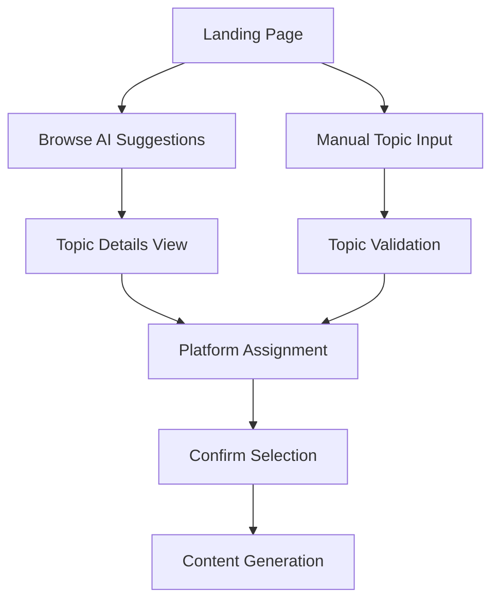
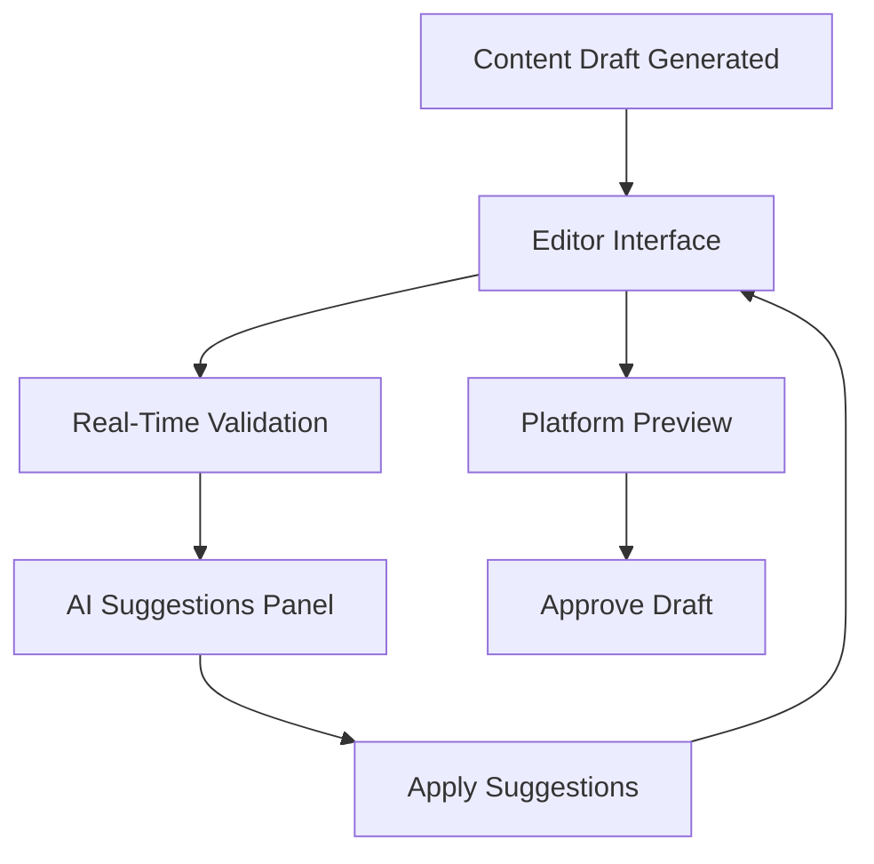

# Vector Wave UI

### Cel Serwisu
Interfejs użytkownika (UI) dla systemu Vector Wave, zbudowany w oparciu o Next.js i React. Umożliwia interakcję z całym przepływem generowania treści, od wyboru tematu, przez edycję z pomocą asystenta AI, aż po planowanie publikacji.

### Kluczowe Technologie
- **Framework**: Next.js 14 (App Router)
- **Język**: TypeScript
- **Styling**: Tailwind CSS
- **Zarządzanie Stanem**: Zustand + React Query
- **Komponenty AI**: `@assistant-ui/react`, `@copilotkit/react-ui`

### Uruchomienie i Testowanie
Serwis jest częścią submodułu `kolegium` i jest przeznaczony do uruchamiania lokalnie w trybie deweloperskim.

```bash
# Przejdź do katalogu UI
cd kolegium/vector-wave-ui

# Uruchom serwer deweloperski
npm run dev
```
Serwer będzie dostępny pod adresem `http://localhost:3000`.

---
### Istniejąca Dokumentacja (Zachowana)

This is a [Next.js](https://nextjs.org) project bootstrapped with [`create-next-app`](https://nextjs.org/docs/app/api-reference/cli/create-next-app).

## Getting Started

First, run the development server:

```bash
npm run dev
# or
yarn dev
# or
pnpm dev
# or
bun dev
```

Open [http://localhost:3000](http://localhost:3000) with your browser to see the result.

You can start editing the page by modifying `app/page.tsx`. The page auto-updates as you edit the file.

This project uses [`next/font`](https://nextjs.org/docs/app/building-your-application/optimizing/fonts) to automatically optimize and load [Geist](https://vercel.com/font), a new font family for Vercel.

## Learn More

To learn more about Next.js, take a look at the following resources:

- [Next.js Documentation](https://nextjs.org/docs) - learn about Next.js features and API.
- [Learn Next.js](https://nextjs.org/learn) - an interactive Next.js tutorial.

You can check out [the Next.js GitHub repository](https://github.com/vercel/next.js) - your feedback and contributions are welcome!

## Deploy on Vercel

The easiest way to deploy your Next.js app is to use the [Vercel Platform](https://vercel.com/new?utm_medium=default-template&filter=next.js&utm_source=create-next-app&utm_campaign=create-next-app-readme) from the creators of Next.js.

Check out our [Next.js deployment documentation](https://nextjs.org/docs/app/building-your-application/deploying) for more details.

---
### Skonsolidowana Dokumentacja

---
file: docs/specifications/VECTOR_WAVE_UI_UX_SPECIFICATIONS.md
---
# 🎨 Vector Wave UI/UX Specifications
**Complete User Interface Layer for Content Generation Workflow**

## 📋 Overview

### **Objective**
Create a comprehensive user interface layer that supports both AI Writing Flow (selective validation) and Kolegium (comprehensive validation) workflows, providing users with intuitive tools for content generation, validation, and multi-platform publishing.

### **Design Philosophy**
- **Progressive Enhancement**: Start with essential features, enhance with advanced capabilities
- **Workflow-Centric**: UI adapts to user's chosen workflow (selective vs comprehensive)
- **Real-Time Feedback**: Immediate validation and AI assistance throughout the process
- **Multi-Platform Awareness**: Platform-specific optimizations and previews
- **Performance-First**: Fast, responsive interface with minimal loading states

---

## 🏗️ Architecture Overview

### **Technology Stack**
```yaml
frontend_framework: "Next.js 14 (App Router)"
ui_library: "React 18 + TypeScript"
styling: "Tailwind CSS + Headless UI"
state_management: "Zustand + React Query"
real_time: "WebSockets + Server-Sent Events"
charts: "Chart.js / Recharts"
forms: "React Hook Form + Zod validation"
testing: "Jest + React Testing Library + Playwright"
```

### **Component Architecture**
```yaml
layout_components:
  - TopNavigation
  - SidebarWorkflow
  - BreadcrumbTrail
  - StatusIndicators

workflow_components:
  - TopicSelectionInterface
  - ContentEditorInterface
  - ValidationResultsPanel
  - PublishingPlannerInterface
  - FeedbackCollectionSystem

shared_components:
  - AIAssistantChat
  - PlatformPreview
  - ProgressIndicator
  - NotificationSystem
  - LoadingStates
```

---

## 🎯 Task 3.6.1: Topic Selection Interface

### **User Experience Flow**


### **Component Specifications**

#### **3.6.1A: AI Topic Suggestions Browser (2h)**
```yaml
component: TopicSuggestionsBrowser
location: /app/topics/suggestions

features:
  grid_layout:
    - Card-based topic display (3 columns on desktop, 1 on mobile)
    - Infinite scroll with pagination
    - Filter by platform, category, engagement potential
  
  topic_card:
    - Title with engaging hook
    - AI confidence score (visual indicator)
    - Estimated engagement metrics
    - Platform suitability badges
    - Quick preview on hover
  
  interactions:
    - Click to expand details
    - Heart to favorite
    - Quick platform assignment
    - Batch selection for multiple topics

api_integration:
  endpoints:
    - "GET /api/topics/suggestions?limit=12&offset=0&platform=all"
    - "POST /api/topics/favorite/{topic_id}"
    - "GET /api/topics/engagement-estimates/{topic_id}"

ui_mockup: |
  ┌─────────────────────────────────────────────────┐
  │ 🎯 AI-Suggested Topics                         │
  │ [Filter: All Platforms ▼] [Sort: Engagement ▼] │
  ├─────────────────────────────────────────────────┤
  │ ┌─────────┐ ┌─────────┐ ┌─────────┐            │
  │ │ 🚀 AI    │ │ 💡 Web3  │ │ ⚡ Dev   │            │
  │ │ Agents   │ │ Future   │ │ Speed   │            │
  │ │ 95% 📊   │ │ 87% 📊   │ │ 91% 📊   │            │
  │ │ Li Tw Gh │ │ Li Su Tw │ │ Li Tw Be │            │
  │ └─────────┘ └─────────┘ └─────────┘            │
  └─────────────────────────────────────────────────┘
```

#### **3.6.1B: Manual Topic Input Form (2h)**
```yaml
component: ManualTopicInputForm
location: /app/topics/create

features:
  form_fields:
    - Topic title (required, 5-100 chars)
    - Description (optional, up to 500 chars)
    - Target audience selection
    - Industry/category tags
    - Inspiration sources (URLs, articles)
  
  validation:
    - Real-time title uniqueness check
    - Engagement potential estimation
    - Platform compatibility analysis
    - SEO optimization suggestions

ui_mockup: |
  ┌─────────────────────────────────────────────────┐
  │ ✏️ Create Custom Topic                          │
  ├─────────────────────────────────────────────────┤
  │ Title: [_________________________] ✓           │
  │        ^AI suggests: "10x better approaches"    │
  │                                                 │
  │ Description: [________________________]         │
  │ [________________________]                     │
  │                                                 │
  │ Audience: [Developers ▼] [Tech Leaders ▼]      │
  │ Industry: [#AI] [#SaaS] [+Add Tag]              │
  │                                                 │
  │ Inspiration:                                    │
  │ [https://example.com/article] [+Add URL]        │
  │                                                 │
  │ 📊 Estimated Engagement: 78% | Best for: Li Tw │
  │                                                 │
  │           [Cancel] [Create Topic]               │
  └─────────────────────────────────────────────────┘
```

#### **3.6.1C: Platform Assignment Interface (2h)**
```yaml
component: PlatformAssignmentInterface

features:
  platform_selector:
    - Visual platform cards with logos
    - Compatibility scoring per platform
    - Content optimization hints
    - Estimated performance metrics
  
  smart_recommendations:
    - AI suggests optimal platform combinations
    - Content variations preview
    - Publishing timing recommendations
    - Cross-platform engagement synergy

platforms_supported:
  - LinkedIn (articles + carousels)
  - Twitter (threads + single posts)
  - Ghost (blog posts)
  - Substack (newsletters)
  - Beehiiv (newsletters)

ui_mockup: |
  ┌─────────────────────────────────────────────────┐
  │ 🎯 Platform Assignment                          │
  │ Topic: "AI Agents Transform Development"        │
  ├─────────────────────────────────────────────────┤
  │ ┌─────────┐ ┌─────────┐ ┌─────────┐            │
  │ │ 💼 Li    │ │ 🐦 Tw    │ │ 👻 Gh    │            │
  │ │ Article  │ │ Thread   │ │ Post     │            │
  │ │ 92% fit  │ │ 85% fit  │ │ 78% fit  │            │
  │ │ [✓] Sel  │ │ [✓] Sel  │ │ [ ] Sel  │            │
  │ └─────────┘ └─────────┘ └─────────┘            │
  │                                                 │
  │ 🚀 AI Recommendations:                          │
  │ • Start with LinkedIn article for authority     │
  │ • Follow with Twitter thread for reach         │
  │ • Best publishing time: Tue 9AM EST             │
  │                                                 │
  │               [Continue to Content]             │
  └─────────────────────────────────────────────────┘
```

#### **3.6.1D: Topic Confirmation & Handoff (2h)**
```yaml
component: TopicConfirmationHandoff

features:
  summary_review:
    - Selected topic details
    - Chosen platforms with optimizations
    - Content generation strategy
    - Success metrics definition
  
  workflow_selection:
    - AI Writing Flow (selective validation)
    - Kolegium Workflow (comprehensive validation)
    - Hybrid approach option

test_requirements:
  unit_tests:
    coverage_target: ">85% line coverage"
    tests:
      - test_topic_suggestions_loading()
      - test_manual_topic_form_validation()
      - test_platform_assignment_logic()
      - test_topic_confirmation_workflow()
  
  integration_tests:
    coverage_target: ">80% API endpoint coverage"
    tests:
      - test_topics_api_integration()
      - test_platform_assignment_api()
      - test_workflow_handoff_integration()
  
  user_interaction_tests:
    tests:
      - test_topic_card_interactions()
      - test_form_validation_feedback()
      - test_platform_selection_flow()
      - test_mobile_responsive_behavior()
```

---

## 🖊️ Task 3.6.2: Draft Review & Editing Interface

### **User Experience Flow**


### **Component Specifications**

#### **3.6.2A: Content Editor with Live Validation (2h)**
```yaml
component: LiveContentEditor
location: /app/editor/{workflow_id}

features:
  editor:
    - Rich text editor with markdown support
    - Real-time character count per platform
    - AI-powered autocomplete suggestions
    - Syntax highlighting for platform-specific formatting
  
  live_validation:
    - Style guide violations highlighted
    - Platform constraint warnings
    - SEO optimization tips
    - Engagement improvement suggestions
  
  split_view:
    - Editor pane (60% width)
    - Preview pane (40% width)
    - Validation results sidebar

ui_mockup: |
  ┌─────────────────────────────────────────────────┐
  │ 📝 Content Editor | LinkedIn Article            │
  ├─────────────────────────────────────────────────┤
  │ ┌──────────────────┐ │ ┌─────────────────────┐  │
  │ │ # AI Agents      │ │ │ 💼 LinkedIn Preview │  │
  │ │ Transform...     │ │ │                     │  │
  │ │                  │ │ │ # AI Agents Trans.. │  │
  │ │ The future of    │ │ │ by Your Name        │  │
  │ │ development ~~is │ │ │                     │  │
  │ │ ⚠️ TOO GENERIC   │ │ │ The future of dev.. │  │
  │ │ already~~ arrived │ │ │                     │  │
  │ │                  │ │ │ [Read more]         │  │
  │ │ 1,247/2,000 chars│ │ │ 👍 💬 🔄 📤        │  │
  │ └──────────────────┘ │ └─────────────────────┘  │
  │                                                 │
  │ ⚡ AI Suggestions:                               │
  │ • Replace "is already" with "has" (conciseness) │
  │ • Add specific example after "development"      │
  │ • Consider stronger hook in opening             │
  └─────────────────────────────────────────────────┘
```

#### **3.6.2B: AI Assistant Chat Integration (2h)**
```yaml
component: AIAssistantChat
location: Sidebar panel in editor

features:
  chat_interface:
    - Context-aware AI assistant
    - Content-specific suggestions
    - Style guide interpretation
    - Platform optimization advice
  
  suggestion_types:
    - Grammar and style improvements
    - SEO optimization recommendations
    - Engagement enhancement tips
    - Platform-specific adaptations
  
  quick_actions:
    - One-click suggestion application
    - Rewrite paragraph options
    - Tone adjustment controls
    - Length optimization tools

ui_mockup: |
  ┌─────────────────────────────────────────────────┐
  │ 🤖 AI Assistant                                 │
  ├─────────────────────────────────────────────────┤
  │ 💬 Your content looks great! Here are some     │
  │    improvements:                                │
  │                                                 │
  │ 🎯 Line 3: "The future of development"         │
  │    → "Development teams worldwide"              │
  │    [Apply] [Ignore] [More options ▼]           │
  │                                                 │
  │ 📊 Engagement Score: 78% → 84% (after changes) │
  │                                                 │
  │ 💭 Ask me anything:                             │
  │ [Make it more technical_____________] [Send]    │
  │                                                 │
  │ ⚡ Quick Actions:                                │
  │ [Shorten by 20%] [Add CTA] [Optimize SEO]      │
  └─────────────────────────────────────────────────┘
```

#### **3.6.2C: Validation Results Display (2h)**
```yaml
component: ValidationResultsPanel

features:
  validation_categories:
    - Style guide compliance
    - Platform constraints
    - SEO optimization
    - Engagement prediction
    - Brand consistency
  
  result_display:
    - Color-coded severity levels
    - Inline highlighting in editor
    - Fix suggestion actions
    - Progress tracking

severity_levels:
  error: "Must fix before publishing (red)"
  warning: "Should fix for better results (yellow)"
  suggestion: "Optional improvements (blue)"
  success: "Meeting all requirements (green)"
```

#### **3.6.2D: Multi-Platform Content Variations (2h)**
```yaml
component: PlatformVariationsManager

features:
  variation_tabs:
    - LinkedIn version
    - Twitter version
    - Newsletter version
    - Blog post version
  
  auto_adaptation:
    - Length optimization per platform
    - Format conversion (article → thread)
    - Call-to-action customization
    - Hashtag optimization

test_requirements:
  unit_tests:
    coverage_target: ">85% line coverage"
    tests:
      - test_editor_content_synchronization()
      - test_live_validation_triggers()
      - test_ai_suggestion_application()
      - test_platform_variation_generation()
  
  integration_tests:
    coverage_target: ">80% API endpoint coverage"
    tests:
      - test_validation_service_integration()
      - test_ai_assistant_api_integration()
      - test_content_preview_generation()
  
  user_interaction_tests:
    tests:
      - test_editor_typing_performance()
      - test_suggestion_click_handling()
      - test_platform_switching_workflow()
      - test_real_time_validation_display()
```

---

## 📅 Task 3.6.3: Publishing Planner Interface

### **Component Specifications**

#### **3.6.3A: Platform Selection with Optimization Hints (2h)**
```yaml
component: PlatformOptimizationSelector

features:
  platform_cards:
    - Current platform status
    - Optimization recommendations
    - Best publishing times
    - Expected performance metrics
  
  smart_suggestions:
    - Platform combination recommendations
    - Content sequencing strategy
    - Cross-promotion opportunities

ui_mockup: |
  ┌─────────────────────────────────────────────────┐
  │ 🚀 Publishing Planner                           │
  ├─────────────────────────────────────────────────┤
  │ ┌───────────────┐ ┌───────────────┐            │
  │ │ 💼 LinkedIn    │ │ 🐦 Twitter     │            │
  │ │ ✅ Ready       │ │ ⚠️ Needs CTA   │            │
  │ │ Est: 250 views │ │ Est: 180 views │            │
  │ │ Best: Tue 9AM  │ │ Best: Wed 2PM  │            │
  │ │ [Schedule]     │ │ [Fix & Sched]  │            │
  │ └───────────────┘ └───────────────┘            │
  │                                                 │
  │ 🎯 Optimization Tips:                           │
  │ • Schedule LinkedIn first (authority building)  │
  │ • Follow with Twitter 2 hours later            │
  │ • Add LinkedIn post link to Twitter thread     │
  └─────────────────────────────────────────────────┘
```

#### **3.6.3B: Scheduling Interface with Optimal Slots (2h)**
```yaml
component: OptimalSchedulingInterface

features:
  calendar_view:
    - Weekly calendar with optimal time slots
    - Platform-specific recommendations
    - Conflict detection with existing posts
    - Bulk scheduling capabilities
  
  time_recommendations:
    - AI-powered optimal timing
    - Audience activity analysis
    - Platform algorithm considerations
    - Time zone optimization

ui_mockup: |
  ┌─────────────────────────────────────────────────┐
  │ 📅 Publishing Schedule                          │
  ├─────────────────────────────────────────────────┤
  │     Mon    Tue    Wed    Thu    Fri             │
  │  ┌─────┐ ┌─────┐ ┌─────┐ ┌─────┐ ┌─────┐       │
  │ 9│     │ │🔥Li │ │     │ │     │ │     │       │
  │  │     │ │ AI  │ │     │ │     │ │     │       │
  │ 2│     │ │     │ │⚡Tw │ │     │ │     │       │
  │  │     │ │     │ │Thread│ │     │ │     │       │
  │  └─────┘ └─────┘ └─────┘ └─────┘ └─────┘       │
  │                                                 │
  │ 🎯 Optimal Times This Week:                     │
  │ • LinkedIn: Tue 9AM (89% engagement rate)      │
  │ • Twitter: Wed 2PM (76% engagement rate)       │
  │                                                 │
  │ [Auto-Schedule All] [Custom Times]              │
  └─────────────────────────────────────────────────┘
```

#### **3.6.3C: LinkedIn Presentation Preview (2h)**
```yaml
component: LinkedInPresentationPreview

features:
  carousel_preview:
    - Slide-by-slide preview
    - Interactive navigation
    - Design template selection
    - Branding customization
  
  presentation_editor:
    - Slide layout options
    - Visual element positioning
    - Color scheme selection
    - Logo and branding placement

ui_mockup: |
  ┌─────────────────────────────────────────────────┐
  │ 🎨 LinkedIn Presentation Preview                │
  ├─────────────────────────────────────────────────┤
  │ ┌─────────────────┐ [◀ 1/5 ▶]                  │
  │ │ 🚀 AI Agents     │                            │
  │ │ Transform Dev    │ Templates:                 │
  │ │                 │ [Modern] [Tech] [Minimal]  │
  │ │ by @YourHandle  │                            │
  │ │                 │ Branding:                  │
  │ │ [Your Logo]     │ [Logo ✓] [Colors ✓]       │
  │ └─────────────────┘                            │
  │                                                 │
  │ Slide Content:                                  │
  │ ┌─ Slide 1: Title & Hook                       │
  │ ├─ Slide 2: Problem Statement                  │
  │ ├─ Slide 3: Solution Overview                  │
  │ ├─ Slide 4: Implementation                     │
  │ └─ Slide 5: Call to Action                     │
  │                                                 │
  │ [Edit Slides] [Preview Full] [Generate Post]   │
  └─────────────────────────────────────────────────┘
```

#### **3.6.3D: Publication Status Tracking (2h)**
```yaml
component: PublicationStatusTracker

features:
  status_dashboard:
    - Real-time publication status
    - Platform-specific progress
    - Error detection and reporting
    - Performance metrics tracking
  
  notifications:
    - Success confirmations
    - Failure alerts with resolution steps
    - Performance milestone notifications

test_requirements:
  unit_tests:
    coverage_target: ">85% line coverage"
    tests:
      - test_platform_optimization_logic()
      - test_scheduling_algorithm()
      - test_presentation_generation()
      - test_publication_status_tracking()
  
  integration_tests:
    coverage_target: ">80% API endpoint coverage"
    tests:
      - test_scheduling_api_integration()
      - test_presentation_service_integration()
      - test_publishing_orchestrator_integration()
  
  user_interaction_tests:
    tests:
      - test_calendar_interaction()
      - test_presentation_preview_navigation()
      - test_publication_status_updates()
```

---

## 📊 Task 3.6.4: User Feedback Collection System

### **Component Specifications**

#### **3.6.4A: Topic Rating & Feedback Interface (2h)**
```yaml
component: TopicFeedbackInterface

features:
  rating_system:
    - 5-star rating for topic suggestions
    - Category-specific feedback (relevance, interest, timing)
    - Optional text feedback
    - Quick thumbs up/down for rapid feedback
  
  feedback_categories:
    - Topic Relevance (1-5)
    - Personal Interest (1-5)  
    - Timing Appropriateness (1-5)
    - Platform Suitability (1-5)

ui_mockup: |
  ┌─────────────────────────────────────────────────┐
  │ ⭐ Rate This Topic                               │
  │ "AI Agents Transform Development"               │
  ├─────────────────────────────────────────────────┤
  │ Overall Rating: ⭐⭐⭐⭐⭐                       │
  │                                                 │
  │ Relevance:   ⭐⭐⭐⭐⭐ (Very relevant)        │
  │ Interest:    ⭐⭐⭐⭐☆ (Interesting)          │
  │ Timing:      ⭐⭐⭐☆☆ (Too early?)           │
  │ Platforms:   ⭐⭐⭐⭐⭐ (Perfect fit)         │
  │                                                 │
  │ Additional feedback (optional):                 │
  │ [Great topic! Would love more technical____]    │
  │ [_________________________________________]     │
  │                                                 │
  │ [Skip] [Submit Feedback]                        │
  └─────────────────────────────────────────────────┘
```

#### **3.6.4B: Content Quality Assessment (2h)**
```yaml
component: ContentQualityFeedbackPanel

features:
  quality_metrics:
    - Content clarity rating
    - Engagement potential assessment
    - Platform optimization score
    - AI assistance helpfulness
  
  improvement_suggestions:
    - User-generated improvement ideas
    - Feature request collection
    - Workflow optimization feedback

ui_mockup: |
  ┌─────────────────────────────────────────────────┐
  │ 📈 Content Quality Feedback                     │
  ├─────────────────────────────────────────────────┤
  │ How was your content creation experience?       │
  │                                                 │
  │ Content Clarity:    ⭐⭐⭐⭐⭐                 │
  │ AI Helpfulness:     ⭐⭐⭐⭐☆                 │
  │ Platform Fit:       ⭐⭐⭐⭐⭐                 │
  │ Overall Process:    ⭐⭐⭐⭐☆                 │
  │                                                 │
  │ What could be improved?                         │
  │ ☐ Faster AI responses                           │
  │ ☐ Better validation feedback                    │
  │ ☐ More platform options                        │
  │ ☐ Enhanced editor features                      │
  │                                                 │
  │ Suggestions: [_______________________]          │
  │                                                 │
  │ [Submit Feedback]                               │
  └─────────────────────────────────────────────────┘
```

#### **3.6.4C: Platform Performance Feedback (2h)**
```yaml
component: PlatformPerformanceFeedback

features:
  performance_tracking:
    - Post-publication engagement metrics
    - User satisfaction with results
    - Platform-specific optimization effectiveness
    - ROI and time-saving assessments
  
  comparative_analysis:
    - Performance vs expectations
    - Platform effectiveness comparison
    - Workflow efficiency metrics

test_requirements:
  unit_tests:
    coverage_target: ">85% line coverage"
    tests:
      - test_feedback_collection_logic()
      - test_rating_submission()
      - test_feedback_aggregation()
  
  integration_tests:
    coverage_target: ">80% API endpoint coverage"  
    tests:
      - test_feedback_api_integration()
      - test_performance_metrics_collection()
  
  user_interaction_tests:
    tests:
      - test_rating_interface_interactions()
      - test_feedback_form_validation()
      - test_feedback_submission_flow()
```

---

## 📊 Task 3.6.5: System Status & Monitoring Dashboard

### **Component Specifications**

#### **3.6.5A: Service Health Overview (2h)**
```yaml
component: ServiceHealthDashboard
location: /app/system/health

features:
  service_status:
    - Real-time service health indicators
    - Response time monitoring
    - Error rate tracking
    - Capacity utilization metrics
  
  health_indicators:
    - Green: All systems operational
    - Yellow: Performance degraded  
    - Red: Service unavailable
    - Blue: Maintenance mode

ui_mockup: |
  ┌─────────────────────────────────────────────────┐
  │ 🚀 System Status Dashboard                      │
  ├─────────────────────────────────────────────────┤
  │ Overall Status: 🟢 All Systems Operational      │
  │                                                 │
  │ ┌─────────────────┐ ┌─────────────────┐        │
  │ │ 🟢 Editorial     │ │ 🟢 ChromaDB     │        │
  │ │ 45ms avg        │ │ 12ms avg        │        │
  │ │ 99.9% uptime    │ │ 100% uptime     │        │
  │ └─────────────────┘ └─────────────────┘        │
  │                                                 │
  │ ┌─────────────────┐ ┌─────────────────┐        │
  │ │ 🟡 Kolegium     │ │ 🟢 Publisher    │        │
  │ │ 234ms avg       │ │ 78ms avg        │        │
  │ │ High load       │ │ 99.5% uptime    │        │
  │ └─────────────────┘ └─────────────────┘        │
  │                                                 │
  │ 🔔 Alerts: Kolegium response time elevated     │
  │ 📊 System Load: 67% | Memory: 45%               │
  └─────────────────────────────────────────────────┘
```

#### **3.6.5B: Content Generation Queue Status (2h)**
```yaml
component: ContentGenerationQueueMonitor

features:
  queue_visualization:
    - Active job count
    - Average processing time
    - Queue length indicators
    - Job priority visualization
  
  job_tracking:
    - Individual job status
    - Progress indicators
    - Estimated completion times
    - Error detection and alerts

ui_mockup: |
  ┌─────────────────────────────────────────────────┐
  │ 🔄 Content Generation Queue                     │
  ├─────────────────────────────────────────────────┤
  │ Active Jobs: 3 | Queued: 7 | Completed: 142    │
  │                                                 │
  │ ┌─────────────────────────────────────────────┐ │
  │ │ 🚀 "AI Development Tools" - LinkedIn        │ │  
  │ │ ████████████░░░░ 75% | ETA: 2 min          │ │
  │ └─────────────────────────────────────────────┘ │
  │                                                 │
  │ ┌─────────────────────────────────────────────┐ │
  │ │ 🎯 "Web3 Security" - Twitter Thread         │ │
  │ │ ██████░░░░░░░░░░ 35% | ETA: 5 min          │ │
  │ └─────────────────────────────────────────────┘ │
  │                                                 │
  │ Queue Performance:                              │
  │ • Average completion: 3.2 minutes               │
  │ • Success rate: 97.8%                           │
  │ • Peak queue time: 12 minutes                   │
  └─────────────────────────────────────────────────┘
```

#### **3.6.5C: Publishing Job Monitoring (2h)**
```yaml
component: PublishingJobMonitor

features:
  publication_pipeline:
    - Pre-publish validation status
    - Platform publishing status
    - Post-publish verification
    - Performance tracking initiation
  
  error_handling:
    - Failed publication detection
    - Retry mechanism status
    - Manual intervention alerts
    - Resolution guidance

test_requirements:
  unit_tests:
    coverage_target: ">85% line coverage"
    tests:
      - test_service_health_monitoring()
      - test_queue_status_calculation()
      - test_job_progress_tracking()
      - test_error_detection_logic()
  
  integration_tests:
    coverage_target: ">80% API endpoint coverage"
    tests:
      - test_health_check_api_integration()
      - test_queue_monitoring_api()
      - test_job_status_api_integration()
  
  real_time_tests:
    tests:
      - test_websocket_status_updates()
      - test_real_time_queue_updates()
      - test_alert_notification_delivery()
```

---

## 🔧 Integration Requirements

### **Responsive Design**
```yaml
breakpoints:
  mobile: "320px - 768px"
  tablet: "768px - 1024px"  
  desktop: "1024px+"

mobile_optimizations:
  - Single column layouts
  - Touch-friendly interface elements
  - Swipe gestures for navigation
  - Collapsible sidebars and panels

tablet_optimizations:
  - Two-column layouts where appropriate
  - Enhanced touch interactions
  - Optimized keyboard/mouse hybrid usage

desktop_optimizations:
  - Multi-panel layouts
  - Keyboard shortcuts
  - Advanced feature accessibility
  - Multiple simultaneous operations
```

### **Real-Time Updates**
```yaml
websocket_integration:
  connection: "wss://api.vectorwave.io/ws"
  events:
    - content_generation_progress
    - validation_results_update
    - publication_status_change
    - system_health_change
    - queue_status_update

server_sent_events:
  endpoint: "/api/events"
  use_cases:
    - Long-running job progress
    - System status notifications
    - User activity updates
```

### **Accessibility (WCAG 2.1 AA)**
```yaml
compliance_features:
  keyboard_navigation:
    - Full keyboard accessibility
    - Logical tab order
    - Focus indicators
    - Skip links

  screen_reader:
    - Semantic HTML structure
    - ARIA labels and descriptions
    - Descriptive alt text
    - Live region updates

  visual_accessibility:
    - High contrast mode support
    - Scalable text (up to 200%)
    - Color blind friendly palettes
    - Motion preferences respect

  interaction_accessibility:
    - Minimum touch target sizes (44px)
    - Extended timeout options
    - Error prevention and correction
    - Clear form instructions
```

### **Performance Requirements**
```yaml
performance_targets:
  page_load: "<3 seconds (first contentful paint)"
  interaction: "<1 second (user interaction response)"
  real_time: "<500ms (websocket event handling)"

optimization_strategies:
  bundle_splitting:
    - Route-based code splitting
    - Component lazy loading
    - Library chunking optimization
  
  caching:
    - Static asset caching
    - API response caching
    - Progressive Web App caching
  
  optimization:
    - Image optimization and lazy loading
    - Critical CSS inlining
    - Database query optimization
```

### **Error Handling & User Experience**
```yaml
error_handling_strategy:
  user_friendly_messages:
    - Plain language error descriptions
    - Actionable resolution steps  
    - Context-specific help
    - Escalation options

  error_recovery:
    - Automatic retry mechanisms
    - Graceful degradation
    - Offline functionality
    - Data persistence during errors

  error_reporting:
    - Comprehensive error logging
    - User feedback collection
    - Performance impact tracking
    - Resolution monitoring
```

---

## 🧪 Testing Strategy

### **Testing Pyramid**
```yaml
unit_tests:
  coverage_target: ">90%"
  focus:
    - Component logic
    - Utility functions  
    - State management
    - API integration layers

integration_tests:
  coverage_target: ">80%"
  focus:
    - Component interactions
    - API integrations
    - User workflows
    - Cross-platform compatibility

e2e_tests:
  coverage_target: ">70%"
  focus:
    - Complete user journeys
    - Multi-platform workflows
    - Performance under load
    - Accessibility compliance

visual_regression_tests:
  tools: "Percy / Chromatic"
  coverage:
    - Component visual consistency
    - Responsive design verification
    - Cross-browser compatibility
    - Dark/light theme support
```

### **Performance Testing**
```yaml
performance_monitoring:
  tools:
    - Lighthouse CI
    - Core Web Vitals monitoring
    - Real User Monitoring (RUM)
    - Synthetic monitoring

  metrics:
    - First Contentful Paint (FCP)
    - Largest Contentful Paint (LCP)
    - First Input Delay (FID)
    - Cumulative Layout Shift (CLS)
    - Time to Interactive (TTI)

load_testing:
  scenarios:
    - Normal user load (100 concurrent users)
    - Peak traffic (1000 concurrent users)  
    - Stress testing (2000+ concurrent users)
    - Extended endurance testing
```

---

## 📅 Implementation Timeline

### **Week 1: Foundation & Infrastructure**
- Day 1-2: Project setup, architecture, and tooling
- Day 3-4: Base components and design system
- Day 5: Topic Selection Interface (Task 3.6.1)

### **Week 2: Core Editing Experience**
- Day 1-3: Draft Review & Editing Interface (Task 3.6.2)
- Day 4-5: AI Assistant integration and testing

### **Week 3: Publishing & Planning**  
- Day 1-3: Publishing Planner Interface (Task 3.6.3)
- Day 4-5: LinkedIn presentation system

### **Week 4: Feedback & Monitoring**
- Day 1-2: User Feedback Collection System (Task 3.6.4)
- Day 3-4: System Status & Monitoring Dashboard (Task 3.6.5)
- Day 5: Integration testing and deployment

### **Week 5: Polish & Launch**
- Day 1-2: Performance optimization and bug fixes
- Day 3-4: Accessibility compliance and testing
- Day 5: User acceptance testing and launch preparation

---

## 🎯 Success Metrics

### **User Experience Metrics**
```yaml
task_completion_rate: ">95% for core workflows"
user_satisfaction: ">4.5/5 average rating"
time_to_first_publish: "<10 minutes for new users"
error_rate: "<2% for critical user actions"
```

### **Performance Metrics**
```yaml
page_load_time: "<3 seconds (95th percentile)"
interaction_response: "<1 second (95th percentile)"
uptime: ">99.9% availability"
real_time_latency: "<500ms for live updates"
```

### **Adoption Metrics**
```yaml
daily_active_users: "Target growth of 20% monthly"
feature_adoption: ">80% for core features within 30 days"
user_retention: ">70% 7-day retention rate"
workflow_completion: ">85% of started workflows completed"
```

---

## 🔄 Maintenance & Evolution

### **Continuous Improvement**
```yaml
user_feedback_integration:
  - Weekly user feedback review sessions
  - Monthly feature prioritization based on usage data
  - Quarterly UX research and usability testing
  - Annual comprehensive UI/UX audit

technical_maintenance:
  - Daily automated testing and deployment
  - Weekly performance monitoring review
  - Monthly security and dependency updates
  - Quarterly architecture and scalability review
```

### **Future Enhancements**
```yaml
planned_features:
  - Advanced analytics dashboard
  - Team collaboration features
  - Custom workflow builder
  - Integration with additional platforms
  - Mobile app development
  - AI-powered content ideation
  - Advanced personalization engine
```

---

**📚 References:**
- [Vector Wave API Documentation](../api/README.md)
- [Design System Guidelines](../design/README.md)
- [Performance Requirements](../requirements/PERFORMANCE.md)
- [Accessibility Guidelines](../requirements/ACCESSIBILITY.md)
---
file: kolegium/vector-wave-ui/docs/AI_EDITORIAL_ASSISTANT_RECOMMENDATIONS.md
---
# 🎯 Rekomendacje dla Inteligentnego Asystenta Redakcyjnego

## 0. **Domyślne Zachowanie - Proaktywny Start**

### 🚀 Przy starcie konwersacji:
Asystent powinien **automatycznie** (bez czekania na pytanie):

1. **Wylistować dostępne tematy** z content/raw/
2. **Pokazać quick stats** (ile nowych, ile przeanalizowanych)
3. **Zaproponować akcje**

Przykład:
```
Cześć! 👋 Mam dla Ciebie przegląd dostępnych tematów:

📂 NOWE (3):
• adhd-ideas-overflow (8 plików) - świeże pomysły o ADHD
• ai-agents-tutorial (12 plików) - kompletny guide  
• startup-metrics (5 plików) - case study z danymi

📊 W TRAKCIE (2):
• vector-wave-story (analiza 80% done)
• crewai-deepdive (czeka na review)

✅ OPUBLIKOWANE WCZORAJ (1):
• gpt-5-predictions → LinkedIn (450 reactions!)

Który temat Cię interesuje? Mogę:
[🔍 Przeanalizować nowy] [📈 Dokończyć w trakcie] [🎯 Quick win na dziś]
```

### 🎯 Inteligentne powitanie bazujące na kontekście:

**Rano (6:00-10:00):**
```
Dzień dobry! ☕ Mamy 3 świeże tematy które przyszły w nocy:
[...]
Co publikujemy dziś rano na LinkedIn?
```

**Popołudnie (14:00-17:00):**
```
Cześć! Post poranny ma już 230 reakcji 🔥
Mamy 2h do Twitter prime time - który temat przerobić na thread?
```

**Wieczór (19:00-23:00):**
```
Dobry wieczór! Czas na przygotowanie contentu na jutro.
Top 3 tematy według potencjału:
[...]
```

## 1. **Kontekstowe Flow Redakcyjne**

**DISCOVERY → ANALYSIS → EDITORIAL → PRODUCTION → DISTRIBUTION → METRICS**

Każda faza powinna mieć swoje kontekstowe akcje:

## 2. **Inteligentne Akcje per Faza**

### 📂 DISCOVERY (Po wylistowaniu folderów):
- "Przeanalizuj wszystkie foldery i pokaż TOP 3 z największym potencjałem"
- "Pokaż tylko foldery z ostatnich 7 dni"
- "Znajdź foldery pasujące do trendu [X]"
- Przyciski: [Analizuj folder] [Pokaż szczegóły] [Pomiń]

### 🔍 ANALYSIS (Po analizie folderu):
- "Czy chcesz głębszą analizę z perspektywy [LinkedIn/Twitter/Newsletter]?"
- "Porównaj z podobnymi tematami z ostatnich publikacji"
- "Sprawdź konkurencję - czy ktoś już pisał o tym?"
- Przyciski: [Uruchom kolegium] [Wygeneruj warianty] [Wróć do listy] [Zapisz na później]

### ✍️ EDITORIAL (Po decyzji kolegium):
- "Folder zatwierdzony! Co dalej?"
- Przyciski: 
  - [Generuj posty social media]
  - [Stwórz prezentację Presenton]
  - [Zaplanuj publikację]
  - [Przypisz do autora]
  - [Wygeneruj briefy dla platform]

### 🚀 PRODUCTION (Tworzenie contentu):
- "Wybierz format do wygenerowania:"
  - [LinkedIn Article - 1500 słów]
  - [Twitter Thread - 10 tweetów]
  - [Newsletter Deep Dive - 3000 słów]
  - [Presenton Deck - 12 slajdów]
  - [YouTube Script - 10 min]
- "Chcesz najpierw zobaczyć szkic czy od razu pełną wersję?"

### 📅 SCHEDULING (Planowanie):
- "Kiedy opublikować? Analiza pokazuje że najlepszy czas to:"
  - [Jutro 9:00 - LinkedIn peak]
  - [Piątek 15:00 - Newsletter]
  - [Custom data i czas]
- "Czy ustawić przypomnienie o cross-postingu?"

### 📊 METRICS (Po publikacji):
- "Content opublikowany! Chcesz:"
  - [Śledzić metryki real-time]
  - [Ustawić alert przy 100+ reakcjach]
  - [Zaplanować follow-up post]
  - [Analizować komentarze AI]

## 3. **Inteligentne Sugestie Kontekstowe**

**Asystent powinien:**
- **Pamiętać historię** - "Ostatnio dobrze działały tematy o AI agents, mamy coś podobnego?"
- **Sugerować łączenie** - "Te 3 foldery mówią o podobnym temacie, może seria?"
- **Przewidywać potrzeby** - "Za 2 dni masz lukę w kalendarzu, przygotować content?"
- **Uczyć się preferencji** - "Zauważyłem że preferujesz publikować rano, ustawić jako domyślne?"

## 4. **Multi-Action Buttons**

Zamiast pojedynczych akcji, grupy przycisków:

```
Po analizie folderu:
┌─────────────────┬──────────────────┬─────────────────┐
│ 🚀 Quick Win    │ 📚 Deep Dive     │ 🎯 Viral Play   │
│ Tweet + LI Post │ Full Pipeline    │ Thread + Deck   │
└─────────────────┴──────────────────┴─────────────────┘
```

## 5. **Workflow Shortcuts**

**"Tryby pracy" do wyboru:**
- **🏃 Sprint Mode** - "Potrzebuję contentu na dziś"
- **📊 Strategic Mode** - "Planujmy na cały tydzień"
- **🔥 Trending Mode** - "Co jest hot i możemy szybko wykorzystać?"
- **🧪 Experiment Mode** - "Testujmy nowe formaty"

## 6. **Predictive Actions**

**Asystent przewiduje co chcesz zrobić:**
- "Widzę że to kontrowersyjny temat - może zacząć od ankiety na Twitter?"
- "Ten content ma dużo danych - wygenerować infografiki?"
- "To technical deep dive - może najpierw prosty explainer?"

## 7. **Cross-Platform Intelligence**

**Jeden content, wiele wyjść:**
```
Bazowy content: "AI Agents w produkcji"
↓
Asystent proponuje:
- LinkedIn: Case study z metrykami
- Twitter: Thread "10 rzeczy których nie wiedziałeś"
- Newsletter: Technical deep dive
- Presenton: "Pitch deck dla CTO"
- YouTube: "Live coding session"
```

## 8. **Feedback Loop Integration**

**Po każdej publikacji:**
- "Ten post ma 2x więcej engagement niż średnia. Przeanalizować dlaczego?"
- "Komentarze sugerują follow-up o [X]. Dodać do backlogu?"
- "3 osoby pytają o tutorial. Wygenerować?"

## 9. **Emergency Actions**

**Szybkie akcje kryzysowe:**
- "Trending topic! Mamy 2h żeby coś opublikować"
- "Konkurencja opublikowała podobny content - pivot czy double down?"
- "Błąd w opublikowanym poście - auto-korekta czy manual?"

## 10. **AI Learning Actions**

**Asystent uczy się i sugeruje:**
- "Twoje posty o [X] mają średnio 3x lepszy CTR. Więcej tego?"
- "Piątki są martwe dla engagement. Przesunąć publikacje?"
- "Format 'kontrast opinions' działa najlepiej. Zastosować tutaj?"

---

# 🧠 Inteligentne Wykrywanie Kontekstu i Dynamiczne Akcje

## 1. **Stan Analizy i Historia**

System powinien pamiętać:
```javascript
// W useCopilotReadable dodać:
{
  description: "Historia analiz i ich wyniki",
  value: {
    analyzed_folders: {
      "adhd-ideas-overflow-2025-07-31": {
        analyzed_at: "2025-08-01T14:30:00",
        result: { /* wyniki analizy */ },
        status: "completed"
      }
    }
  }
}
```

## 2. **Inteligentne Pytania Follow-up**

Po wykryciu że temat był analizowany:

```
🔍 Temat "ADHD Ideas Overflow" był już analizowany 2 godziny temu.

Co chcesz zrobić?
┌────────────────────┬─────────────────────┬───────────────────┐
│ 📊 Pokaż wyniki    │ 🔄 Analizuj ponownie│ 📝 Zobacz raport  │
└────────────────────┴─────────────────────┴───────────────────┘

Lub:
┌────────────────────┬─────────────────────┬───────────────────┐
│ 🚀 Uruchom pipeline│ 📅 Zaplanuj         │ 🔗 Porównaj z...  │
└────────────────────┴─────────────────────┴───────────────────┘
```

## 3. **Kontekstowe Przyciski Bazujące na Typie**

**Dla SERIES:**
```
Seria "2025-07-31 Brainstorm" (14 części):
┌─────────────────────┬──────────────────────┬────────────────────┐
│ 📚 Cała seria jako  │ 🎯 Wybierz najlepsze │ 🔀 Podziel na      │
│    deep dive        │    3 części          │    mini-serie      │
└─────────────────────┴──────────────────────┴────────────────────┘
```

**Dla STANDALONE:**
```
Content "ADHD Ideas" (8 artykułów):
┌─────────────────────┬──────────────────────┬────────────────────┐
│ 🎲 Mix & Match     │ 📊 Ranking potencjału│ 🏷️ Taguj tematy   │
│   różne kombinacje  │    dla każdego       │    do kategorii    │
└─────────────────────┴──────────────────────┴────────────────────┘
```

## 4. **Smart Action Mapping**

System powinien mapować naturalne pytania na akcje:

```javascript
const contextualMappings = {
  "przeanalizuj ten temat": (context) => {
    if (context.already_analyzed) {
      return {
        primary_action: "show_analysis_results",
        secondary_actions: ["reanalyze", "run_pipeline", "compare"]
      }
    }
    return { primary_action: "analyze_folder" }
  },
  
  "co z tym zrobić": (context) => {
    if (context.content_type === "SERIES") {
      return {
        actions: ["create_thread", "split_episodes", "make_course"]
      }
    }
    return {
      actions: ["quick_post", "deep_dive", "viral_angle"]
    }
  }
}
```

## 5. **Dynamiczne Generowanie UI**

Zamiast hardcodowanych przycisków:

```typescript
// W handler akcji
const generateContextualUI = (analysisResult, history) => {
  const actions = [];
  
  // Jeśli high viral score
  if (analysisResult.viralScore > 80) {
    actions.push({
      label: "🔥 Strike while hot!",
      action: "immediate_publish",
      priority: "high"
    });
  }
  
  // Jeśli podobny do poprzedniego sukcesu
  if (similarToSuccess(analysisResult, history)) {
    actions.push({
      label: "📈 Powtórz sukces",
      action: "use_winning_template",
      template_id: history.best_performer
    });
  }
  
  return formatAsButtons(actions);
};
```

## 6. **Contextual Intelligence Examples**

### Scenariusz 1: Powtórna analiza
```
User: "przeanalizuj adhd ideas"
AI: "Ten folder był analizowany 2h temu. Od tego czasu:
     - Dodano 2 nowe pliki
     - Zmieniono tytuł głównego dokumentu
     
     [🔄 Analizuj tylko zmiany] [📊 Pełna reanaliza] [👁️ Pokaż ostatnie wyniki]"
```

### Scenariusz 2: Łączenie tematów
```
User: "co mamy o AI agents?"
AI: "Znalazłem 3 foldery z powiązaną tematyką:
     
     1. 'ai-agents-production' (SERIES, 12 części)
     2. 'crewai-tutorial' (STANDALONE, 5 plików)  
     3. 'agent-orchestration' (SERIES, 8 części)
     
     [🔗 Stwórz mega-guide] [📊 Porównaj podejścia] [🎯 Best-of compilation]"
```

## 7. **Learning from Actions**

System powinien uczyć się z wyborów:

```javascript
// Track user choices
const trackChoice = (context, chosenAction) => {
  analytics.record({
    context_type: context.scenario,
    presented_options: context.options,
    chosen: chosenAction,
    time_to_decision: context.decisionTime
  });
  
  // Adjust future recommendations
  updatePreferences(user, {
    prefers: chosenAction.type,
    in_context: context.scenario
  });
};
```

## 8. **Intelligent Batching**

Gdy user pyta o wiele rzeczy:

```
User: "pokaż wszystkie tematy o AI z ostatniego tygodnia"
AI: "Znalazłem 7 tematów. Pogrupowałem je dla Ciebie:

     🔥 HOT TOPICS (3)
     [AI Agents] [CrewAI] [GPT-5 Leaks]
     
     📚 DEEP DIVES (2)  
     [LLM Architecture] [Prompt Engineering]
     
     🛠️ TUTORIALS (2)
     [Build AI App] [Fine-tuning Guide]
     
     [🎲 Analizuj wszystkie] [🏆 Tylko TOP 3] [📊 Macierz potencjału]"
```

## Podsumowanie

To wszystko sprawia, że asystent staje się prawdziwym **AI Editorial Assistant** który nie tylko wykonuje polecenia, ale **aktywnie pomaga** w procesie decyzyjnym, ucząc się z każdej interakcji i dostosowując swoje rekomendacje do kontekstu i preferencji użytkownika.

---

**Next Steps**:
1. Implementacja `useCopilotReadable` z historią analizy
2. Stworzenie `contextualMappings` dla dynamicznych akcji
3. Budowa `generateContextualUI` dla przycisków
4. Integracja z `analytics.record` dla uczenia się

---

**Status**: ✅ **Rekomendacje gotowe do implementacji**
**Priorytet**: Wysoki - kluczowe dla UX i efektywności
**Szacowany czas**: 2-3 dni na wdrożenie podstawowego mechanizmu